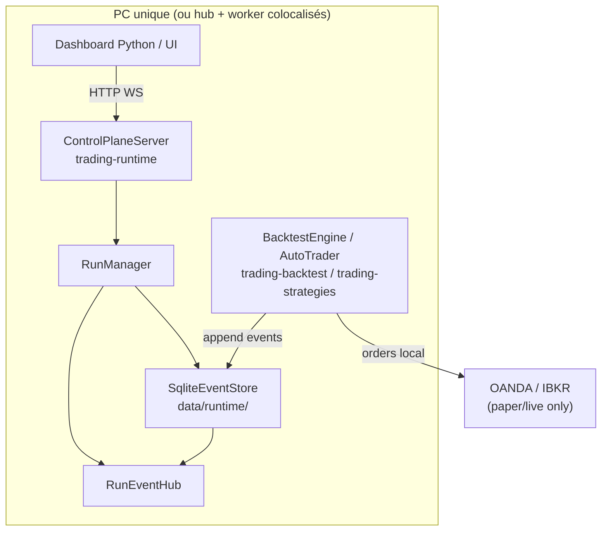
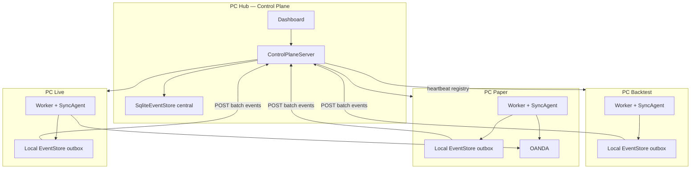

# Brainstorming Session Results

**Facilitator:** Martin Fournier
**Date:** 2026-05-24

## Session Overview

**Topic:** Architecture distribuée pour Trading Bridge — exécution du moteur de trading sur une ou plusieurs machines (backtest, paper trade, live), le tout connecté à un serveur central unique pour le monitoring et l'historique unifié.

**Goals:**
- Vision produit et architecture haut niveau
- Choix techniques concrets (protocoles, stack, modules Maven)
- Livrables attendus :
  - Schéma d'architecture
  - Liste de composants à créer
  - Priorités de sprint
  - Risques à anticiper
  - Modèle de données pour l'historique centralisé

### Context Guidance

Projet existant : monorepo Maven Java 21, modules `trading-core`, `trading-backtest`, `trading-data`, `trading-broker` (scaffold), `trading-strategies`, `trading-runtime` (EventStore en cours). Pas de Spring. Dashboard Python adjacent. Sprint 12 — consolidation plateforme.

Contraintes implicites : UTC partout, pas de credentials hardcodés, dépendances acycliques entre modules.

### Session Setup

**Flexibilité de déploiement :**
- Mode tout-en-un : backtest + paper + live sur la même machine
- Mode distribué : 1 PC par mode (backtest / paper / live)

**Exigence centrale :** un serveur unique qui monitorerait l'ensemble, conserverait l'historique pour tous les nœuds, et servirait de point de vérité pour la supervision.

**Niveau de maturité visé :** les deux — vision ET implémentation concrète.

## Technique Selection

**Approach:** AI-Recommended Techniques + Party Mode (roundtable multi-agents)
**Analysis Context:** Architecture distribuée avec serveur central — vision produit et choix techniques

**Recommended Techniques:**

- **Question Storming:** Cartographier l'espace problème avant de designer
- **Morphological Analysis:** Explorer combinaisons topologie × protocole × persistance × auth
- **Role Playing + Reverse Brainstorming:** Besoins par persona, risques, priorités sprint

**AI Rationale:** Sujet complexe multi-dimensionnel nécessitant cadrage (questions), exploration systématique (morphologie), puis validation par rôles et échecs anticipés.

## Technique Execution — Round 1 (Party Mode)

**Technique:** Question Storming
**Agents convoqués:** Winston (Architect), John (PM), Amelia (Engineer), Mary (Analyst)
**Statut:** En cours — 48 questions générées, en attente réactions utilisateur

### Round 2 — Positions MVP (Party Mode)

**Agents:** Winston, John, Amelia, Sally (UX — première intervention)

**Convergence émergente:**
- Hub = monitor passif + journal unifié (pas orchestrateur actif, pas routing ordres)
- Nœud local = exécution + envoi broker
- Hub down = mode dégradé autonome + buffer local + replay
- Promesse MVP (John): « ne jamais perdre un run » > vérité temps réel > always available
- Module proposé (Amelia): `trading-node` agent léger + étendre `trading-runtime` existant

### Round 3 — Morphological Analysis (Party Mode)

**Agents:** Winston (matrix), Amelia (impl), Mary (risk), John (MVP pick)

**6 paramètres identifiés:** P1 Journal hub · P2 Transport · P3 Buffer dégradé · P4 Ordre/réconciliation · P5 Autorité runId · P6 Rôle hub

**Combos:**
- **A MVP (Winston):** SQLite + HTTP POST batch + outbox local + seq monotone + UUID nœud + observateur pur
- **B Croissance:** PostgreSQL + outbox + hub pré-alloue runs + config read-only
- **C Wild card:** NATS + gRPC + WAL JSONL + vector clock

**Tension Amelia vs Winston:** Amelia recommande Pull HTTP d'abord (S1), Push en S2 ; Winston Combo A = Push batch dès MVP.

**Convergence John:** Tuer K8s/consensus ; MVP = 1 worker + event store durable + control plane ; multi-nœud après confiance.

**Mary:** Combo audit = hub + push temps réel + mTLS + rétention tiered WORM (plus exigeant que MVP).

### Round 4 — Reverse Brainstorming (Party Mode)

**Agents:** Winston (8 arch), Amelia (8 eng), Mary (8 audit), John (8 trust), Sally (6 UX)
**Total failure scenarios:** 38

**Top mitigations convergentes:**
1. Idempotence bout-en-bout + ACK atomique avant purge buffer
2. Persist → then broadcast (ordre opérations)
3. Séquence logique primaire (pas timestamp seul)
4. Réconciliation broker ↔ journal (statut RECONCILED/DIVERGED)
5. UI prouve fraîcheur — jamais « vert » sans preuve
6. Snapshot immuable config au lancement run
7. Fail-closed buffer > 80% (gel exécution)
8. Evidence pack exportable par runId

## Idea Organization and Prioritization

### Session Achievement Summary

- **~90 idées** générées (48 questions + 3 combos morpho + 38 scénarios d'échec + positions MVP)
- **4 techniques** en party mode (Winston, John, Amelia, Mary, Sally)
- **8 mitigations structurantes** identifiées couvrant ~80 % du risque

### Thematic Organization

**Thème 1 — Hub central (Control Plane)**
- Rôle passif : observer, journaliser, exposer API/UI — jamais router ordres au MVP
- Réutiliser `trading-runtime` : `ControlPlaneServer`, `RunManager`, `SqliteEventStore`
- Transport : Pull HTTP d'abord (`GET /api/runs/{id}/events?after=seq`), Push batch sprint suivant
- Persistance hub : SQLite append-only (migration PostgreSQL en croissance)

**Thème 2 — Nœuds d'exécution (Workers)**
- Backtest / paper / live = même contrat nœud, modes différents (`RunMode`)
- Exécution + broker local ; buffer SQLite outbox si hub down
- Heartbeat + identité nœud (`nodeId`) enregistrée au hub
- Module `trading-node` (agent sync) — sprint 15, pas avant mono-nœud stable

**Thème 3 — Confiance et preuve**
- Promesse MVP : **« ne jamais perdre un run »** (John)
- Persist → then broadcast ; séquence monotone primaire
- Snapshot config immuable au lancement ; `schemaVersion` sur events
- UI prouve fraîcheur (« vu il y a X s ») — jamais vert sans preuve

**Thème 4 — UX supervision (Sally)**
- Écran « État du réseau » : live > paper > backtest
- Stop run avec confirmation (live = taper STOP)
- Comparaison backtest/live avec bandeau parité explicite
- Nœud offline = priorité visuelle + runs affectés listés

**Breakthrough Concepts**
- **Combo fusionné phased** : mono-nœud → pull sync → push multi-PC → mTLS/audit
- **Ghost Journal** (Winston) : le pire échec = journal parfait qui ne correspond pas au broker
- **UI affirme vs prouve** (John) : contrat de persistance vérifiable

---

## Architecture cible

### Schéma — Phase MVP (mono-nœud, Sprint 13)



### Schéma — Phase distribuée (Sprint 15+)



### Décisions d'architecture (ADR synthèse)

| Décision | Choix MVP | Reporté |
|----------|-----------|---------|
| Rôle hub | Observateur + journal + contrôle start/stop | Kill-switch central, routing ordres |
| Source vérité exécution | Nœud local | Hub |
| Hub down | Buffer local + replay | — |
| Transport | HTTP JSON (existant Javalin) | gRPC, NATS |
| Persistance hub | SQLite (`data/runtime/`) | PostgreSQL |
| Auth nœud↔hub | Confiance LAN (dev) | mTLS |
| Ordres broker | Toujours nœud local | Jamais hub |

---

## Composants à créer / étendre

### Existant à consolider (`trading-runtime`)

| Composant | Fichier | Action |
|-----------|---------|--------|
| Control Plane API | `ControlPlaneServer.java` | Pagination events, endpoints nœuds |
| Run lifecycle | `RunManager.java` | Transaction atomique statut + event terminal |
| Event store | `SqliteEventStore.java` | WAL, chemin configurable, idempotence |
| Broadcast | `BroadcastingEventStore.java` | Ordre persist → broadcast |
| Event hub | `RunEventHub.java` | Cleanup subscribers, backpressure |

### Nouveau — Sprint 13–14 (dans `trading-runtime`)

| Composant | Responsabilité |
|-----------|----------------|
| `RunConfigSnapshot` | Snapshot immuable params stratégie au `RUN_STARTED` |
| `PersistenceContract` | Métadonnées « garanti persisté » pour UI |
| `EventGapDetector` | Détection trous séquence pour alertes |
| `RuntimeDataPaths` | Résolution chemin DB (`data/runtime/`, env override) |

### Nouveau — Sprint 15 (`trading-node` module)

| Composant | Responsabilité |
|-----------|----------------|
| `NodeIdentity` | `nodeId`, hostname, mode capabilities |
| `SyncClient` | Pull/push events vers hub, retry, watermark |
| `LocalOutboxStore` | Buffer SQLite si hub unreachable |
| `HeartbeatScheduler` | POST `/api/nodes/{nodeId}/heartbeat` |
| `NodeMain` | Entry point agent (sans moteur) ou embedded dans worker |

### Nouveau — Sprint 16+ (hub)

| Composant | Responsabilité |
|-----------|----------------|
| `NodeRegistry` | Registre nœuds + lastSeen + statut |
| `BrokerReconciler` | Positions hub vs broker → `RECONCILED`/`DIVERGED` |
| `EvidencePackExporter` | Export ZIP/JSONL audit par runId |
| `RunLeaseManager` | Lease exclusif symbole/stratégie (multi-nœud live) |

### Dashboard Python (adjacent)

| Action | Détail |
|--------|--------|
| Client hub | Consommer `/api/runs`, WebSocket events |
| Fraîcheur UI | Afficher `lastSeen`, statut dégradé |
| Comparaison | Deux runIds → courbes + bandeau parité |

---

## Modèle de données — historique centralisé

### Entités

```
NodeRecord
  nodeId          UUID (stable par installation)
  hostname        string
  capabilities    [BACKTEST, PAPER, LIVE]
  registeredAt    Instant (UTC)
  lastHeartbeat   Instant (UTC)
  status          ONLINE | OFFLINE | DEGRADED

RunRecord (étendu)
  runId           UUID
  nodeId          UUID (nullable mono-nœud local)
  strategyId      string
  symbol          string
  mode            BACKTEST | PAPER | LIVE
  status          RUNNING | COMPLETED | FAILED | CANCELLED
  startedAt       Instant
  completedAt     Instant?
  configSnapshot  JSON (immuable — hash SHA-256)
  configHash      string
  lastEventSeq    long (watermark hub)

StoredRunEvent (existant — étendu)
  sequence        long (monotone par runId, hub-assigned à l'ingestion)
  event           RunEvent

RunEvent (existant v1 — champs)
  schemaVersion   int (=1)
  type            RunEventType
  timestamp       Instant (UTC émission nœud)
  runId           string
  strategyId      string
  symbol          string
  mode            string
  payload         Map

SyncCheckpoint (nouveau — par nœud+run)
  nodeId          UUID
  runId           UUID
  lastAckedSeq    long
  lastSyncedAt    Instant

OperatorAction (nouveau — audit)
  actionId        UUID
  actor           string
  action          STOP_RUN | CANCEL_ALL | ...
  runId           UUID
  timestamp       Instant
  reason          string?
```

### Clés d'idempotence

- **Event ingestion :** `(runId, eventId)` où `eventId` = UUID dans payload ou header
- **Sync batch ACK :** hub retourne `{ lastAckedSequence, acceptedCount }`
- **Purge outbox locale :** uniquement si `localSeq <= lastAckedSequence`

### Types d'événements prioritaires (granularité fine)

| Type | Payload clé | Usage |
|------|-------------|-------|
| `RUN_STARTED` | configSnapshot, dataSource, capital | Audit, replay |
| `BAR_PROCESSED` | barTime, OHLC (optionnel MVP) | Debug |
| `ORDER_SUBMITTED` | orderId, side, type, correlationId | Traçabilité |
| `ORDER_FILLED` | fillPrice, brokerFillId | Réconciliation |
| `RUN_ENDED` | pnl, trades, metrics | Dashboard |
| `ERROR` | message, stack | Alertes |
| `OPERATOR_ACTION` | actor, action | Compliance |
| `NODE_HEARTBEAT` | cpu, mem, activeRuns | Monitoring |

### Stockage SQLite hub (tables suggérées)

```sql
-- nodes(node_id, hostname, capabilities_json, registered_at, last_heartbeat, status)
-- runs(run_id, node_id, strategy_id, symbol, mode, status, started_at, completed_at, config_snapshot_json, config_hash)
-- events(run_id, sequence, event_id, ingested_at, event_json) UNIQUE(run_id, event_id)
-- sync_checkpoints(node_id, run_id, last_acked_seq, updated_at)
-- operator_actions(action_id, run_id, actor, action, timestamp, reason)
```

---

## Priorités sprint

### Sprint 13 — « Never lose a run » (mono-nœud)

**Objectif :** Lancer backtest depuis control plane, events persistés, reprise après crash.

| # | Story | Acceptance |
|---|-------|------------|
| 13.1 | Chemin DB configurable + volume persistant | `data/runtime/events.db` survit redeploy |
| 13.2 | Persist → broadcast ordering | Test : pas de double event WebSocket |
| 13.3 | Statut run atomique avec event terminal | COMPLETED implique RUN_ENDED en store |
| 13.4 | Config snapshot au RUN_STARTED | Hash vérifiable, immuable |
| 13.5 | Gap detection séquence | API signale trous explicitement |
| 13.6 | Dashboard : fraîcheur statut | « Dernier event il y a X s » |

**Livrables utilisateur (John) :**
1. Backtest via API sans Maven manuel
2. Events live via WebSocket
3. Crash → run + journal retrouvables

### Sprint 14 — Durabilité sync locale

| # | Story |
|---|-------|
| 14.1 | Pagination cursor `afterSequence` robuste |
| 14.2 | Idempotence ingestion `(runId, eventId)` |
| 14.3 | `OPERATOR_ACTION` events (stop run) |
| 14.4 | Evidence pack export JSONL par runId |
| 14.5 | Tests partition simulée (timeout, 503) |

### Sprint 15 — Premier nœud distant

| # | Story |
|---|-------|
| 15.1 | Module `trading-node` + `NodeIdentity` |
| 15.2 | `POST /api/runs/{id}/events` batch + ACK |
| 15.3 | Local outbox + replay on reconnect |
| 15.4 | `NodeRegistry` + heartbeat |
| 15.5 | Dashboard « État du réseau » (Sally) |

### Sprint 16 — Confiance production

| # | Story |
|---|-------|
| 16.1 | Réconciliation broker positions |
| 16.2 | Comparaison backtest/live avec bandeau parité |
| 16.3 | mTLS nœud↔hub |
| 16.4 | Run lease (anti split-brain live) |
| 16.5 | Rétention tiered + archivage froid |

---

## Registre des risques

| ID | Risque | Prob | Impact | Mitigation | Sprint |
|----|--------|------|--------|------------|--------|
| R1 | Events perdus (persist/broadcast race) | M | C | persist → broadcast | 13 |
| R2 | DB éphémère perdue au deploy | M | C | RuntimeDataPaths | 13 |
| R3 | UI voyant vert mensonger | M | H | Heartbeat + fraîcheur | 13 |
| R4 | Sync partielle, gap permanent | M | C | lastAckedSequence | 15 |
| R5 | Double fill replay | L | C | Idempotence brokerFillId | 15 |
| R6 | Config run modifiable a posteriori | M | H | ConfigSnapshot | 13 |
| R7 | Divergence backtest/live silencieuse | M | H | Golden + parité UI | 16 |
| R8 | Ghost journal (fills sans broker) | L | C | BrokerReconciler | 16 |
| R9 | Split-brain multi-nœud live | L | C | RunLeaseManager | 16 |
| R10 | K8s/consensus rabbit hole | H | H | **Éviter** — phased rollout | — |

---

## Action Planning — Semaine 1

1. **Valider ADR** — hub passif, exécution locale, mono-nœud d'abord
2. **Sprint 13.1** — `RuntimeDataPaths` + doc `data/runtime/` dans `.gitignore` (déjà `.gitkeep`)
3. **Sprint 13.2** — Fix ordering `BroadcastingEventStore` + test régression
4. **Spike dashboard** — Python client sur `/api/health` + `/api/runs`
5. **Créer story file** — `_bmad-output/implementation-artifacts/13-x-distributed-platform-mvp.md`

**Métriques succès :**
- 0 run perdu sur 10 crash/restart tests
- 100 % events séquentiels sans gap non signalé
- Redémarrage control plane < 5 s, runs visibles immédiatement

---

## Session Summary and Insights

**Key Achievements :**
- Architecture distribuée cadrée sans tomber dans le piège K8s/consensus
- Combo morphologique fusionné (mono → pull → push → audit)
- 38 scénarios d'échec → 8 mitigations prioritaires
- Modèle de données aligné sur code existant (`RunEvent`, `StoredRunEvent`, `RunRecord`)

**Session Reflections :**
- Party mode a produit tension productive (Amelia Pull vs Winston Push) → résolu par phasing
- La promesse « never lose a run » tranche mieux que « single source of truth » pour un solo dev
- Le risque #1 n'est pas la distribution — c'est la **persistance locale fiable** avant d'ajouter des nœuds

**Document :** `_bmad-output/brainstorming/brainstorming-session-2026-05-24-1430.md`

**ADR formel :** `_bmad-output/planning-artifacts/adr-13-distributed-platform.md` (ADR-13-07 à ADR-13-14)
