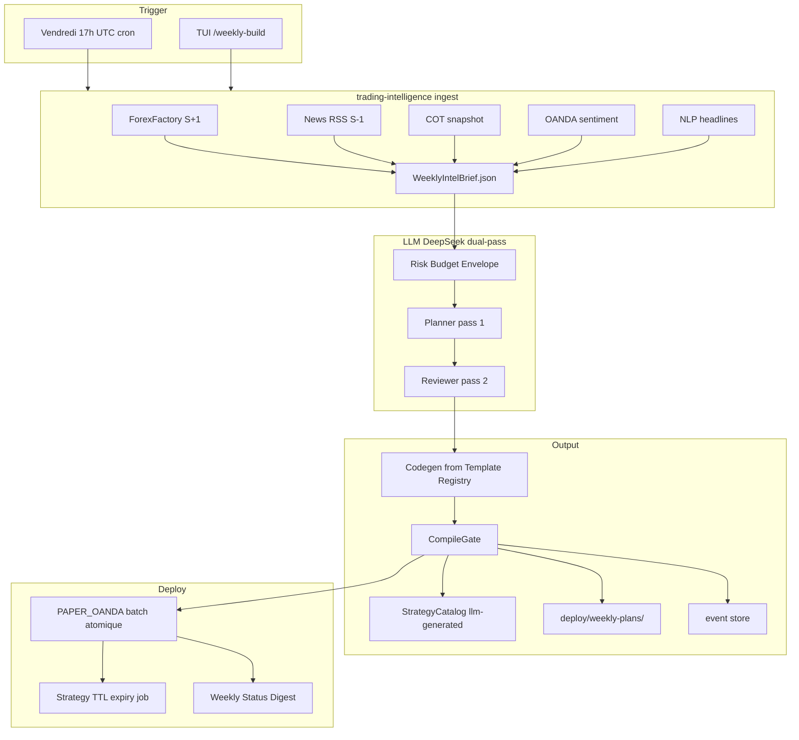

# Brainstorming Session Results

**Facilitateur :** Martin Fournier
**Date :** 2026-06-01

## Session Overview

**Topic :** Strategy Builder hebdomadaire — génération automatique de stratégies pour la semaine à venir, alimenté par news, calendrier économique et sentiment de marché, orchestré par un LLM, exécution planifiée le dimanche soir.

**Goals :**
- **A** — Architecture système (modules, flux de données, intégration LLM)
- **B** — MVP / features (priorisation, scope initial)
- **C** — Patterns de stratégies (types de setups générables par le LLM)
- **D** — Workflow opérationnel (dimanche soir → validation → exécution)
- **E** — Modèle de confiance / garde-fous (quand faire confiance au LLM vs. bloquer)

### Context Guidance

Trading Bridge dispose déjà de briques pertinentes :
- `WeeklyAnalysisRunner` — agrège calendrier (ForexFactory), COT, sentiment OANDA
- `WeekStrategies` / `NewsTradingStrategy` — stratégies news hardcodées
- `EconomicCalendar`, `ForexFactoryScraper` — données calendrier
- Plans hebdo manuels dans `deploy/weekly-plans/`
- Vision Sprint 15 — pipeline news & sentiment (planifié, pas encore implémenté)

### Session Setup

Session démarrée le 2026-06-01. Martin a choisi une nouvelle session (option 2).

Objectifs confirmés : A, B, C, D, E — exploration complète sur architecture, MVP, patterns, workflow et garde-fous.

## Technique Selection

**Approche :** AI-Recommended Techniques

**Techniques recommandées :**

1. **Question Storming** — Définir l'espace problème avant l'architecture
2. **Morphological Analysis** — Matrice systématique inputs × processing × outputs × confiance
3. **Role Playing + Reverse Brainstorming** — Workflow multi-stakeholders + modes d'échec

**Rationale IA :** Session complexe (5 objectifs, système multi-sources + LLM). Question Storming évite de construire la mauvaise architecture ; Morphological Analysis couvre A/B/C ; Role Playing + Reverse couvre D/E.

## Technique Execution — Phase 1 : Question Storming

### Décisions confirmées par Martin

| # | Question | Décision |
|---|----------|----------|
| 1 | Format output | **Stratégie Java compilable** (`Strategy`) |
| 2 | Nature stratégie | **Mix** event news + régime de marché hebdo |
| 3 | Rôle LLM | **Templates existants** paramétrés (pas d'invention from scratch) |
| 4 | Volume | **3 stratégies ciblées** max |
| 5 | Semaine creuse | **Alerte + log**, rien ne se passe |
| 6 | Sources news | **Calendrier + COT + RSS**, recherche d'autres sources |
| 7 | Sentiment | **OANDA positioning + NLP headlines** |
| 8 | Fraîcheur données | Calendrier **semaine prochaine** + extrapolation news **semaine passée / derniers jours** |
| 9 | Scrape fail | **Refuse de produire** |
| 10 | Régime technique | **Optionnel** (pas obligatoire) |
| 11 | Autonomie | **Exécution auto paper** |
| 12 | Lookahead | Stratégie valide **uniquement pour la semaine prochaine** |
| 13 | Traçabilité | **Citer sources** (event, headline, timestamp) |
| 14 | Hallucination event | **Ne pas créer** de stratégie |
| 15 | Garde-fous | **Oui** (reviewer LLM ou gates — à préciser) |
| 16 | Timing | **Open** — pas 100% vendu dimanche soir |
| 17 | Mode run | **100% non-interactif**, déclenchable via TUI |
| 18 | OANDA maintenance | **Envisager vendredi** pour semaine prochaine |
| 19 | Artefacts | **`deploy/weekly-plans/` + event store** |
| 20 | Absence validation | **Paper trade automatique** |
| 21 | Module | **`trading-intelligence`** (nouveau) |
| 22 | Backtest préalable | **Non** — semaine future, pas de données |
| 23 | Catalogue | **Oui**, tag `llm-generated` dans `StrategyCatalog` |
| 24 | WeeklyAnalysisRunner | **Indécis** |
| 25 | LLM | **Configurable**, probablement **DeepSeek** |
| 26 | Responsabilité perte | **Système** |
| 27 | Plafond risque | **Oui**, imposé avant proposition LLM |
| 28 | Output « ne pas trader » | **Oui**, valide |
| 29 | Recency bias | Délégation expert IA |
| 30 | Golden backtest | **Non** requis |

### Tensions identifiées

- **Vendredi vs dimanche** : vendredi évite maintenance OANDA mais calendrier semaine prochaine peut être incomplet
- **Pas de backtest + auto paper** : confiance repose sur templates + gates + reviewer LLM
- **Compilable Java + templates** : codegen/param-fill depuis templates, pas génération libre de logique

### Décisions complémentaires (round 2)

| Question | Décision |
|----------|----------|
| Templates initiaux | Proposés par facilitateur (experts domaine) |
| Paires | **Liste fixe** (whitelist) |
| Paper deployment | **PAPER_OANDA** direct (pas PAPER_STUB) |
| Reviewer LLM | **Même modèle DeepSeek**, prompt différent |

### Templates experts proposés (catalogue MVP)

| ID | Template | Expert / école | Déclencheur hebdo |
|----|----------|----------------|-------------------|
| T1 | **HighImpactNewsBreakout** | Kathy Lien — event-driven FX | Event HIGH impact calendrier S+1 |
| T2 | **COTContrarianFade** | Larry Williams / COT methodology | Positioning speculator extrême (>80e percentile) |
| T3 | **RetailSentimentFade** | Contrarian retail (OANDA book) | Retail >70% one side + NLP divergence |
| T4 | **LondonOpenRangeBreakout** | Session breakout (prop shop) | Semaine sans event majeur lundi matin |
| T5 | **WeeklyOpenGapFade** | Gap fill Monday | Gap week-end 5–30 pips lundi |
| T6 | **CentralBankWeekBias** | Macro desk — CB week | FOMC/ECB/RBA/BoE dans calendrier S+1 |
| T7 | **PreEventRangeBreakout** | Volatility expansion | 24h avant CPI/NFP — range compression |
| T8 | **NoTradeWeek** | Risk manager | Inputs contradictoires ou calendrier creux |

**Whitelist paires suggérée :** EUR_USD, GBP_USD, USD_JPY, GBP_JPY, AUD_USD, USD_CAD (aligné plans hebdo existants)

**Schedule recommandé :** Vendredi 17h00 UTC, fallback samedi 10h00 UTC

### Validations finales Martin

- **8 templates (T1–T8)** : ✅ validés
- **6 paires whitelist** : ✅ validées (EUR_USD, GBP_USD, USD_JPY, GBP_JPY, AUD_USD, USD_CAD)

## Technique Execution Results

### Question Storming
- **Focus :** 30 questions → 30 décisions architecturales
- **Breakthrough :** LLM = paramétreur de templates, pas inventeur de logique
- **Résolution #24 :** `WeeklyAnalysisRunner` reste CLI debug ; pipeline structuré dans `trading-intelligence`

### Morphological Analysis
- **Focus :** Matrice ingest × templates × deploy × gates
- **Breakthrough :** Vendredi 17h UTC + fallback samedi (vs dimanche soir initial)
- **Validations :** 8 templates T1–T8, whitelist 6 paires

### Role Playing + Reverse Brainstorming
- **Focus :** 4 personas (Martin, Risk Officer, Reviewer, Scheduler) + 10 modes d'échec
- **Breakthrough :** Deploy atomique (3 ou 0) + Strategy TTL metadata (`validUntil` fin de semaine)

## Inventaire complet des idées (14)

| ID | Titre | Thème |
|----|-------|-------|
| #1 | Template Param Factory | Templates & codegen |
| #2 | Weekly Intel Brief JSON | Ingestion |
| #3 | Friday Pipeline Cron | Scheduling |
| #4 | NoTradeWeek First-Class Output | Risk / output |
| #5 | Source-Anchored Codegen | Traçabilité |
| #6 | Expert Template Registry | Templates & codegen |
| #7 | Dual-Pass DeepSeek Pipeline | LLM |
| #8 | PAPER_OANDA Weekly Deployment Bundle | Deploy |
| #9 | Weekly Status Digest | Ops / UX |
| #10 | Weekly Risk Budget Envelope | Garde-fous |
| #11 | Reviewer Rejection Audit Trail | Garde-fous |
| #12 | trading-intelligence Module Layout | Architecture |
| #13 | Partial Deploy Prevention | Garde-fous |
| #14 | Strategy TTL Metadata | Lifecycle |

## Idea Organization and Prioritization

### Thème 1 — Architecture & module
_Focus : Où vit le système et comment il s'intègre à Trading Bridge_

- **#12 trading-intelligence Module Layout** — nouveau module Maven isolé
- **#2 Weekly Intel Brief JSON** — artefact intermédiaire déterministe
- **#6 Expert Template Registry** — contrat LLM ↔ templates Java

**Insight :** Séparer ingestion (Java pur) de raisonnement (LLM) = debuggable sans relancer le modèle.

### Thème 2 — Pipeline LLM & templates
_Focus : Comment le LLM produit des stratégies compilables sans halluciner_

- **#1 Template Param Factory** — slots paramétriques uniquement
- **#7 Dual-Pass DeepSeek Pipeline** — Planner (T=0.7) + Reviewer (T=0.2)
- **#5 Source-Anchored Codegen** — metadata sources embarquée dans le code
- **Templates T1–T8 validés** — catalogue expert figé

**Insight :** Confiance = templates + reviewer fact-check, pas backtest (semaine future).

### Thème 3 — Garde-fous & risque
_Focus : Responsabilité système, plafonds, anti-échec_

- **#10 Weekly Risk Budget Envelope** — max 3 strat, 0.01 lots, 5% DD hebdo
- **#11 Reviewer Rejection Audit Trail** — rejets logués dans event store
- **#13 Partial Deploy Prevention** — deploy atomique
- **#14 Strategy TTL Metadata** — expiry vendredi 21h UTC
- **#4 NoTradeWeek** — output valide, pas un échec silencieux

**Insight :** « Ne pas trader » et « refuse de produire » sont des états first-class auditable.

### Thème 4 — Ops & workflow
_Focus : Vendredi auto, paper OANDA, visibilité opérateur_

- **#3 Friday Pipeline Cron** — vendredi 17h UTC, fallback samedi 10h
- **#8 PAPER_OANDA Weekly Deployment Bundle** — promote batch auto
- **#9 Weekly Status Digest** — résumé TUI/post-run

**Insight :** Martin ne valide pas lundi — le système paper-trade seul ; digest pour supervision passive.

### Priorisation

**Top 3 impact :**
1. **#12 + #2** — Module + WeeklyIntelBrief (fondation de tout)
2. **#7 + #6 + T1/T8** — Dual-pass LLM + 2 premiers templates (news + no-trade)
3. **#10 + #13 + #8** — Risk envelope + deploy atomique PAPER_OANDA

**Quick wins :**
- Réutiliser `ForexFactoryScraper`, `COTDataFetcher`, `OandaPositionAnalyzer` dans IngestStep
- T1 via `NewsTradingStrategy` existant (wrapper template)
- T8 = stratégie no-op Java triviale

**Breakthrough concepts :**
- **Template Param Factory** — limite le LLM au paramétrage
- **Strategy TTL** — « bonne pour la semaine » enforceable par le runtime
- **NoTradeWeek** — décision risk manager automatisée

## Architecture cible

## Action Planning

### MVP-0 — Ingest + Brief (semaine 1)
1. Créer module `trading-intelligence` dans le reactor Maven
2. Définir schema `WeeklyIntelBrief` (JSON) : calendar[], news[], cot[], sentiment[], contradictions[]
3. `IngestPipeline` réutilisant scrapers `trading-data` existants
4. Fail-fast si scrape calendrier KO ; retry API samedi configurable
5. Test unitaire avec fixtures ForexFactory

**Ressources :** `trading-data` connecteurs existants  
**Succès :** `WeeklyIntelBrief.json` produit vendredi avec events S+1 réels

### MVP-1 — LLM Planner + Reviewer sans codegen (semaine 2)
1. Client LLM configurable (`DEEPSEEK_API_KEY`, provider abstraction)
2. Prompts Planner / Reviewer versionnés dans `trading-intelligence/resources/prompts/`
3. `RiskBudgetEnvelope` injecté avant Planner
4. Output : `WeeklyPlanDraft.json` (template picks + params + sources)
5. Reviewer rejette hallucinations → log dans event store (#11)

**Succès :** Plan draft validé reviewer pour semaine réelle, 0 event inventé

### MVP-2 — Codegen T1 + T8 + compile (semaine 3)
1. `TemplateRegistry` JSON → classes Java (T1 wrap `NewsTradingStrategy`, T8 no-op)
2. `CodegenStep` remplit slots depuis `WeeklyPlanDraft`
3. `CompileGate` : `mvn compile -pl trading-strategies`
4. Tag `llm-generated` dans `StrategyCatalog`
5. Markdown plan dans `deploy/weekly-plans/`

**Succès :** Java compile, stratégies visibles dans catalogue

### MVP-3 — Templates T2–T7 (semaines 4–6)
1. Un template par sprint (COT, retail fade, LORB, gap fade, CB bias, pre-event)
2. Réutiliser prop strategies existantes où possible (T4, T5)
3. Gates anti-correlation paire+direction

### MVP-4 — PAPER_OANDA auto-deploy (semaine 7)
1. `DeployStep` batch via control plane API
2. Deploy atomique (#13)
3. Strategy TTL metadata + expiry job (#14)
4. Cron vendredi 17h UTC dans `scripts/` ou control plane scheduler

**Succès :** 3 strategies ou NoTradeWeek déployées paper sans intervention

### MVP-5 — TUI ops (semaine 8)
1. `/weekly-build [--force]` — trigger manuel
2. `/weekly-status` — digest (#9)
3. Affichage sources + reviewer notes

## Décisions architecturales finales (ADR summary)

| Décision | Choix |
|----------|-------|
| Module | `trading-intelligence` (nouveau) |
| Output | Java `Strategy` compilable |
| LLM rôle | Paramétreur templates T1–T8 |
| LLM provider | DeepSeek configurable, dual-pass |
| Schedule | Vendredi 17h UTC, fallback samedi 10h |
| Deploy | PAPER_OANDA auto, atomique |
| Paires | EUR_USD, GBP_USD, USD_JPY, GBP_JPY, AUD_USD, USD_CAD |
| Backtest pré-run | Non (semaine future) |
| Golden backtest | Non requis |
| WeeklyAnalysisRunner | CLI debug conservé |
| Recency bias | News decay 7j + COT anchor + contrarian trigger |

## Session Summary and Insights

**Réalisations :**
- Vision complète Strategy Builder hebdomadaire en une session
- 30 décisions + 8 templates + 6 paires validées
- Architecture module, pipeline, gates, MVP roadmap 8 sprints

**Insights clés :**
- Le risque principal n'est pas le LLM « mauvais trader » mais le LLM « mauvais fact-checker » → dual-pass + ingest déterministe
- NoTradeWeek et refuse-to-produce sont des succès, pas des échecs
- PAPER_OANDA (pas STUB) aligne avec prop-shop et promote path LIVE

**Prochaine étape recommandée :** Créer story BMAD « Epic Intelligence — Weekly Strategy Builder MVP-0 » ou lancer `trading-intelligence` module scaffold.

**Document :** `_bmad-output/brainstorming/brainstorming-session-2026-06-01-2324.md`

