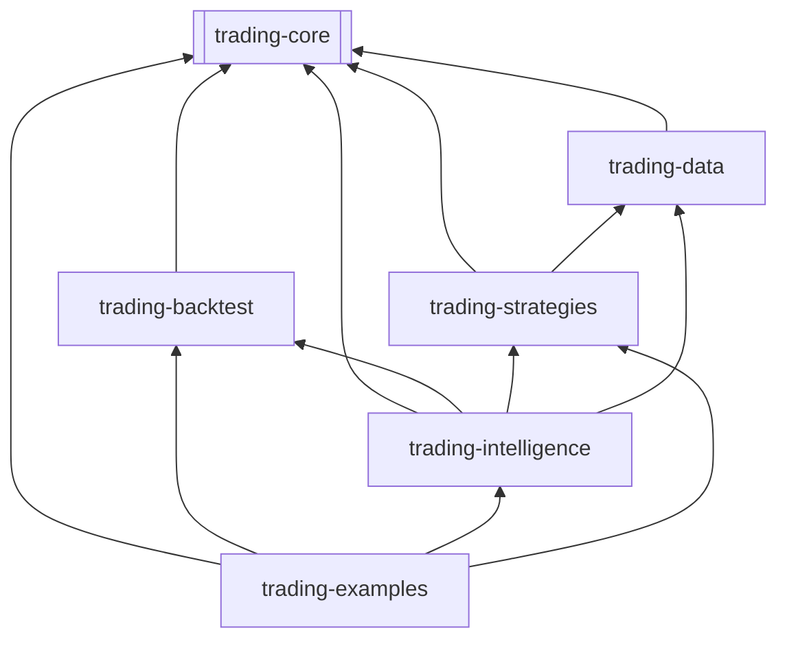

# Story: 3 4 Multi Timeframe Support

Status: ready-for-dev

## Story

## 1. État des lieux (Brownfield)

**Le module `trading-intelligence` existe déjà.** Il contient ~63 fichiers Java avec :

| Composant | Statut | Rôle |
|-----------|--------|------|
| `IngestPipeline` | ✅ Existant | Ingestion COT, calendrier économique (ForexFactory), sentiment OANDA |
| `WeeklyPlanner` | ✅ Existant | Choix de templates (T1-T8) selon le contexte de marché |
| `WeeklyStrategyCodeGenerator` | ✅ Existant | Codegen par handler pattern (wrapper + héritage de stratégies existantes) |
| `TemplateRegistry` | ✅ Existant | 8 templates (T1-T8), 4 modes de codegen |
| `WeeklyCompileWatcher` | ✅ Existant | Surveillance compilation Docker |
| `WeeklyDeployWatcher` | ✅ Existant | Déploiement vers control plane |
| `HttpDeepSeekClient` | ✅ Existant | Client LLM raw HTTP (sans LangChain4j) |
| `AgenticModelFactory` | ✅ Existant | Factory de modèles LangChain4j (OpenAiChatModel, OllamaChatModel) |
| `WeeklyPlannerTest` | ✅ Existant | Tests unitaires |
| `WeeklyStrategyOutlook` | ✅ Existant | DTO dans `trading-core` |

**⚠ Problème :** Le code existant est conçu pour les stratégies **News Weekly** (via weekly planner). Le pipeline LT génération n'existe pas dans ce module — il est dans le **skill Hermes** `long-term-strategies` comme processus manuel.

Notre job est d'étendre `trading-intelligence` pour supporter la génération autonome LT, Prop Shop, et News Weekly — pas de réécrire le module.

---

## 2. Architecture du Pipeline

### 2.1 Diagramme de flux

```mermaid
flowchart LR
    subgraph "Phase 1 — Conception"
        CONTEXT[RAG Context<br/>Playbook + Leçons + Catalog] --> LLM[LLM<br/>DeepSeek/Claude]
        LLM -->|StrategySpec JSON| VALIDATE{Schéma<br/>valide?}
        VALIDATE -->|Non| RETRY[LLM Retry]
        RETRY --> LLM
    end

    subgraph "Phase 2 — Compile & Backtest"
        VALIDATE -->|Oui| CODEGEN[Code Generator<br/>Template → .java]
        CODEGEN --> COMPILE[mvn compile<br/>Incremental ~5-10s]
        COMPILE -->|Échec compile| CODEGEN
        COMPILE --> BACKTEST[BacktestEngine<br/>Walk-forward 4 pairs × 4 périodes]
    end

    subgraph "Phase 3 — Évaluation"
        BACKTEST --> EVAL{Seuils<br/>atteints?}
        EVAL -->|Non (max 5 itérations)| FEEDBACK[Feedback LLM]
        FEEDBACK --> LLM
        EVAL -->|Non (>5 itérations)| REJECT[❌ Échouée]
        EVAL -->|Oui| QUALIFIED[✅ Qualifiée]
    end

    subgraph "Phase 4 — Enregistrement"
        QUALIFIED --> CATALOG[StrategyCatalog<br/>+ StrategyMetadata]
        REJECT --> EXP[Experience Log<br/>append-only JSON]
        CATALOG --> EXP
        EXP --> MEMORY[Synthèse périodique<br/>LLM résume 50 entrées → 1]
    end
```

### 2.2 Composants (nouveaux et modifiés)

| Composant | Classe | Module | Type |
|-----------|--------|--------|:----:|
| **Pipeline orchestrator** | `LtPipelineOrchestrator` | `trading-intelligence` | 🆕 Nouveau |
| **LLM Strategy generator** | `LtStrategyGenerator` | `trading-intelligence` | 🆕 Nouveau |
| **Code Generator (LT)** | `LtTemplateCodeGenerator` | `trading-intelligence` | 🆕 Nouveau |
| **StrategySpec** | `StrategySpec` | `trading-core` | 🆕 Nouveau |
| **StrategyMetadata** | `StrategyMetadata` | `trading-core` | 🆕 Nouveau |
| **ValidationProfile** | `ValidationProfile` (interface) | `trading-core` | 🆕 Nouveau |
| **LT Validator** | `LongTermValidator` | `trading-intelligence` | 🆕 Nouveau |
| **Experience Store** | `ExperienceStore` | `trading-intelligence` | 🆕 Nouveau |
| **Pipeline Runner** | `RunStrategyPipeline` | `trading-examples` | 🆕 Nouveau |
| **StrategyCatalog** | — | `trading-strategies` | 🔧 Modifié |
| **HttpDeepSeekClient** | — | `trading-intelligence` | 🔧 Déprécié → remplacer par AgenticModelFactory |

### 2.3 Dépendances entre modules



**Invariant :** `trading-intelligence` ne doit JAMAIS dépendre de `trading-examples` ou `trading-runtime`. Le graphe doit rester acyclique.

---

## 3. Data Model

### 3.1 StrategySpec (extensible, pas de champs hardcodés)

Contrairement à la première version du PRD, `StrategySpec` n'a PAS de champs comme `fastPeriod`/`slowPeriod`. Il utilise un modèle extensible :

```java
// trading-core
public record StrategySpec(
    String name,
    String inspiration,
    String description,
    StrategyProfile profile,       // LONG_TERM, PROP_SHOP, NEWS_WEEKLY
    String category,               // TREND_FOLLOWING, MEAN_REVERSION, MOMENTUM...
    List<String> indicators,       // ["SMA(20)", "ATR(14)", "RSI(14)"]
    EntryCondition longEntry,      // SMA_FAST_CROSS_ABOVE_SMA_SLOW
    EntryCondition shortEntry,
    ExitCondition exitCondition,   // REVERSE_SIGNAL, SL_TP, MAX_HOLD
    double slMultiplier,           // 2.0
    double tpMultiplier,           // 4.0
    int maxHoldBars,               // 240
    Map<String, Object> params     // Extensible: pour tout paramètre non-standard
) {}

// EntryCondition et ExitCondition en String (pas enum figé)
// pour permettre au LLM de définir des conditions custom
```

### 3.2 StrategyMetadata (queryable)

```java
public record StrategyMetadata(
    String name,
    StrategyProfile profile,
    String category,
    List<String> indicators,
    String inspiration,
    int pairCount,
    double avgPf,
    double avgSharpe,
    double maxDd,
    double avgWinRate,
    int totalTrades,
    List<PairResult> pairResults,  // Résultats détaillés par paire
    Instant createdAt
) {}

public record PairResult(
    String symbol,
    double pf,
    double sharpe,
    double dd,
    double winRate,
    int trades
) {}
```

### 3.3 ValidationProfile (polymorphisme, pas enum)

```java
public interface ValidationProfile {
    String name();
    boolean qualifies(BacktestResult result);
    String whyRejected(BacktestResult result);  // Message clair pour le feedback LLM
    List<String> requiredPairs();                // Paires à tester
}

// Implémentations concrètes :
class LongTermValidator implements ValidationProfile {
    // Walk-forward IS/OOS1/OOS2, 4 paires, 15+ ans
    boolean qualifies(BR r) {
        return r.profitFactor() >= 1.05
            && r.oos1ProfitFactor() >= 1.0
            && r.oos2ProfitFactor() >= 1.0
            && r.maxDrawdownPct() < 20
            && r.totalTrades() >= 100;
    }
}

class PropShopValidator implements ValidationProfile {
    // Scoring 15pts + soft signals + HMM
}

class NewsWeeklyValidator implements ValidationProfile {
    // Événement calendrier + SL large
}
```

### 3.4 Experience Store (append-only, pas de RAG)

```java
// data/experience-store/experience-2026-06-14.jsonl
// Format: 1 JSON object par ligne (JSONL)
{
  "spec": { "name": "LtCrossMomentum", ... },
  "result": { "qualified": false, "failureReason": "PF 0.89 < 1.05", ... },
  "lessons": [
    "SMA crossover seul ne suffit pas sur H1",
    "Ajouter un filtre de volatilité (ATR ratio)"
  ],
  "timestamp": "2026-06-14T18:30:00Z"
}
```

**Pas de vector DB, pas d'embedding, pas de RAG fancy en v1.** L'Experience Store est :
- Append-only (JSONL, jamais modifié)
- Synthèse périodique : tous les 50 entries, un LLM résume → 1 entrée synthétique
- Chargé dans le contexte du LLM au démarrage du pipeline (glissière : 10 dernières + synthèses)

---

## Acceptance Criteria

1. **AC1 — Verification**:
   - [ ] Append-only (JSONL, jamais modifié)
2. **AC2 — Verification**:
   - [ ] Synthèse périodique : tous les 50 entries, un LLM résume → 1 entrée synthétique
3. **AC3 — Verification**:
   - [ ] Chargé dans le contexte du LLM au démarrage du pipeline (glissière : 10 dernières + synthèses)

## Tasks / Subtasks

- [ ] Task 1: Core Implementation
- [ ] Task 2: Testing & Verification
