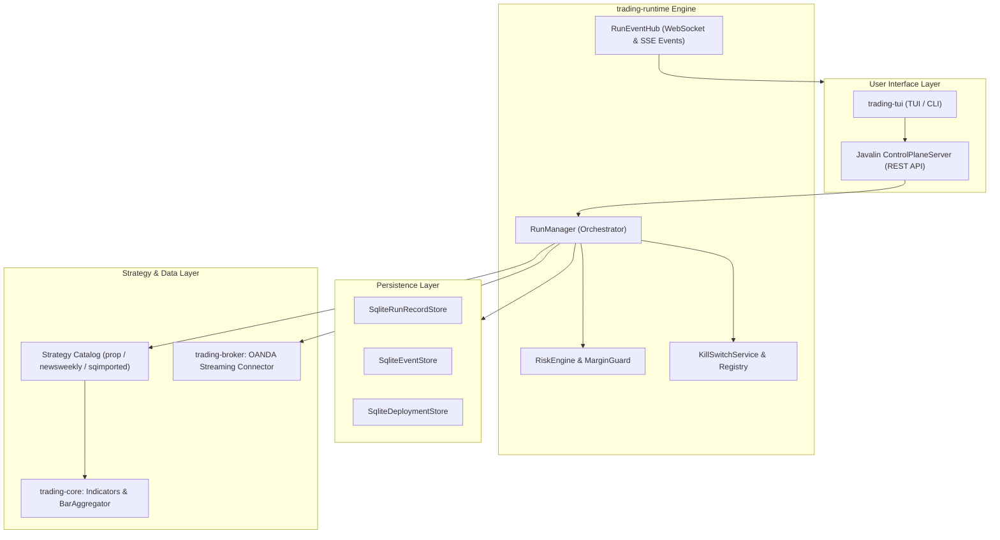
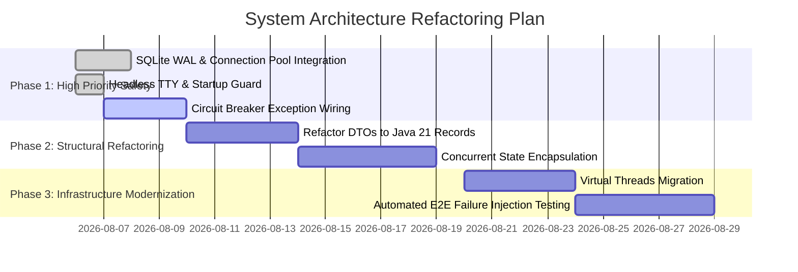

# 🏛️ Architecture & Code Maintainability Audit Report

**Author:** Winston (System Architect)  
**Date:** 2026-08-06  
**Git Branch:** `feature/architecture-maintainability-audit`  
**Repository Scope:** `trading-bridge` (`trading-core`, `trading-runtime`, `trading-strategies`, `trading-broker`, `trading-data`, `trading-tui`)  

---

## 1. Executive Summary

This architecture report presents a comprehensive technical audit of the `trading-bridge` codebase. The objective is to identify systemic anti-patterns, maintainability bottlenecks, and latent bug hotspots, while providing a clear blueprint for refactoring the system into a resilient, developer-friendly codebase.

Although the project's multi-module Maven structure cleanly separates core mathematical indicators (`trading-core`) from execution orchestration (`trading-runtime`) and strategy logic (`trading-strategies`), several architectural vulnerabilities require structural refactoring:
1. **Shared State Mutability & Concurrency Risks**: Thread-safety vulnerabilities in `RunManager`, `RunEventHub`, and background worker threads.
2. **Database Resource & Connection Lock Bottlenecks**: Unpooled SQLite connections susceptible to `SQLITE_BUSY` contention during parallel reads/writes.
3. **Fragile Exception & Circuit-Breaker Boundaries**: Exception swallowing in streaming executors (`OandaTransactionStreamer`, `SqBridgeService`) that fails to trigger `KillSwitchRegistry`.
4. **Headless Process Lifecycle Vulnerabilities**: Un-guarded `stdinWatcher` loops causing process suspension (`SIGTTIN`) in non-TTY container/background execution environments.

---

## 2. High-Level Architecture Spine



---

## 3. Deep-Dive Vulnerability & Bug Hotspot Analysis

### 3.1 Unbounded Concurrency & Mutable Shared State
* **Diagnosis**: `RunManager` holds in-memory maps of active strategy runs (`RunRecord`). Concurrent access across HTTP request threads and background strategy workers lacks unified synchronization locks.
* **Impact**: Race conditions during status transitions (`IDLE` ➔ `RUNNING` ➔ `RECONCILING`), resulting in phantom UI states or duplicate order triggers.
* **Remediation**:
  - Replace standard hash maps with `ConcurrentHashMap`.
  - Enforce atomic state transitions using atomic references (`AtomicReference<RunState>`).

### 3.2 SQLite Connection & Lock Contention (`SQLITE_BUSY`)
* **Diagnosis**: SQLite store implementations (`SqliteEventStore`, `SqliteRunRecordStore`) open ad-hoc `DriverManager.getConnection()` handles without connection pooling or Write-Ahead Logging (WAL) configuration.
* **Impact**: Synchronous database operations (e.g. batch event flushes or heavy integrity audits) block writer threads, throwing `SQLiteException: database is locked`.
* **Remediation**:
  - Integrate **HikariCP** lightweight connection pooling for SQLite.
  - Enforce `PRAGMA journal_mode=WAL;` and `PRAGMA busy_timeout=5000;` on initialization.
  - Offload long-running database integrity checks to background thread pools.

### 3.3 Silent Exception Swallowing & Circuit Breaker Bypass
* **Diagnosis**: Catch blocks in `OandaTransactionStreamer` and `SqBridgeService` print stack traces via `e.printStackTrace()` or log warnings without notifying `KillSwitchRegistry`.
* **Impact**: Critical network or broker API failures leave the runtime in a false `RUNNING` state, ignoring open risk exposure.
* **Remediation**:
  - Standardize error boundaries to automatically invoke `KillSwitchService.triggerEmergencyStop(reason)` upon uncaught exceptions.

### 3.4 Process Lifecycle & Headless Execution Hangs (`SIGTTIN`)
* **Diagnosis**: `stdinWatcher` attempts to read standard input synchronously without verifying if an interactive TTY console is attached.
* **Impact**: Process receives `SIGTTIN` signal when launched via background scripts or Docker containers, causing immediate thread suspension prior to HTTP port binding.
* **Remediation**:
  - Wrap TTY readers with `if (System.console() != null)` checks to bypass terminal input hooks in headless modes.

---

## 4. Strategic Refactoring Patterns for Code Maintainability

### Pattern A: Immutable Domain Records (Java 21)
Replace mutable DTO classes (`Bar`, `Order`, `Position`) with immutable Java 21 Records:
```java
// Immutable domain model eliminating thread-safety side effects
public record Bar(
    Instant timestamp,
    double open,
    double high,
    double low,
    double close,
    long volume
) {}
```
* **Benefit**: Guarantees thread-safe data sharing across indicator calculations and execution workers without defensive copying.

### Pattern B: Unified Resilient Execution Boundary
Wrap all strategy execution tasks in a resilient execution template:
```java
public final class ExecutionBoundary {
    private static final Logger log = LoggerFactory.getLogger(ExecutionBoundary.class);

    public static void executeWithCircuitBreaker(String runId, Runnable task) {
        try {
            task.run();
        } catch (Throwable t) {
            log.error("Fatal failure in strategy run [{}]. Triggering KillSwitch.", runId, t);
            KillSwitchRegistry.get().triggerEmergencyStop(runId, t.getMessage());
            throw new ExecutionException("Strategy run failed", t);
        }
    }
}
```

### Pattern C: Modern Concurrency with Java Virtual Threads
Migrate thread pools in `RunLauncher` and event listeners to Java Virtual Threads:
```java
// Lightweight concurrent worker execution without OS thread overhead
try (var executor = Executors.newVirtualThreadPerTaskExecutor()) {
    executor.submit(() -> strategyWorker.execute());
}
```

---

## 5. Prioritized Implementation Roadmap



### Milestone Checklist
- [x] Create dedicated git feature branch `feature/architecture-maintainability-audit`.
- [ ] Implement HikariCP connection pooling and WAL mode for `SqliteRunRecordStore` and `SqliteEventStore`.
- [ ] Connect background exception handlers to `KillSwitchRegistry`.
- [ ] Refactor DTOs (`Bar`, `Order`, `Position`) to Java 21 Records.
- [ ] Migrate `RunLauncher` worker pools to Virtual Threads.
