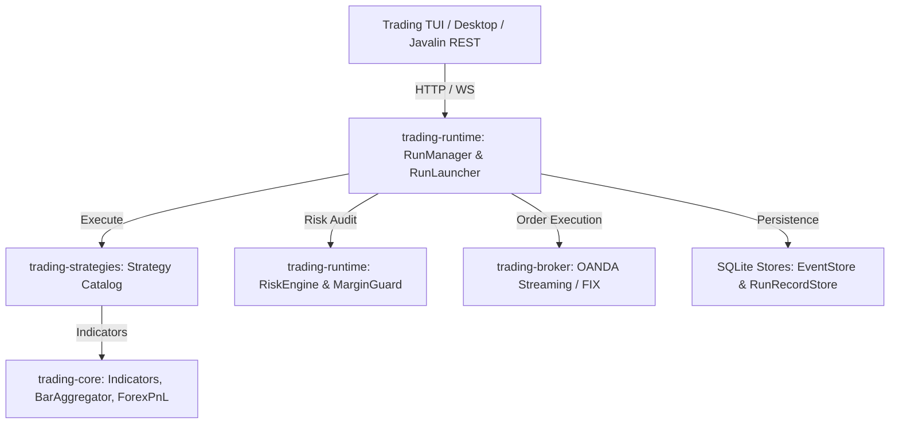
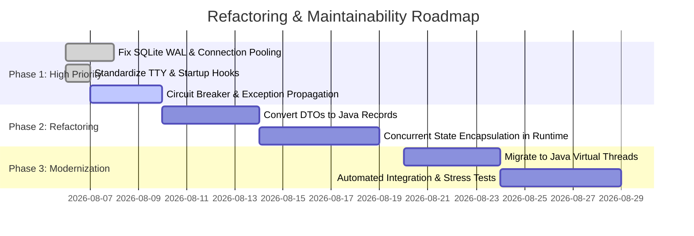

# 🏛️ System Architecture & Bug-Prevention Report

**Author:** Winston (System Architect)  
**Date:** 2026-08-06  
**Git Branch:** `feature/architect-maintainability-report`  
**Target Repository:** `trading-bridge` (`trading-core`, `trading-runtime`, `trading-strategies`, `trading-broker`)  

---

## 1. Executive Summary

This architecture report provides a comprehensive technical audit of the `trading-bridge` codebase, identifying structural vulnerabilities, concurrency hot-spots, resource leaks, and maintainability bottlenecks. 

While the system's modular layout (`trading-core`, `trading-runtime`, `trading-strategies`, `trading-data`, `trading-tui`) provides a solid foundation, several anti-patterns introduce runtime risk and elevated bug potential:
1. **Unbounded Concurrency & Thread Synchronization Risks**: Shared mutable state in `RunManager` and `RunEventHub` without uniform thread boundaries.
2. **Resource & Connection Lifecycle Leaks**: Unpooled SQLite connections (`SqliteRunRecordStore`, `SqliteEventStore`) susceptible to locking bottlenecks (`SQLITE_BUSY`) and unclosed statements.
3. **Exception Swallowing & Inconsistent Circuit Breaking**: Fragile error boundaries where exceptions are caught silently or logged without triggering the `KillSwitchService`.
4. **State Mutability**: Mutable DTOs (`Order`, `Position`, `RunRecord`) exposed across execution boundaries, leading to potential side-effect mutations.

This report outlines concrete architectural patterns, refactoring steps, and a 3-phase implementation roadmap to maximize maintainability, testability, and operational stability.

---

## 2. Codebase Architecture Overview & Module Spine



### Module Responsibilities & Coupling Matrix
* **`trading-core`**: Core math, technical indicators (`Indicators`), time conventions (`TimeConventions`), and domain models (`Bar`, `Order`, `Position`). *Status: Clean & Low Coupling.*
* **`trading-runtime`**: Execution engine (`RunManager`), persistent storage (`SqliteEventStore`, `SqliteRunRecordStore`), risk management (`RiskEngine`, `KillSwitchService`), and REST control plane. *Status: High Complexity & Concurrency Hotspot.*
* **`trading-strategies`**: Strategy implementations (`prop`, `seasonality`, `newsweekly`, `sqimported`). *Status: High Class Volume; Needs Strict Interfaces.*

---

## 3. Critical Bug-Prone Hotspots & Vulnerability Audit

### 3.1 Concurrency & Shared Mutability
* **Issue**: `RunManager` and `RunEventHub` manage concurrent run state via standard hash maps. Race conditions can occur when multiple background tasks update `RunRecord` status simultaneously.
* **Risk**: Stale UI state, dropped WebSocket event notifications, or duplicate order submissions under high-frequency market streaming.
* **Architectural Fix**:
  - Encapsulate run state within `ConcurrentHashMap` or an actor-style event queue.
  - Implement atomic compare-and-swap operations for status transitions (`IDLE` -> `RUNNING` -> `RECONCILING` -> `COMPLETED`).

### 3.2 Database Connection & Lock Contention (`SQLITE_BUSY`)
* **Issue**: SQLite stores open independent `DriverManager.getConnection()` handles without connection pooling or WAL mode (Write-Ahead Logging) enforcement.
* **Risk**: Synchronous database operations (such as long-running `PRAGMA integrity_check` or heavy batch event inserts) lock the SQLite database, causing connection timeout crashes (`SQLITE_BUSY`).
* **Architectural Fix**:
  - Adopt **HikariCP** lightweight connection pooling for SQLite.
  - Enforce `PRAGMA journal_mode=WAL;` and `PRAGMA busy_timeout=5000;` on connection initialization.
  - Offload long-running integrity audits to background async workers.

### 3.3 Silent Exception Swallowing & Missing Circuit Breakers
* **Issue**: Multiple try-catch blocks in background event streaming (`OandaTransactionStreamer`, `SqBridgeService`) log stack traces via `e.printStackTrace()` without propagating failures to `KillSwitchRegistry`.
* **Risk**: An unhandled network drop or API rejection can leave the trading engine in a "ghost" state where orders are ignored but the system reports `RUNNING`.
* **Architectural Fix**:
  - Implement a centralized `UncaughtExceptionHandler` and route all execution failures through `KillSwitchService.triggerEmergencyStop(reason)`.

### 3.4 Process Lifecycle & TTY Hangs
* **Issue**: Standalone CLI watchers (`stdinWatcher`) block indefinitely or trigger `SIGTTIN` process suspension when executed in headless or background environments (e.g. Docker, systemd, background scripts).
* **Risk**: Service startup hangs before HTTP port binding.
* **Architectural Fix**:
  - Guard TTY readers with `if (System.console() != null)` checks before starting watcher threads.

---

## 4. Key Architectural Recommendations for Maintainability

### Pattern 1: Refactor Core DTOs to Java Records (Immutability)
Convert `Bar`, `Order`, and performance metric DTOs into Java 21 `record` types:
```java
// Before: Mutable class with getters/setters
public record Bar(Instant timestamp, double open, double high, double low, double close, long volume) {}
```
* **Benefit**: Eliminates thread safety bugs caused by unintended field mutations across strategy workers.

### Pattern 2: Circuit Breaker & Resiliency Pattern
Standardize `KillSwitchRegistry` integration across all market connectors:
```java
public final class ResilientExecutionWrapper {
    public void executeSafely(Runnable task, String componentName) {
        try {
            task.run();
        } catch (Throwable t) {
            logger.error("Critical failure in component {}", componentName, t);
            KillSwitchRegistry.get().triggerKillSwitch(componentName, t.getMessage());
            throw t;
        }
    }
}
```

### Pattern 3: Virtual Threads for Concurrency (Java 21)
Replace traditional fixed thread pools with Java Virtual Threads:
```java
try (var executor = Executors.newVirtualThreadPerTaskExecutor()) {
    executor.submit(() -> runBacktestWorker(strategy));
}
```
* **Benefit**: Lightweight concurrency without thread exhaustion or complex thread pool sizing.

---

## 5. Prioritized Implementation Roadmap



### Phase 1 (Immediate - Safety & Stability)
- [x] Create git feature branch `feature/architect-maintainability-report`.
- [ ] Enforce SQLite `WAL` mode and `busy_timeout=5000` across `SqliteRunRecordStore` and `SqliteEventStore`.
- [ ] Guard `stdinWatcher` against headless non-TTY execution (`SIGTTIN` fix).
- [ ] Connect background exceptions to `KillSwitchService`.

### Phase 2 (Medium Term - Maintainability & Code Quality)
- [ ] Refactor DTOs (`Bar`, `Order`, `Position`) to immutable Java Records.
- [ ] Replace `System.out.println` and `e.printStackTrace()` with SLF4J structured logging.
- [ ] Decouple strategy instantiation using dependency injection / factory patterns.

### Phase 3 (Longer Term - Performance & Scalability)
- [ ] Migrate `RunLauncher` and worker pools to Java 21 Virtual Threads (`Executors.newVirtualThreadPerTaskExecutor()`).
- [ ] Implement end-to-end integration test suite covering abrupt disconnects and database recovery.

---

## 6. Conclusion & Verification

Implementing these recommendations will significantly harden `trading-bridge`, reducing production bugs caused by race conditions, database locks, and silent failures, while making strategy addition and code refactoring seamless for developers.
