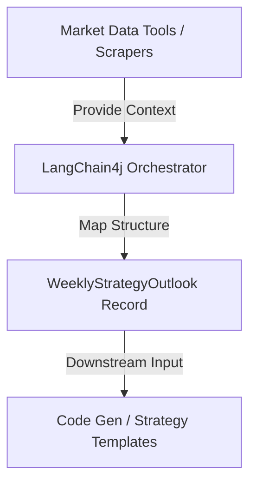
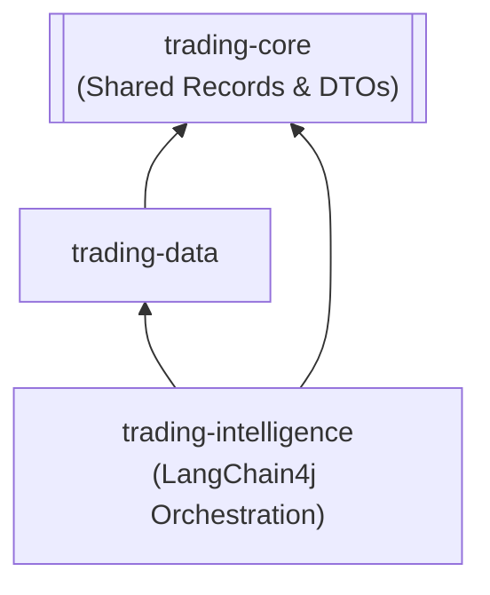

# Product Requirement Document (PRD) - Agentic Market Strategist (Orchestration Layer)

## 1. Executive Summary & Objective

### 1.1 Purpose
The purpose of this document is to specify the architectural, technical, and functional requirements for a Java-based Agentic Market Strategist utilizing the LangChain4j framework within the **Trading Bridge** platform.

This system acts as an intelligence and orchestration layer. It automatically ingests, scrapes, and parses macroeconomic, sentiment, and historical seasonality data, feeds this context to a High-Reasoning Large Language Model (LLM), and returns a highly deterministic, structured JSON object mapped directly to native Java record architectures.

### 1.2 Target Integration
The resulting `WeeklyStrategyOutlook` DTO will be fed directly into downstream code generation or templating tools to instantiate live executable strategies within the `trading-strategies` module. This system treats the LLM as a systematic risk officer rather than a speculative execution engine.



### 1.3 Success Metrics & Counter-metrics [REQ-AG-01]
To validate the effectiveness and safety of this orchestration layer:
*   **Regime Classification Accuracy:** The LLM's classification of market regimes must achieve a $\ge 85\%$ match rate against a programmatic baseline validator on historical data.
*   **Orchestration Latency:** Complete execution of the ReAct tool-use loop and final DTO mapping must complete in under **15.0 seconds** under normal API response times.
*   **Spike/Cost Guardrail (Counter-metric):** Average token cost per run must remain below $0.10 USD. Any anomaly leading to excessive tool loops or duplicate requests must be aborted before exceeding a cost safety limit of **$0.50 USD** per execution.
*   **Strategy Drawdown (Counter-metric):** Strategies configured with LLM-adjusted parameters must not exceed the historical maximum drawdown of their baseline template by more than 15%.

### 1.4 Non-Goals [REQ-AG-02]
To prevent scope creep, the following capabilities are explicitly **out of scope**:
*   **Real-time tick-by-tick orchestration:** The agentic layer operates offline (e.g., weekend/daily analysis), never on a live market tick event stream.
*   **Interactive user chat interface:** The system is purely programmatic. No chatbot UI, conversational prompt overrides, or human-in-the-loop chat triggers will be built in the backend.
*   **Autonomous Order Execution:** The LLM does not execute trades directly. It produces structured setups that are parsed, validated, and run by the core Java engine.
*   **Multi-agent negotiation:** No multi-agent consensus loops are allowed. The engine is a single orchestrator executing tools sequentially.

---

## 2. System Architecture & Project Alignment

### 2.1 Module Layout & Tech Stack [REQ-AG-03]
To respect the acyclic dependency structure of Trading Bridge and avoid module duplication, the orchestrator and its models are integrated as follows:
*   **Module Placement:** `[ASSUMPTION: §2.1]` No new module will be created. The LangChain4j engine, prompt blueprints, and orchestration service will be housed entirely within the existing `trading-intelligence` module.
*   **Shared Records:** To maintain an acyclic module graph, the shared target DTO records (such as `WeeklyStrategyOutlook`) will be defined in `trading-core`. This allows downstream modules like `trading-strategies` to import them without depending on `trading-intelligence`.
*   **Dependencies:** `langchain4j-core`, `langchain4j-open-ai` (or alternative configured provider). Jackson for JSON validation. No Spring or Lombok.
*   **Java Version:** Java 21+ utilizing records and pattern matching.



### 2.2 Security & Configuration [REQ-AG-04]
*   **API Credentials:** The orchestration layer will load the API keys and endpoints (e.g., `OPENAI_API_KEY`, `OPENAI_BASE_URL`) from system environment variables. Credentials must never be hardcoded, logged, or checked into the repository.

---

## 3. Data Ingestion & Tool Specifications (`@Tool`)

Timestamps returned by all tools must be normalized to **UTC `Instant`**.

### 3.1 Tool 1: Macroeconomic Calendar Engine [TOOL-01]
*   **Signature:** `List<com.martinfou.trading.data.EconomicCalendar.Event> fetchEconomicCalendar(Instant start, Instant end)`
*   **Description:** `[ASSUMPTION: §3.1]` Wraps the existing `com.martinfou.trading.data.EconomicCalendar` component to query weekly timelines and retrieve high-impact events.
*   **Data Source:** Parses the ForexFactory RSS feed via the platform's internal loaders.
*   **Constraints:** Returns only events with `ImpactLevel.HIGH` to preserve context. Crucially, the calendar tool wrapper must clear the `actual` value field for any event whose timestamp is greater than the current simulation/evaluation timestamp to prevent lookahead bias.

### 3.2 Tool 2: Sentiment Aggregator [TOOL-02]
*   **Signature:** `SentimentData fetchMarketSentiment(String asset, Instant timestamp)`
*   **Description:** Extracts retail positioning metrics (long/short ratios) and news streams.
*   **Data Source:** Queries internal databases storing retail client positioning statistics and authorized financial news feeds.
*   **Constraints:** Requires an explicit `Instant timestamp` parameter to retrieve the historical sentiment state corresponding to the simulation time during backtests, preventing lookahead bias.

### 3.3 Tool 3: Seasonality Matrix Warehouse [TOOL-03]
*   **Signature:** `SeasonalityData fetchWeeklySeasonality(String asset, Instant timestamp)`
*   **Description:** Queries performance metrics for a specific calendar week over a multi-decade timeframe.
*   **Data Source:** Queries the platform's historical seasonality database populated by baseline genetic runs.
*   **Constraints:** Requires an `Instant timestamp` parameter (acting as a historical cutoff) to prevent lookahead bias. The tool derives the ISO-8601 week number programmatically from the timestamp.

---

## 4. Quantitative Analysis System Prompt Blueprint [REQ-AG-05]

The system prompt is injected into LangChain4j's `@SystemMessage` annotation. To ensure determinism, all fractional arithmetic calculations and weight adjustments are handled programmatically in Java after extracting raw values from the DTO. The orchestrator programmatically injects the target asset symbol (`targetAsset`) and its current close price (`currentAssetPrice`) into the LLM context.

```
## ROLE DEFINITION
You are a Lead Quantitative Risk Officer and Algorithmic Trading Strategist running inside an institutional execution pipeline. Your explicit task is to evaluate incoming structural market data via your exposed tools, cross-examine statistical convergence profiles, and output a highly precise, bounded execution outlook.

The target asset under evaluation is provided as targetAsset. You must use this symbol when querying tools.
The current market price of the asset is provided as currentAssetPrice.

## CORE LOGICAL CONSTRAINTS

1. MARKET REGIME CLASSIFICATION
Categorize the upcoming asset environment into one of the following regimes based on qualitative characteristics:
- HIGH_VOL_TREND: Strong directional momentum showing steady trend expansion.
- LOW_VOL_CONSOLIDATION: Contracting price range, tight consolidation.
- MEAN_REVERSION: Ranging profile testing historical support/resistance levels.
- HIGH_RISK_EVENT_LOCK: Heavy concentrations of high-impact events (e.g. central bank rate announcements, NFP, CPI) occurring within the week.

2. SYSTEMATIC VECTOR CONVERGENCE
Evaluate how retail sentiment aligns with historical seasonality.
Output the raw news sentiment score and the historical win-rate percentage.
- VETO RULE: If live news sentiment conflicts with seasonality, explicitly flag the sentiment divergence. Set RiskFactors.sentimentDivergence to true, and detail the conflict in RiskFactors.coreFrictionDetails.
- MACRO CONFLICT: If a high-impact calendar conflict is present, set RiskFactors.macroEventConflict to true.

3. RISK ENFORCEMENT & PRESERVATION BOUNDARIES
- All setups must define invalidation parameters.
- If the asset is entering a high-impact event window, entry zones must capture exhaustion zones rather than immediate breakout zones.

4. ALPHA INVALIDATION KILL-SWITCH
Define a deterministic event, macro pivot, or structural change that invalidates the underlying strategy alpha before a hard price stop is hit.

5. TRADE SETUP GENERATION RULES
Select and populate the `setups` array based on the identified market regime:
- For HIGH_VOL_TREND, create directional LIMIT or STOP triggers in the direction of the trend.
- For MEAN_REVERSION, place LIMIT orders at key reversal boundaries.
- Ensure all targeted price zones are mathematically consistent with the current market price (provided as currentAssetPrice).
- Associate each setup with a specific template rule (e.g. gap fade, range breakout) under the executionContextRules map.

## RESPONSE STYLE
Output your strategy conclusions mapped to the JSON schema. No markdown wrapping.
```

---

## 5. Structured Data Schema Spec (Target Records) [REQ-AG-06]

All target schema structures must use **Java 21 Records** defined within the modules as specified:

### 5.1 Downstream DTO Records (Defined in `trading-core` module)
```java
package com.martinfou.trading.core.agent;

import java.util.List;
import java.util.Map;

public record WeeklyStrategyOutlook(
    String targetAsset,
    MarketDirection bias,                 // BULLISH, BEARISH, NEUTRAL
    MarketRegime identifiedRegime,        // HIGH_VOL_TREND, LOW_VOL_CONSOLIDATION, MEAN_REVERSION, HIGH_RISK_EVENT_LOCK
    ComfortLevel comfortLevel,             // HIGH, MEDIUM, LOW (Calculated programmatically in Java)
    double rawSentimentScore,              // Sentiment index: -1.0 (bearish) to 1.0 (bullish)
    double seasonalityWinRate,             // Seasonality baseline: 0.0 to 100.0
    String strategyRationale,              // Analytical breakdown of data intersection
    List<TradeTriggerCondition> setups,    // Concrete array of trigger setups
    RiskFactors riskFactors,               // Threat signatures and divergence states
    String alphaKillSwitchCondition        // Explicit event parameter that triggers strategy teardown
) {}

public enum MarketDirection { BULLISH, BEARISH, NEUTRAL }
public enum MarketRegime { HIGH_VOL_TREND, LOW_VOL_CONSOLIDATION, MEAN_REVERSION, HIGH_RISK_EVENT_LOCK }
public enum ComfortLevel { HIGH, MEDIUM, LOW }

public record TradeTriggerCondition(
    String setupName,
    com.martinfou.trading.core.Order.Side side,   // Reuses Order.Side (BUY, SELL)
    com.martinfou.trading.core.Order.Type type,   // Reuses Order.Type (MARKET, LIMIT, STOP)
    double targetedPriceZone,
    int invalidationPips,                         // Structural stop loss distance in pips
    Map<String, String> executionContextRules     // Parameters for the template engine (restricted keys)
) {}

public record RiskFactors(
    boolean macroEventConflict,
    boolean sentimentDivergence,
    String coreFrictionDetails
) {}
```

### 5.2 Tool-Specific and Ingestion Records (Defined in `trading-intelligence` module)
```java
package com.martinfou.trading.intelligence.agent;

import java.util.List;

/** Raw DTO representing the initial output parsed from LLM before java post-processing. */
public record WeeklyStrategyOutlookRaw(
    String targetAsset,
    com.martinfou.trading.core.agent.MarketDirection bias,
    com.martinfou.trading.core.agent.MarketRegime identifiedRegime,
    double rawSentimentScore,
    double seasonalityWinRate,
    String strategyRationale,
    List<com.martinfou.trading.core.agent.TradeTriggerCondition> setups,
    com.martinfou.trading.core.agent.RiskFactors riskFactors,
    String alphaKillSwitchCondition
) {}

public record SentimentData(
    String asset,
    double sentimentScore,                        // Score between -1.0 and 1.0
    String retailRatioString,                     // Retail ratio text (e.g. "72% Short / 28% Long")
    List<String> newsHeadlines
) {}

public record SeasonalityData(
    String asset,
    int weekOfYear,
    com.martinfou.trading.core.agent.MarketDirection directionalBias, // Type-safe enum
    int averagePips
) {}
```

---

## 6. Functional & Runtime Requirements

### 6.1 Deterministic LLM Hardening [REQ-AG-07]
*   **LLM Model Selection:** The default LLM provider configuration targets `gpt-4o` with `temperature(0.0)`.
*   **Local Fallback Support:** For offline development, local CI testing, and validation checks, the engine supports local models (e.g. `llama3` or `mistral` running via Ollama) to eliminate cost issues. However, high-reasoning models (commercial APIs or fine-tuned weights) are required for valid historical backtests to avoid frequent validation schema fallbacks.
*   **Timeout & Retry Policy:** Individual tool execution calls must time out after **3.0 seconds** with a maximum of **1 retry**. Retries will execute with a **1-second fixed delay**. Any permanent tool failure after retries immediately aborts execution and triggers the deterministic bypass fallback.

### 6.2 ReAct Loop & Cost Guardrails [REQ-AG-08]
*   **Loop Limits:** To prevent infinite tool call recursion, a strict maximum limit of **4 iterations** is enforced for any single ReAct orchestration loop. Executing multiple tool calls in parallel within a single turn counts as a single iteration.
*   **Execution Timeout:** The entire execution of the orchestration service is capped by a strict thread timeout of **40 seconds**.
*   **Cost Threshold:** The system must track token usage and abort any loop if projected transaction cost exceeds **$0.50 USD** for a single run.

### 6.3 Validation & Safe Fallbacks [REQ-AG-09]
*   **Programmatic Comfort Level Logic:** The Java service layer calculates `ComfortLevel` exhaustively using the following rules:
    *   `HIGH`: Bias is non-NEUTRAL, seasonality win-rate $\ge 60.0\%$, sentiment score aligns with the directional bias ($> 0.2$ for `BULLISH`, $< -0.2$ for `BEARISH`), and both `macroEventConflict` and `sentimentDivergence` are `false`.
    *   `LOW`: Either `macroEventConflict` is `true`, `sentimentDivergence` is `true`, the seasonality win-rate is $< 50.0\%$, or the directional bias is `NEUTRAL`.
    *   `MEDIUM`: For all other cases not matching the criteria for `HIGH` or `LOW` (this acts as the default catch-all).
*   **Asset-Specific Input Validation:** The validation service queries the execution context bar feed to retrieve the asset's current close price, checking that:
    *   `targetedPriceZone` is positive and within $\pm 5.0\%$ of the current price.
    *   `invalidationPips` is positive and within the range of $10$ to $200$ pips.
    *   Setup `side` and trigger `type` conform to the bias conflict matrix:
        *   `BULLISH` bias permits triggers `BUY_LIMIT`, `BUY_STOP`, and `MARKET` (buying directionally).
        *   `BEARISH` bias permits triggers `SELL_LIMIT`, `SELL_STOP`, and `MARKET` (selling directionally).
        *   `NEUTRAL` bias permits no setups (must be empty).
    *   The keys inside `executionContextRules` are restricted to a pre-defined set: `"thresholdPrice"`, `"triggerOffset"`, and `"trendStrength"`.
*   **Deterministic Bypass & Telemetry:** `[ASSUMPTION: §6.3]` If the LLM output fails schema validation, fails asset-specific rules, or times out, the service must catch the exception, log a warning with the stack trace via SLF4J, increment the failure counter metric (`agentic_fallback_failures_total`), and return the safe fallback state:
    *   `targetAsset`: The requested asset symbol.
    *   `bias`: `NEUTRAL`
    *   `identifiedRegime`: `HIGH_RISK_EVENT_LOCK`
    *   `rawSentimentScore`: `0.0`
    *   `seasonalityWinRate`: `50.0`
    *   `strategyRationale`: `"Fallback triggered due to schema validation or execution timeout."`
    *   `setups`: Empty list
    *   `riskFactors`: `new RiskFactors(true, true, "Fallback triggered")`
    *   `alphaKillSwitchCondition`: `"IMMEDIATE_TEARDOWN"`
    *   Programmatic `ComfortLevel` set to `LOW`.

---

## 7. Glossary & Index

### 7.1 Glossary [REQ-AG-10]
*   **WeeklyStrategyOutlook:** The root DTO record housing the weekly market regime, bias, raw metrics, and setups.
*   **ComfortLevel:** Programmatic confidence level (HIGH, MEDIUM, LOW) derived in Java based on sentiment and seasonality convergence.
*   **ReAct Loop:** Reasoning-and-Acting execution model where the LLM iteratively runs tools to collect context before yielding the final result.
*   **Lookahead Bias:** An error in backtesting where future data is ingested to make historical trade decisions, invalidating the test.

### 7.2 Assumptions Index [REQ-AG-11]
1.  **[ASSUMPTION: §2.1]** The existing `trading-intelligence` module will house the orchestration and LangChain4j components, while DTOs are placed in `trading-core`.
2.  **[ASSUMPTION: §3.1]** The calendar tool will wrap the existing `EconomicCalendar` component and filter for high-impact events.
3.  **[ASSUMPTION: §6.3]** Any validation or parsing failure triggers a fallback bypass to `HIGH_RISK_EVENT_LOCK`.
