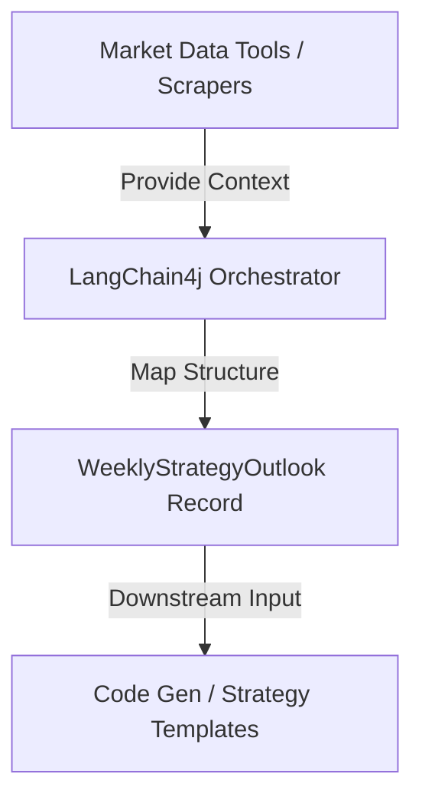
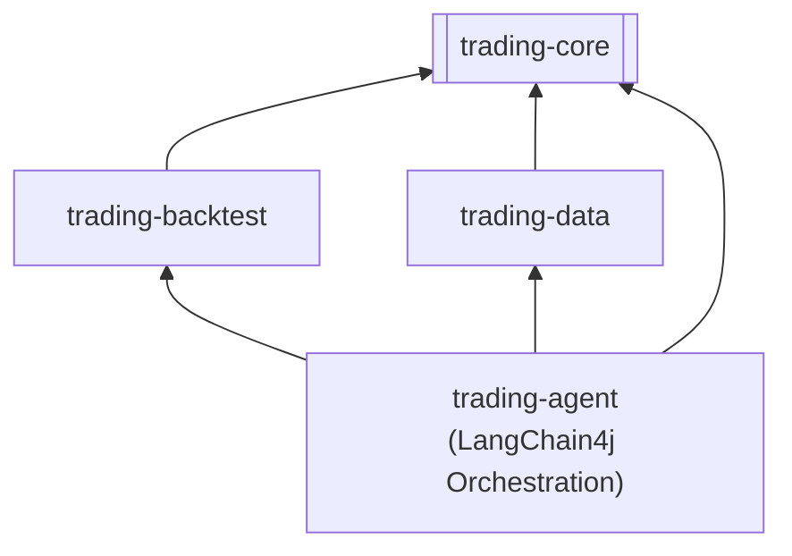

# Product Requirement Document (PRD) - Agentic Market Strategist (Orchestration Layer)

## 1. Executive Summary & Objective

### 1.1 Purpose
The purpose of this document is to specify the architectural, technical, and functional requirements for a Java-based Agentic Market Strategist utilizing the LangChain4j framework within the **Trading Bridge** platform.

This system acts as an intelligence and orchestration layer. It automatically ingests, scrapes, and parses macroeconomic, sentiment, and historical seasonality data, feeds this context to a High-Reasoning Large Language Model (LLM), and returns a highly deterministic, structured JSON object mapped directly to native Java record architectures.

### 1.2 Target Integration
The resulting `WeeklyStrategyOutlook` DTO will be fed directly into downstream code generation or templating tools to instantiate live executable strategies within the `trading-strategies` module. This system treats the LLM as a systematic risk officer rather than a speculative execution engine.



---

## 2. System Architecture & Project Alignment

### 2.1 Module Layout & Tech Stack
To respect the acyclic dependency structure of Trading Bridge, the orchestrator and its models must be placed correctly:
* **`trading-agent` (New Module) [ASSUMPTION]:** A new module will be created to house the LangChain4j engine, prompt blueprints, and the orchestration service.
* **Dependencies:** `langchain4j-core`, `langchain4j-open-ai` (or configured model provider). Jackson will be used for internal JSON validations. No Spring or Lombok will be introduced.
* **Java Version:** Java 21+ using modern record semantics and pattern matching.



---

## 3. Data Ingestion & Tool Specifications (`@Tool`)

The LLM must interact with the Trading Bridge ecosystem through three modular tool implementations. Timestamps returned by tools must be normalized to **UTC `Instant`**.

### 3.1 Tool 1: Macroeconomic Calendar Engine
* **Method Signature:** `List<CalendarEvent> fetchEconomicCalendar(Instant start, Instant end)`
* **Project Alignment [ASSUMPTION]:** This tool will wrap our existing `com.martinfou.trading.data.EconomicCalendar` component. It will query the weekly timeline and filter for high-impact events.
* **Payload Constraints:** Filters out low-impact events. Returns only: Currency, Event Name, Forecast, Previous, and Impact Level.

### 3.2 Tool 2: Sentiment Aggregator
* **Method Signature:** `SentimentData fetchMarketSentiment(String asset)`
* **Description:** Extracts retail positioning metrics (e.g., long/short ratios) and news streams.
* **Payload Constraints:** Translates arbitrary sentiment strings into a bounded score between `-1.0` (Extreme Bearish) and `+1.0` (Extreme Bullish), along with a retail ratio string (e.g., `"72% Short / 28% Long"`).

### 3.3 Tool 3: Seasonality Matrix Warehouse
* **Method Signature:** `SeasonalityData fetchWeeklySeasonality(String asset, int weekOfYear)`
* **Description:** Queries historical performance metrics for a specific calendar week over a multi-decade timeframe.
* **Payload Constraints:** Returns historical base win-rate percentages, directional biases, and average pip generation profiles.

---

## 4. Quantitative Analysis System Prompt Blueprint

The system prompt will be injected directly into LangChain4j’s `@SystemMessage` annotation.

```
## ROLE DEFINITION
You are a Lead Quantitative Risk Officer and Algorithmic Trading Strategist running inside an institutional execution pipeline. Your explicit task is to evaluate incoming structural market data via your exposed tools, cross-examine statistical convergence profiles, and output a highly precise, bounded execution outlook.

## CORE LOGICAL CONSTRAINTS

1. MARKET REGIME CLASSIFICATION
Categorize the upcoming asset environment into one of the following regimes:
- HIGH_VOL_TREND: Strong structural directional momentum backed by sentiment.
- LOW_VOL_CONSOLIDATION: Tight contracting boundaries, compression parameters.
- MEAN_REVERSION: Ranging profile with clearly defined technical barriers.
- HIGH_RISK_EVENT_LOCK: Heavy high-impact red-folder data concentration (e.g., FOMC, NFP, CPI) where immediate order execution must be buffered or suspended due to low liquidity.

2. SYSTEMATIC VECTOR CONVERGENCE (THE PROBABILITY MATRIX)
- HIGH CONVERGENCE: Seasonality base-rate aligns with live sentiment, and no high-impact macro data events interfere. Set ComfortLevel to HIGH.
- STRATEGIC DIVERGENCE (VETO RULE): If immediate News Sentiment contradicts multi-decade Seasonality, the immediate real-time Sentiment vector carries a 2.5x weight multiplier. Live structural shifts override historical seasonal tendencies. Downgrade ComfortLevel to LOW or MEDIUM and shift order entries to deep support boundaries.
- PROBABILITY ASSIGNMENT: Calculate `probabilityPercentage` strictly based on historical seasonality base-rates, down-adjusted by 5% to 15% for every point of data divergence or calendar friction identified. Default to 50.0% if data is inconclusive.

3. RISK ENFORCEMENT & PRESERVATION BOUNDARIES
- All tactical entry conditions must detail strict `invalidationPips` markers.
- If an asset is entering a high-impact event window, entry zones must be buffered to capture post-release exhaustion phases.

4. ALPHA INVALIDATION KILL-SWITCH
Define a deterministic event, macro pivot, or structural change that invalidates the underlying strategy alpha before a hard price stop is hit.

## RESPONSE STYLE
Output your strategy conclusions mapped to the JSON schema. No markdown wrapping.
```

---

## 5. Structured Data Schema Spec (Target Records)

All target schema structures must use **Java 21 Records** with accessor methods matching Trading Bridge guidelines (concise, no `get` prefix).

```java
package com.martinfou.trading.agent.model;

import java.util.List;

public record WeeklyStrategyOutlook(
    String targetAsset,
    MarketDirection bias,                 // BULLISH, BEARISH, NEUTRAL
    MarketRegime identifiedRegime,        // HIGH_VOL_TREND, LOW_VOL_CONSOLIDATION, MEAN_REVERSION, HIGH_RISK_EVENT_LOCK
    ComfortLevel comfortLevel,             // HIGH, MEDIUM, LOW
    double probabilityPercentage,          // Hard metric: 0.0 to 100.0
    String strategyRationale,              // Analytical breakdown of data intersection
    List<TradeTriggerCondition> setups,    // Concrete array to parse into find/replace templates
    RiskFactors riskFactors,               // Threat signatures and divergence states
    String alphaKillSwitchCondition        // Explicit event parameter that triggers strategy teardown
) {}

public enum MarketDirection { BULLISH, BEARISH, NEUTRAL }
public enum MarketRegime { HIGH_VOL_TREND, LOW_VOL_CONSOLIDATION, MEAN_REVERSION, HIGH_RISK_EVENT_LOCK }
public enum ComfortLevel { HIGH, MEDIUM, LOW }

public enum TriggerType { BUY_LIMIT, SELL_LIMIT, BUY_STOP, SELL_STOP, MARKET }

public record TradeTriggerCondition(
    String setupName,
    TriggerType executionTriggerType,      // e.g., BUY_LIMIT, SELL_STOP
    double targetedPriceZone,
    int invalidationPips,                  // Structural stop loss distance
    String executionContextRules           // Specific rule constraint for the template parser
) {}

public record RiskFactors(
    boolean macroEventConflict,
    boolean sentimentDivergence,
    String coreFrictionDetails
) {}
```

---

## 6. Functional & Runtime Requirements

### 6.1 Deterministic LLM Hardening
* The LLM configuration must set `temperature(0.0)` for predictable structure mapping and analytical consistency.

### 6.2 Token Context, Tool Loops, and Caching
* LangChain4j orchestrator must support sequential ReAct tool executions before building the final structured mapping DTO.
* **Backtesting & Rate Limits:** To prevent latency destruction and excessive API costs during backtests, the agentic layer must strictly operate offline (e.g., asynchronous strategy template generation over weekends) rather than per-tick real-time execution. In scenarios where historical AI simulation is required, explicit LLM response caching or mock responses must be employed to bypass live provider API calls.

### 6.3 Validation & Fallbacks [ASSUMPTION]
* If the LLM output violates constraints (e.g. invalid enums or formatting errors), the orchestrator must catch the parse exception and default the output to a safe fallback bypass state (`NEUTRAL` bias, `HIGH_RISK_EVENT_LOCK` or `LOW_VOL_CONSOLIDATION` regime, `LOW` comfort level, and empty trade setups).
