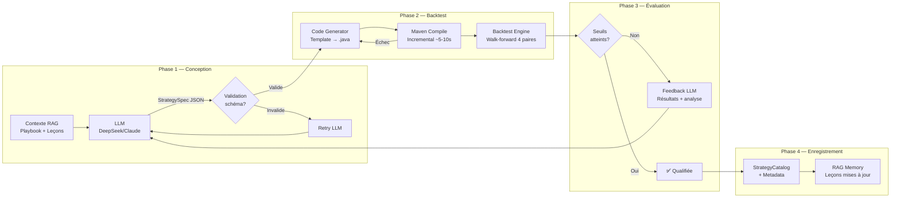
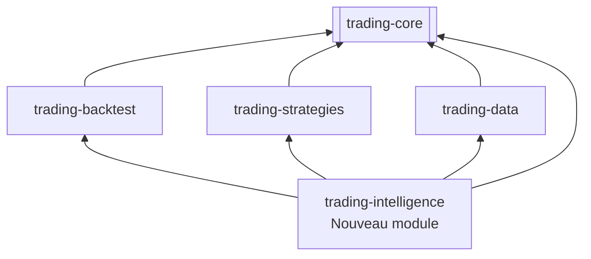

# PRD — Unified Strategy Engine

> **Objectif :** Unifier les 3 workflows de génération de stratégies (Long Terme, Prop Shop, News Weekly) sous un seul moteur orchestré par LLM (LangChain4j) avec feedback loop automatique, catalog queryable, et profils de validation paramétrables.

---

## 1. Executive Summary

### 1.1 Problème

Actuellement, la génération de stratégies dans Trading Bridge souffre de **3 silos parallèles** :

| Workflow | Skill | Cron | Format de validation | Statut |
|----------|-------|------|---------------------|--------|
| **Long Terme** (LT) | `long-term-strategies` | Paused | Walk-forward 15+ ans, 4 paires, 10 stratégies livrées | ✅ Riche mais manuel |
| **Prop Shop** (hebdo) | `weekly-forex-prop-shop` | Paused | Scoring 15pts, soft signals, HMM, COT | 🟡 Complexe, peu automatisé |
| **News Weekly** | `forex-news-trading` | Paused | Événements calendrier, 1 semaine | 🔴 Manuel, dates hardcodées |

Ces 3 workflows partagent pourtant :
- Le même moteur de backtest (`BacktestEngine`)
- Les mêmes données (H1, 9 paires, 2006-2026)
- Les mêmes indicateurs (Indicators.java)
- Les mêmes contraintes (closeOnly, calcRiskPosition, ATR SL/TP)

Mais ils ne **partagent pas** :
- Les leçons apprises (section 1.3 du playbook n'alimente pas la génération prop shop)
- Le catalog (StrategyCatalog ne distingue pas LT vs prop vs news)
- La validation (walk-forward pour LT, scoring pour prop shop — critères différents, pas de passerelle)

Par ailleurs, la **Section 10 du LT Strategy Playbook** (génération LLM via LangChain4j) et le **PRD Agentic Strategist** (2026-06-06) décrivent l'architecture mais **0 ligne de code n'a été implémentée**.

### 1.2 Vision

Un **Unified Strategy Engine** qui :

1. **Génère** des concepts de stratégie via LLM (DeepSeek/Claude orchestré par LangChain4j)
2. **Compile et backteste** automatiquement (walk-forward multi-paire)
3. **Itère** avec feedback loop (le LLM reçoit les résultats et s'améliore)
4. **Qualifie** selon le profil (LT / Prop / News) avec des gates paramétrables
5. **Enregistre** dans un StrategyCatalog unifié avec métadonnées de performance
6. **Documente** les leçons dans le RAG context pour les générations futures

### 1.3 Métriques de succès

| Métrique | Cible | Comment |
|----------|-------|---------|
| Stratégies générées/run | ≥ 3 concepts testés | Pipeline LLM 5 itérations max |
| Taux de qualification | ≥ 20% des concepts | Mesuré sur 10 runs |
| Temps total pipeline | < 10 min | Compilation locale (Maven) + backtest 4 paires |
| Feedback loop | Automatique | Leçons injectées dans le contexte du LLM |
| Catalog unifié | 1 source de vérité | Queryable par PF, Sharpe, catégorie |

---

## 2. Analyse d'Impact

### 2.1 Modules impactés

| Module | Impact | Changement |
|--------|--------|------------|
| `trading-intelligence` (nouveau) | **CRÉATION** | Module LangChain4j : LLM orchestration, StrategySpec, feedback loop |
| `trading-core` | Changement mineur | Ajout de `StrategyProfile` enum, `StrategyMetadata` record |
| `trading-strategies` | Changement mineur | `StrategyCatalog` enrichi avec métadonnées |
| `trading-backtest` | Aucun | Réutilise le moteur existant |
| `trading-examples` | Changement mineur | Runner CLI pour le pipeline |
| `docs/` | Mise à jour | Section 10 du playbook → implémentée |

### 2.2 Prérequis techniques

- **LangChain4j** (`dev.langchain4j:langchain4j:1.0.0-beta2`) — nouvelle dépendance Maven
- **DeepSeek API** ou **Claude API** — clé existante (DEEPSEEK_API_KEY dans .env)
- **Java 26 + Maven 3.9.16** via mise (existant — `/home/martinfou/.local/share/mise/installs/`)
- **BarStore H1** 2006-2026 (existant)

---

## 3. User Stories

| # | As a... | I want to... | So that... | Priorité |
|---|---------|-------------|------------|:--------:|
| US-1 | Trader | Lancer la génération autonome de stratégies LT via CLI | J'obtiens N concepts testés sans intervention manuelle | P0 |
| US-2 | Trader | Voir les résultats de chaque itération (concept → backtest → verdict) | Je comprends ce qui a été testé et pourquoi | P0 |
| US-3 | Développeur | Configurer le profil de validation (LT strict / Prop scoring / News week) | Le même moteur sert les 3 workflows | P0 |
| US-4 | Trader | Que les échecs alimentent automatiquement les runs suivants | Le LLM ne répète pas les erreurs documentées | P1 |
| US-5 | Trader | Chercher dans le catalog par PF, Sharpe, drawdown, catégorie | Je retrouve une stratégie sans fouiller git | P1 |
| US-6 | Développeur | Ajouter un nouveau type de stratégie sans toucher au pipeline | Le moteur est extensible par configuration | P2 |
| US-7 | Trader | Relancer la génération hebdo (prop shop) via le même moteur | Un seul cron remplace les 3 existants | P2 |

---

## 4. Architecture

### 4.1 Pipeline de Génération



### 4.2 Module Layout



### 4.3 Data Model

```java
// trading-core — Shared records

public enum StrategyProfile {
    LONG_TERM,      // Walk-forward 15+ ans, 4 paires, PF > 1.05 OOS
    PROP_SHOP,      // Scoring 15pts, scrutin soft signals + HMM
    NEWS_WEEKLY,    // Événement calendrier, 1 semaine, SL large
}

public record StrategyMetadata(
    String name,
    StrategyProfile profile,
    String category,           // TREND_FOLLOWING, MEAN_REVERSION, MOMENTUM...
    List<String> indicators,   // ["SMA", "ATR", "RSI"]
    String inspiration,        // Source / papier de recherche
    int pairCount,             // Paires qualifiées
    double avgPf,
    double avgSharpe,
    double maxDd,
    double avgWinRate,
    int totalTrades,
    Instant createdAt
) {}

// trading-intelligence — Pipeline records

public record StrategySpec(
    String name,
    String inspiration,
    String description,
    StrategyProfile profile,
    String category,
    List<String> indicators,
    int fastPeriod,
    int slowPeriod,
    int rsiPeriod,
    int atrPeriod,
    double slMultiplier,
    double tpMultiplier,
    double entryThreshold,
    EntryCondition longEntry,
    EntryCondition shortEntry,
    ExitCondition exitCondition,
    int maxHoldBars
) {}

public record PipelineResult(
    StrategySpec spec,
    boolean qualified,
    Map<String, BacktestMetrics> perPairResults,  // pair → metrics
    String failureReason,
    List<String> lessonsLearned,
    long durationMs
) {}
```

### 4.4 Profils de Validation

| Critère | LONG_TERM | PROP_SHOP | NEWS_WEEKLY |
|---------|:---------:|:---------:|:-----------:|
| Période | 2010-2025 | 2019-2025 | Semaine courante |
| Paires | ≥ 2/4 | ≥ 2/9 | 1 paire cible |
| PF FULL | ≥ 1.05 | ≥ 1.3 | N/A (pas de backtest) |
| PF OOS1 | ≥ 1.0 | ≥ 1.1 | N/A |
| PF OOS2 | ≥ 1.0 | N/A | N/A |
| Sharpe FULL | ≥ 0.5 | ≥ 0.8 | N/A |
| DD max | < 20% | < 15% | SL fixe |
| WR | > 35% | > 40% | N/A |
| Trades min | 100 | 50 | — |
| Walk-forward | ✅ OUI | IS/OOS 70/30 | ❌ |
| Soft signals | ❌ optionnel | ✅ REQUIS | ❌ |
| Scoring 15pts | ❌ | ✅ OUI | ❌ |
| Événement macro | ❌ | ❌ | ✅ REQUIS |

### 4.5 Feedback Loop (RAG)

Le contexte LLM est enrichi automatiquement à chaque run :

1. **Au départ** : Playbook sections 1-9, section 1.3 (leçons), catalog des stratégies existantes
2. **Après chaque itération** : Résultat backtest + analyse d'échec → ajouté au contexte
3. **Entre runs hebdo** : Leçons de la semaine écoulée → persistées dans `data/experience-store/`

Ce mécanisme évite que le LLM propose des concepts déjà testés et échoués.

### 4.6 Coûts LLM estimés

| Opération | Tokens estimés (input) | Tokens estimés (output) | Coût DeepSeek (~$0.14/M in, $0.42/M out) |
|-----------|:---------------------:|:----------------------:|:----------------------------------------:|
| Génération concept | 4K | 1K | ~$0.001 |
| Feedback + itération | 6K | 0.5K | ~$0.001 |
| 5 itérations | ~30K | ~5K | **~$0.006** |
| 10 runs/semaine | ~300K | ~50K | **~$0.06/semaine** |

Le coût est négligeable (~$0.25/mois) — pas de justification pour un modèle local.

---

## 5. Décisions d'Architecture

| Décision | Choix | Alternatives | Raison |
|----------|-------|-------------|--------|
| Framework LLM | LangChain4j | Spring AI, Custom Java | Pas de Spring, structured output natif, tool calling, poids ~2MB |
| Module | `trading-intelligence` (nouveau) | Ajouter à `trading-core` | Préserve graphe acyclique, isolation des dépendances LLM |
| Modèle LLM | DeepSeek (via OpenAI-compatible) | Claude, Ollama local | Déjà utilisé (HttpDeepSeekClient), coût négligeable, rapide |
| Code generation | Template Java → compile | LLM génère le .java complet | Template = structure garantie, LLM décide paramètres + logique |
| Stockage leçons | Fichier JSON `data/experience-store/` | SQLite, RAG DB | Simple, versionnable, lisible |
| Compilation | Maven local (Java 26, Maven 3.9.16 via mise) | Docker Maven | Pas de overhead Docker, compile incrémental ~5-10s vs 30-60s container |
| Catalog query | Enrichir StrategyCatalog | Nouveau module catalog | StrategyCatalog est déjà le point d'entrée unique |

---

## 6. Open Questions

1. **Modèle LLM** — DeepSeek actuel suffit ou on veut Claude pour la partie conception créative (plus cher, meilleur) ? Coûte ~$0.01/session de plus — négligeable.
2. **Code generation** — Template Java avec holes (paramètres) ou LLM génère la classe complète ? Template = plus sûr mais moins flexible. LLM complet = plus de puissance mais risque de code invalide.
3. **Feedback loop** — Quelle profondeur de RAG ? Garder les 5 derniers échecs seulement ou tout l'historique ?
4. **Schedule** — Un cron hebdomadaire le dimanche (après analyse prop shop) ou quotidien ?
5. **Priorité** — Commencer par le pipeline LT (le plus standardisé) ou Prop Shop (le plus complexe, donc le plus de valeur à automatiser) ?

---

## 7. Phasage Recommandé

### Phase 1 — Foundation (Semaine 1-2)
- Créer module `trading-intelligence` avec dépendance LangChain4j
- Implémenter `StrategySpec` + `StrategyProfile` dans `trading-core`
- Pipeline minimal : LLM → Template → Compile → Backtest → Résultat
- Profil LONG_TERM uniquement

### Phase 2 — Feedback Loop (Semaine 3)
- Implémenter la boucle d'itération (max 5 tentatives)
- Stockage des leçons dans `data/experience-store/`
- Injection RAG du playbook dans le contexte

### Phase 3 — Multi-Profil (Semaine 4)
- Ajouter profil PROP_SHOP (scoring 15pts, soft signals)
- Ajouter profil NEWS_WEEKLY (événement calendrier)
- Catalog unifié avec métadonnées queryables

### Phase 4 — Production (Semaine 5)
- Cron hebdomadaire remplaçant les 3 crons existants
- Dashboard hermes-web pour visualiser les résultats
- Documentation (mise à jour du playbook)

---

## 8. Risques & Mitigations

| Risque | Probabilité | Impact | Mitigation |
|--------|:----------:|:------:|------------|
| LLM produit du code non compilable | Haute | Moyen | Template garantit la structure ; 3 retry max par spec |
| Coût LLM explose en boucle infinie | Basse | Faible | Max 5 itérations, timeout 40s, budget $0.50/run |
| Overfitting par feedback loop | Moyenne | Moyen | Le RAG injecte les échecs, pas les succès — évite le biais de confirmation |
| Pipeline trop lent (>15 min) | Basse | Faible | Compilation locale ~5-10s (incrémental) ; backtests parallélisables par paire (4 threads) |
| Stratégies générées trop similaires | Basse | Faible | Le LLM reçoit le catalog complet + instruction explicite de diversité |

---

## 9. Dépendances

| Dépendance | Disponible ? | Note |
|-----------|:----------:|------|
| `trading-intelligence` module | ❌ À créer | Nouveau module Maven |
| `langchain4j-core:1.0.0-beta2` | ❌ À ajouter | Dépendance Maven |
| `langchain4j-open-ai` | ❌ À ajouter | Compatible DeepSeek API |
| Java 26 + Maven 3.9.16 (via mise) | ✅ Existant | Java 26 compile le projet (target 21) ; `mvn compile -pl trading-strategies -am -q` |
| BacktestEngine | ✅ Existant | Walk-forward multi-paire |
| BarStore H1 2006-2026 | ✅ Existant | Dukascopy data |
| StrategySpec Java template | ❌ À créer | Template Velocity ou concaténation |
| DeepSeek API key | ✅ Existant | `DEEPSEEK_API_KEY` dans .env |
