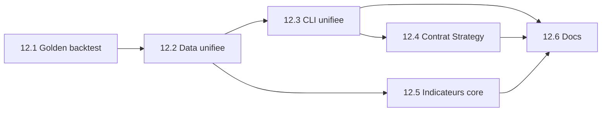

# Sprint 12 — Consolidation de la plateforme

> Martin Fournier — Mai 2026  
> Epic BMAD: **Epic 12 — Platform Consolidation**  
> Commit de reference: `ee871f5` (snapshot avant consolidation)

## Objectif du sprint

Unifier les surfaces dupliquées du depot (données, CLI backtest, contrat Strategy, indicateurs, docs) pour que l'ajout de nouvelles strategies et l'Epic 10 (données historiques) reposent sur une base cohérente.

## Probleme actuel

| Domaine | Etat actuel | Cible |
|---------|-------------|-------|
| Chargeurs | `DataLoader`, `BarStore`, `HistoricalDataLoader`, CSV ad hoc dans `BatchStrategyRunner` | `HistoricalDataLoader` seul |
| CLI backtest | `RunBacktest`, `RunSqBacktest`, `RunPropBacktest`, `BatchStrategyRunner` | `RunBacktest` + `StrategyCatalog` |
| Strategies | `sqimported/`, `prop/`, `generated/`, `batch-results/` (non compile) | Politique documentée + contrat `getPendingOrders()` |
| Indicateurs | `PropIndicators`, code genere parser | `trading-core` partagé |
| Docs | `AGENTS.md`, `docs/` desynchronises | Architecture + commandes a jour |

## Stories et ordre d'execution



| Story | Titre | Priorite | Estimation | Dependances |
|-------|-------|----------|------------|-------------|
| 12.1 | Golden backtest & build stable | P0 | 0.5 j | — |
| 12.2 | Chargement historique unifie | P0 | 1 j | 12.1 |
| 12.3 | CLI & StrategyCatalog | P0 | 1 j | 12.2 |
| 12.4 | Contrat Strategy & emplacements | P1 | 1.5 j | 12.3 |
| 12.5 | Indicateurs partages trading-core | P1 | 1 j | 12.2 |
| 12.6 | Docs architecture & AGENTS.md | P1 | 0.5 j | 12.3, 12.4, 12.5 |

**Duree estimee:** 5–6 jours de dev focalise.

## Definition of Done (sprint)

- [ ] `mvn clean install` vert sur master
- [ ] Test golden backtest verifie bar count + PnL de reference
- [ ] Une seule commande documentee pour backtester toute strategie
- [ ] Aucun runner ne charge CSV sans passer par `HistoricalDataLoader`
- [ ] Violations `getPendingOrders()` corrigees ou adaptees
- [ ] `docs/architecture.md` et `AGENTS.md` alignes

## Hors scope (Epic futur)

- Frontiere live/backtest (Epic 4)
- Parser comme unique codegen (Epic 2)
- Telechargement 20 ans complet (Epic 10 — peut avancer en parallele apres 12.2)

## Premiere tache recommandee

**Story 12.1** — Creer un test d'integration golden avec baseline enregistree:

```bash
# Commande de reference (prop, EUR_USD 2012)
mvn exec:java -pl trading-examples \
  -Dexec.mainClass="com.martinfou.trading.examples.RunPropBacktest" \
  -Dexec.args="LondonOpenRangeBreakout EUR_USD 2012"
# Attendu: ~8760 bars, ~63 trades, PnL positif connu
```

Ensuite: `bmad dev this story _bmad-output/implementation-artifacts/12-1-golden-backtest-stabilization.md`

## Risques

| Risque | Mitigation |
|--------|------------|
| Regression PnL lors migration indicateurs | Golden test + tolerance stricte |
| `.bars` millis vs secondes | Story 12.2 corrige write + read ensemble |
| Volume sqimported pour getPendingOrders | Adapter generique si fix manuel trop long |
