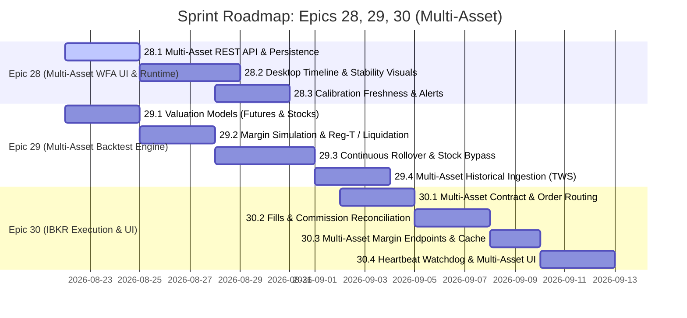

# Sprint Plan: Epics 28, 29, and 30 (Multi-Asset: Forex, Futures & Equities)

**Date:** 2026-08-22  
**Scope:** 
- **Epic 28:** WFA Runtime & UI (Multi-Asset Walk-Forward Analysis, Timeline Visualization, Persistence & Calibration Freshness)
- **Epic 29:** Multi-Asset Backtest Engine & Risk Simulation (Futures: MES, M2K Russell 2000 Small Cap, EMD S&P MidCap 400, MNQ Nasdaq + US Equities `STK`)
- **Epic 30:** IBKR Multi-Asset Live/Paper Execution & Real-Time Dashboard (CME Futures & US Equities SMART Routing)

---

## 🎯 Sprint Objectives & Delivery Goals

1. **Multi-Asset WFA Operations & Observability (Epic 28):**
   - Provide async background execution and REST APIs for Walk-Forward Analysis across all asset classes (`WfaManager`).
   - Deliver Vue 3 interactive visual timeline (`WfaTimeline.vue`) and parameter stability heatmap (`WfaParameterStability.vue`) with asset class badges (Forex, Futures, Equities).
   - Implement real-time calibration freshness tracking (`@CalibrationPolicy` evaluation in `ControlSummaryService` with 🔋/🔔/⚠️ alerts).

2. **Futures & Equities Modeling & Simulation (Epic 29):**
   - Implement `AssetValuationModel` supporting:
     - `FuturesValuationModel` with point multipliers ($5/pt for `MES`, $5/pt for `M2K` Small Cap, $100/pt for `EMD` Mid Cap, $2/pt for `MNQ` Nasdaq) and discrete contract sizing ($\ge 1$).
     - `StockValuationModel` for US Equities (1.0 multiplier $\times$ discrete share quantities $\ge 1$).
     - `ForexValuationModel` preserving existing 0.0 Forex delta.
   - Simulate Initial & Maintenance margin requirements (Futures) and Reg-T 50%/25% margin with PDT rules (Equities) and forced liquidation logic.
   - Assemble continuous contract price series and execute automated contract rollovers at T-10 for Futures, with bypass for non-expiring Equities.
   - Implement multi-asset historical candle downloader via IBKR TWS API (`FUT` on CME and `STK` on SMART).

3. **IBKR Multi-Asset Execution & Margin Dashboard (Epic 30):**
   - Resolve CME FUT contracts (`MES`, `M2K`, `EMD`, `MNQ`) and US Stock contracts (`STK` on SMART) and submit MARKET orders via `IbkrBroker`.
   - Implement double-barrier commission reconciliation with 500ms timeout fallback for both flat contract fees and per-share equity fees.
   - Stream multi-asset account summary (`netLiquidation`, `initMarginReq`, `maintMarginReq`, `freeMargin`, `buyingPower`, `regTMargin`, `pdtStatus`) to Vue 3 Live Room.
   - Build heartbeat watchdog with automated `reqCurrentTime()` liveness probes, UI multi-asset category selector, and safety lockouts.

---

## 📋 Epic & Story Execution Roadmap

---

## 🔬 Detailed Story Breakdown

### **Epic 28: WFA Runtime & UI**
| Story | Title | Status | Primary Modules | Key Deliverables |
| :--- | :--- | :---: | :--- | :--- |
| **28.1** | Endpoints REST API & Persistance (Multi-Actifs) | `ready-for-dev` | `trading-runtime` | `WfaManager`, `wfa_runs` SQLite schema with `asset_class`, `POST/GET /api/runs/walk-forward` |
| **28.2** | Interface Graphique Desktop (Timeline & Stabilité) | `backlog` | `desktop/` | `WfaTimeline.vue`, `WfaParameterStability.vue`, Multi-Asset badges (Forex, Futures, Equities) |
| **28.3** | Suivi de la fraîcheur de calibration & Alertes | `backlog` | `trading-runtime`, `trading-tui`, `desktop/` | `@CalibrationPolicy` evaluator in `ControlSummaryService`, 🔋/🔔/⚠️ badges |

### **Epic 29: Multi-Asset Backtest Engine & Risk Simulation**
| Story | Title | Status | Primary Modules | Key Deliverables |
| :--- | :--- | :---: | :--- | :--- |
| **29.1** | Refactoring de valorisation d'actifs & Multiplicateurs (MES, M2K, EMD, Actions) | `backlog` | `trading-core`, `trading-backtest` | `futures-contracts.json`, `FuturesValuationModel`, `StockValuationModel`, 0.0 Forex delta |
| **29.2** | Simulation des marges et Liquidation forcée (Futures & Reg-T) | `backlog` | `trading-core`, `trading-backtest` | `MarginTracker`, Futures margins (+5% buffer), Reg-T 50%/25%, forced market liquidation |
| **29.3** | Série de prix continue, Rollover CME & Bypass Actions | `backlog` | `trading-data`, `trading-backtest` | `FuturesContinuousSeriesBuilder` (MES, M2K, EMD, MNQ), T-10 transition, `AssetClass.EQUITY` bypass |
| **29.4** | Ingesteur de données historiques via TWS API (Futures & Actions) | `backlog` | `trading-data` | `IbkrHistoricalDataLoader` (FUT on CME, STK on SMART), 500ms pacing delay |

### **Epic 30: IBKR Multi-Asset Execution & Real-Time Dashboard**
| Story | Title | Status | Primary Modules | Key Deliverables |
| :--- | :--- | :---: | :--- | :--- |
| **30.1** | Résolution de contrat & Ordres Multi-Actifs (FUT CME & STK US) | `backlog` | `trading-broker` | `IbkrContractResolver` (CME & SMART), `MockTcpGatewayServer`, non-blocking submission |
| **30.2** | Interception des Fills & Réconciliation commissions | `backlog` | `trading-broker` | `IbkrTransactionRegistry`, 500ms double-barrier bidirectional matching for Futures & Equities |
| **30.3** | Résumé de compte & Métriques de marge Multi-Actifs (REST) | `backlog` | `trading-runtime`, `trading-broker` | `IbkrAccountCache`, `/api/brokers/{brokerId}/account-summary` (NetLiquidation, Reg-T, Buying Power) |
| **30.4** | Heartbeat Watchdog, Sélecteur d'Actifs & Notifications WebSocket | `backlog` | `trading-broker`, `desktop/` | Multi-Asset selector in Live Room, Liveness probe timer, UI connection status badges & lockouts |

---

## 🛡️ Non-Regression & Quality Assurance
- **Strict Invariants:** Forex PnL delta remains $0.00$ (`GoldenBacktestTest`).
- **Offline CI Testability:** `MockTcpGatewayServer` handles both `FUT` and `STK` simulations without live TWS.
- **Contract & Share Integrity:** Discrete integer sizing enforced for Futures ($\ge 1$ contract) and Equities ($\ge 1$ share).
