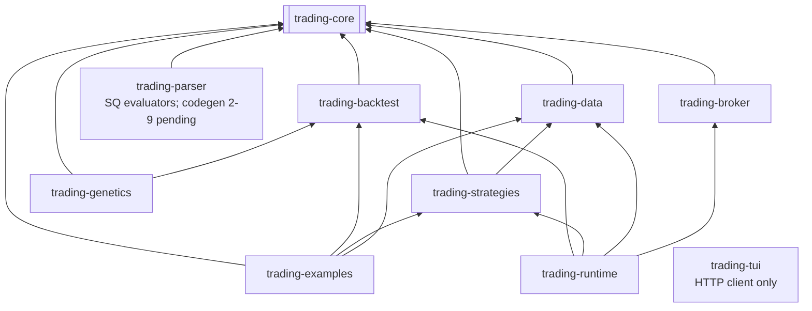

---

## project_name: trading-bridge
user_name: Martinfou
date: '2026-05-17'
sections_completed:
  - technology_stack
  - language_rules
  - framework_rules
  - testing_rules
  - quality_rules
  - workflow_rules
  - anti_patterns
status: complete
rule_count: 42
optimized_for_llm: true

# Project Context for AI Agents

*This file contains critical rules and patterns that AI agents must follow when implementing code in this project. Focus on unobvious details that agents might otherwise miss.*

---

## Project Summary

**Trading Bridge** converts StrategyQuant / JForex strategies to pure Java, with backtesting, a platform runtime (control plane), and broker connectors (OANDA, IBKR). Maven monorepo, Java 21.

**Active epics (2026-05):** Epic 12 / 13 **done**. Epic 2 parser: **2-1**–**2-9** implemented in `trading-parser` ; **2-10** UTC migration in progress/review. See `docs/sq-xml-format.md` §6.

---

## Technology Stack & Versions

| Component            | Version / choice                                                             |
| -------------------- | ---------------------------------------------------------------------------- |
| Java                 | 21 (`maven.compiler.source/target`)                                          |
| Build                | Maven 4.x multi-module, `1.0.0-SNAPSHOT`                                     |
| JUnit                | 5.11.0 (test scope, parent BOM)                                              |
| Jackson              | 2.17.2 (`jackson-databind`, `jackson-dataformat-yaml` in parent)             |
| SLF4J                | 2.0.16 (`slf4j-api`; `slf4j-simple` in `trading-strategies` only)            |
| Javaluator           | 3.0.3 (parent BOM, not yet used in source)                                   |
| HTTP (live data)     | `java.net.http.HttpClient` in `trading-data`                                 |
| Dashboard (adjacent) | Python `dashboard/oanda_server.py` + static HTML — not part of Maven reactor |

**Module dependency graph (respect this):** same Mermaid as `AGENTS.md` § Module layout.

---

## Critical Implementation Rules

### Language-Specific Rules (Java)

- **Package root:** `com.martinfou.trading.<module>` — e.g. `com.martinfou.trading.core`, `com.martinfou.trading.backtest`.
- **Domain model style:** Plain classes with **accessor methods** (`symbol()`, `close()`), not JavaBeans (`getSymbol()`). Enums nested in domain types (`Order.Side`, `Order.Type`, `Order.Status`).
- **Records:** Use for small DTOs in integration code (e.g. `OandaPriceClient.Price`); keep core domain (`Bar`, `Order`, `Trade`, `Position`) as classes unless refactoring explicitly requested.
- **Time (canonical):** **UTC everywhere internally** — `Instant` on `Bar`, `Order`, `Trade` and at API/CSV/calendar boundaries; serialize as ISO-8601 with `Z`. Display only: `America/Toronto` via `TimeConventions`. See `docs/specs.md` §2.5. Never use `LocalDateTime.now()` for trading logic.
- **OANDA:** API timestamps are UTC; parse to `Instant`, not naive `LocalDateTime`.
- **Internal module deps:** Always `${project.version}` on `com.martinfou.trading:*` artifacts in child POMs.
- **No Lombok, no Spring** in current codebase — do not introduce without an explicit sprint/architecture decision.
- **Logging:** `org.slf4j` only; use `LoggerFactory.getLogger(Class)`. Bind `slf4j-simple` only in runnable modules that need console output.

### Framework / Domain Rules (Trading Bridge)

- `**Strategy` contract** (`trading-core`): Implement `name()`, `onBar(Bar)`, `onTick(bid, ask, volume)`, `getPendingOrders()`, `reset()`.
- **Order submission pattern:** Strategies queue orders privately; `getPendingOrders()` must **return a copy and clear** the queue. Prefer `StrategyOrderQueues.drainPending()` in `trading-strategies` — see [`docs/strategy-home.md`](../docs/strategy-home.md).
- **Indicators:** Shared bar-based TA in `com.martinfou.trading.core.indicators.Indicators` — do not duplicate SMA/EMA/RSI/ATR in strategies.
- **Backtest fill semantics:** `BacktestEngine` fills `MARKET` at **`bar.open()`** (not close). `LIMIT`/`STOP` use bar high/low; SL/TP on open positions are enforced on subsequent bars.
- **Backtest costs:** Commission and slippage configurable on `BacktestEngine` / `RunContext` via `BacktestExecutionCost`.
- **Data loading:** Prefer `HistoricalDataLoader` (`trading-data`) for unified paths; legacy `DataLoader` in core for CSV. Timestamps → UTC `Instant`.
- **JForex → Java mapping:** Follow `docs/conversion-guide.md` — `IStrategy` → `Strategy`, `IOrder` → `Order`, engine → `BacktestEngine` / future `Broker`.
- **Sprint 2 parser:** All XML parsing and code generation belongs in `**trading-parser`**, depending only on `trading-core`. Generated strategies implement `Strategy` in `trading-examples` or a dedicated package — not in `trading-core`.
- **Live / OANDA:** REST v3 via `OandaPriceClient` in `trading-data`; practice URL `api-fxpractice.oanda.com`. Credentials via env/config files — **never hardcode or commit keys**.

### Testing Rules

- **Framework:** JUnit 5 (`@Test`), tests under `src/test/java` mirroring main package.
- **Existing pattern:** `OandaTest` calls live-ish helpers (`EconomicCalendar.printWeek()`) — prefer unit tests with mocks for new code; mark integration tests clearly if they hit OANDA.
- **Run:** `mvn test` from root or `-pl trading-parser` / `-pl trading-data` for a single module.
- **Parser tests:** `mvn test -pl trading-parser`
- **Before claiming done:** `mvn clean install` must pass for affected modules.

### Code Quality & Style Rules

- **Minimal diffs:** Only change code required by the task; no drive-by refactors or unrelated modules.
- **Match existing code:** Same naming, logging style, and dependency patterns as neighboring classes.
- **Comments:** Sparse — only for non-obvious trading logic or XML format quirks; no verbose JavaDoc on getters.
- **New dependencies:** Add to parent `dependencyManagement` first, then reference in module POM without version.
- **Executable examples:** Use `mvn exec:java -pl trading-examples -Dexec.mainClass=...` (see `docs/README.md`).

### Development Workflow Rules

- **Sprint source of truth:** `_bmad-output/implementation-artifacts/sprint-status.yaml` for epic/story status; `docs/sprint-plan.md` for long-term vision (numbers may differ from BMAD epics).
- **Specs:** `docs/specs.md` for data models, Strategy API, XML shape, broker interface sketches.
- **BMAD artifacts:** Planning/implementation outputs go under `_bmad-output/`; this file is the agent rules anchor.
- **Git:** Do not commit `dashboard/oanda_creds.json`, `.env`, or API tokens. User commits only when asked.
- **Docs language:** Human-facing project docs are often French; **code identifiers and this file are English**.

### Critical Don't-Miss Rules

| Don't                                           | Do instead                                                        |
| ----------------------------------------------- | ----------------------------------------------------------------- |
| Put broker/API code in `trading-core`           | `trading-data` or `trading-broker`                                |
| Implement parser in `trading-examples`          | `trading-parser` module                                           |
| Use `getPendingOrders()` without clearing queue | Copy list, then `pending.clear()`                                 |
| Assume SL/TP on `Order` work in backtest        | Engine enforces SL/TP on bar OHLC when set on entry |
| Assume no commission/slippage                   | Configure via `BacktestExecutionCost` / `RunContext` |
| Add Dukascopy/JForex JAR dependencies           | Pure Java + `Strategy` interface                                  |
| Break module DAG (e.g. core → backtest)         | Keep acyclic: core at bottom                                      |
| Edit `_bmad/config.toml` for prefs              | Use `_bmad/custom/config.toml` (team) or `*.user.toml` (personal) |
| Expand scope to Spring/SQLite dashboard         | Sprint 5 unless user requests                                     |

**Epic 2 parser (implemented vs pending):**

| Area | Package / class | Status |
|------|-----------------|--------|
| XML DOM + POJO | `sq.SqXmlParser`, `config.StrategyConfig` | Done |
| Indicators | `indicators.SqIndicatorRegistry`, core + extended | Done |
| Entry / signal conditions | `conditions.SqConditionEvaluator`, `SqEntryEvaluator`, `SqSignalEvaluator` | Done |
| Exit conditions | `conditions.SqExitEvaluator` | Done |
| Actions / sizing intents | `actions.SqActionParser`, `SqStrategyActionsEvaluator`, `SqOrderIntent` | Done |
| Java codegen from XML | `codegen.SqStrategyCodeGenerator`, `SqInterpretedStrategy` | Done (2-9) |
| Bar-history operators (`IsFalling`, …) | registry gaps | Deferred — see `docs/sq-xml-format.md` §6 |

Until **2-9** ships, bulk migration may use **JForex export + `JForexConverter`**. Runtime evaluation must stay in `trading-parser`, not `trading-examples`.

---

## Key Paths

| Path                                   | Purpose                                     |
| -------------------------------------- | ------------------------------------------- |
| `trading-core/.../core/`               | `Bar`, `Order`, `Strategy`, `DataLoader`, `GoldenBacktestBaseline` |
| `trading-core/.../indicators/`         | `Indicators` (shared TA)                    |
| `trading-backtest/.../backtest/`       | `BacktestEngine`, `RunContext`, `RunEvent`  |
| `trading-runtime/.../runtime/`         | Control plane, promote gates, event store   |
| `trading-strategies/`                  | Prop / sqimported / generated + catalog     |
| `trading-examples/`                    | `RunBacktest`, golden tests                 |
| `trading-data/.../data/`               | OANDA client, `HistoricalDataLoader`        |
| `trading-broker/`                      | OANDA / IBKR connectors                     |
| `trading-tui/`                         | JLine3 control plane client                 |
| `trading-parser/.../sq/`               | `SqXmlParser`, `SqStrategyDocument`       |
| `trading-parser/.../conditions/`       | `SqConditionEvaluator`, entry/exit/signal   |
| `trading-parser/.../actions/`          | `SqStrategyActionsEvaluator`, order intents |
| `trading-parser/.../indicators/`       | `SqIndicatorRegistry`                     |
| `docs/sq-xml-format.md`                | SQ XML ground truth + story sequence        |
| `docs/architecture.md`                 | Module DAG, runtime, parser flow            |
| `docs/contributing.md`                 | Human onboarding (FR)                       |
| `docs/strategy-home.md`                | Strategy placement, order queue contract    |
| `docs/testing.md`                      | Golden backtest, promote gate thresholds    |
| `_bmad-output/`                        | BMAD artifacts, sprint-status.yaml          |

---

## Usage Guidelines

**For AI Agents:**

- Read this file before implementing any code.
- Follow ALL rules exactly; when in doubt, prefer the more restrictive option.
- Cross-check `docs/specs.md` and `docs/conversion-guide.md` for trading semantics.
- Update this file if new patterns become project standard.

**For Humans:**

- Keep lean — agent-focused, not a duplicate of `docs/specs.md`.
- Update when stack or `Strategy`/engine contract changes.
- Review after each sprint completion.

**Last Updated:** 2026-05-31 (Epic 12/13 alignment, architecture doc, backtest capabilities)