# Sprint Status UI Dashboard

**Project:** trading-bridge | **Last Updated:** 2026-06-28T22:27:38Z

## Hero Metrics

- **Overall Completion:** 69.9% `[██████░░░░]`
- **Sprint Health:** [BLOCKED]
- **Story Breakdown:** Done: 160 | Review: 4 | In-Progress: 0 | Ready: 5 | Backlog: 60

### Active Epics Pipeline

```mermaid
flowchart LR
  classDef done fill:#1b5e20,stroke:#81c784,color:#fff
  classDef ip fill:#e65100,stroke:#ffb74d,color:#fff
  epic15["Epic 15<br/>(56%)"]:::ip
  epic16["Epic 16<br/>(71%)"]:::ip
  epic17["Epic 17<br/>(33%)"]:::ip
  epic19["Epic 19<br/>(40%)"]:::ip
  epic22["Epic 22<br/>(75%)"]:::ip
  epic23["Epic 23<br/>(67%)"]:::ip
  epic24["Epic 24<br/>(100%)"]:::ip
  epic25["Epic 25<br/>(62%)"]:::ip
  epic27["Epic 27<br/>(0%)"]:::ip
  epic3["Epic 3<br/>(12%)"]:::ip
  epic39["Epic 39<br/>(0%)"]:::ip
  epic15 --> epic16
  epic16 --> epic17
  epic17 --> epic19
  epic19 --> epic22
  epic22 --> epic23
  epic23 --> epic24
  epic24 --> epic25
  epic25 --> epic27
  epic27 --> epic3
  epic3 --> epic39
```

## Project Widescreen Board

| Roadmap & Epics | Active Stories (Sprint Kanban) |
| :--- | :--- |
| &nbsp;&nbsp;**Epic 1** (done) `[██████████]` 100% 

Show stories (7)
<ul><li>🟢 1-1-maven-monorepo-structure (done)</li><li>🟢 1-2-domain-models (done)</li><li>🟢 1-3-strategy-interface (done)</li><li>🟢 1-4-basic-backtest-engine (done)</li><li>🟢 1-5-csv-data-loader (done)</li><li>🟢 1-6-sma-crossover-example (done)</li><li>🟢 1-7-foundation-documentation (done)</li></ul>
 | **🟡 Review** |
| &nbsp;&nbsp;**Epic 2** (done) `[██████████]` 100% 

Show stories (10)
<ul><li>🟢 [ 2-1-analyze-strategyquant-xml-format ](file:///Volumes/T7/src/trading-bridge/_bmad-output/implementation-artifacts/2-1-analyze-strategyquant-xml-format.md) (done)</li><li>🟢 [ 2-10-utc-timezone-migration ](file:///Volumes/T7/src/trading-bridge/_bmad-output/implementation-artifacts/2-10-utc-timezone-migration.md) (done)</li><li>🟢 [ 2-2-sqxmlparser-implementation ](file:///Volumes/T7/src/trading-bridge/_bmad-output/implementation-artifacts/2-2-sqxmlparser-implementation.md) (done)</li><li>🟢 [ 2-3-strategyconfig-pojo ](file:///Volumes/T7/src/trading-bridge/_bmad-output/implementation-artifacts/2-3-strategyconfig-pojo.md) (done)</li><li>🟢 [ 2-4-core-indicators-sma-ema-rsi ](file:///Volumes/T7/src/trading-bridge/_bmad-output/implementation-artifacts/2-4-core-indicators-sma-ema-rsi.md) (done)</li><li>🟢 [ 2-5-extended-indicators-macd-bollinger-atr ](file:///Volumes/T7/src/trading-bridge/_bmad-output/implementation-artifacts/2-5-extended-indicators-macd-bollinger-atr.md) (done)</li><li>🟢 [ 2-6-entry-conditions ](file:///Volumes/T7/src/trading-bridge/_bmad-output/implementation-artifacts/2-6-entry-conditions.md) (done)</li><li>🟢 [ 2-7-exit-conditions ](file:///Volumes/T7/src/trading-bridge/_bmad-output/implementation-artifacts/2-7-exit-conditions.md) (done)</li><li>🟢 [ 2-8-position-sizing ](file:///Volumes/T7/src/trading-bridge/_bmad-output/implementation-artifacts/2-8-position-sizing.md) (done)</li><li>🟢 [ 2-9-java-code-generator ](file:///Volumes/T7/src/trading-bridge/_bmad-output/implementation-artifacts/2-9-java-code-generator.md) (done)</li></ul>
 | - [ 16-13-watchdog-weekend-close-and-memory-cleanup ](file:///Volumes/T7/src/trading-bridge/_bmad-output/implementation-artifacts/16-13-watchdog-weekend-close-and-memory-cleanup.md) [STALLED] |
| ▶ **Epic 3** (in-progress) `[█░░░░░░░░░]` 12% 

Show stories (8)
<ul><li>🔵 [ 3-1-complete-limit-and-stop-order-simulation ](file:///Volumes/T7/src/trading-bridge/_bmad-output/implementation-artifacts/3-1-complete-limit-and-stop-order-simulation.md) (ready-for-dev)</li><li>🟢 3-2-commission-and-slippage (done)</li><li>🔵 [ 3-3-trade-exit-lifecycle ](file:///Volumes/T7/src/trading-bridge/_bmad-output/implementation-artifacts/3-3-trade-exit-lifecycle.md) (ready-for-dev)</li><li>🔵 [ 3-4-multi-timeframe-support ](file:///Volumes/T7/src/trading-bridge/_bmad-output/implementation-artifacts/3-4-multi-timeframe-support.md) (ready-for-dev)</li><li>⚪ 3-5-risk-management-rules (backlog)</li><li>⚪ 3-6-html-backtest-report (backlog)</li><li>⚪ 3-7-trade-csv-export (backlog)</li><li>⚪ 3-8-advanced-performance-metrics (backlog)</li></ul>
 | - [ 16-14-position-synchronization ](file:///Volumes/T7/src/trading-bridge/_bmad-output/implementation-artifacts/16-14-position-synchronization.md) |
| &nbsp;&nbsp;**Epic 12** (done) `[██████████]` 100% 

Show stories (11)
<ul><li>🟢 [ 12-1-golden-backtest-stabilization ](file:///Volumes/T7/src/trading-bridge/_bmad-output/implementation-artifacts/12-1-golden-backtest-stabilization.md) (done)</li><li>🟢 [ 12-10-backtest-engine-trust ](file:///Volumes/T7/src/trading-bridge/_bmad-output/implementation-artifacts/12-10-backtest-engine-trust.md) (done)</li><li>🟢 [ 12-11-platform-test-strategies ](file:///Volumes/T7/src/trading-bridge/_bmad-output/implementation-artifacts/12-11-platform-test-strategies.md) (done)</li><li>🟢 [ 12-2-unified-historical-data-loading ](file:///Volumes/T7/src/trading-bridge/_bmad-output/implementation-artifacts/12-2-unified-historical-data-loading.md) (done)</li><li>🟢 [ 12-3-unified-backtest-cli-strategy-catalog ](file:///Volumes/T7/src/trading-bridge/_bmad-output/implementation-artifacts/12-3-unified-backtest-cli-strategy-catalog.md) (done)</li><li>🟢 [ 12-4-run-context-unified-runtime ](file:///Volumes/T7/src/trading-bridge/_bmad-output/implementation-artifacts/12-4-run-context-unified-runtime.md) (done)</li><li>🟢 [ 12-5-run-event-stream-jsonl ](file:///Volumes/T7/src/trading-bridge/_bmad-output/implementation-artifacts/12-5-run-event-stream-jsonl.md) (done)</li><li>🟢 [ 12-6-paper-runner-stub ](file:///Volumes/T7/src/trading-bridge/_bmad-output/implementation-artifacts/12-6-paper-runner-stub.md) (done)</li><li>🟢 [ 12-7-strategy-contract-home-policy ](file:///Volumes/T7/src/trading-bridge/_bmad-output/implementation-artifacts/12-7-strategy-contract-home-policy.md) (done)</li><li>🟢 [ 12-8-shared-indicators-trading-core ](file:///Volumes/T7/src/trading-bridge/_bmad-output/implementation-artifacts/12-8-shared-indicators-trading-core.md) (done)</li><li>🟢 [ 12-9-architecture-docs-agents-alignment ](file:///Volumes/T7/src/trading-bridge/_bmad-output/implementation-artifacts/12-9-architecture-docs-agents-alignment.md) (done)</li></ul>
 | - 22-7-cron-scheduler-strategy-ttl |
| &nbsp;&nbsp;**Epic 13** (done) `[██████████]` 100% 

Show stories (9)
<ul><li>🟢 [ 13-1-decouple-runcontext-catalog-factory ](file:///Volumes/T7/src/trading-bridge/_bmad-output/implementation-artifacts/13-1-decouple-runcontext-catalog-factory.md) (done)</li><li>🟢 [ 13-2-event-store-sqlite ](file:///Volumes/T7/src/trading-bridge/_bmad-output/implementation-artifacts/13-2-event-store-sqlite.md) (done)</li><li>🟢 [ 13-3-control-plane-http ](file:///Volumes/T7/src/trading-bridge/_bmad-output/implementation-artifacts/13-3-control-plane-http.md) (done)</li><li>🟢 [ 13-4-websocket-run-events ](file:///Volumes/T7/src/trading-bridge/_bmad-output/implementation-artifacts/13-4-websocket-run-events.md) (done)</li><li>🟢 [ 13-5-promote-gates-deployment-store ](file:///Volumes/T7/src/trading-bridge/_bmad-output/implementation-artifacts/13-5-promote-gates-deployment-store.md) (done)</li><li>🟢 [ 13-6-tui-v1-jline3 ](file:///Volumes/T7/src/trading-bridge/_bmad-output/implementation-artifacts/13-6-tui-v1-jline3.md) (done)</li><li>🟢 [ 13-7-laravel-dashboard-v1 ](file:///Volumes/T7/src/trading-bridge/_bmad-output/implementation-artifacts/13-7-laravel-dashboard-v1.md) (done)</li><li>🟢 [ 13-8-mini-dataset-ci-golden ](file:///Volumes/T7/src/trading-bridge/_bmad-output/implementation-artifacts/13-8-mini-dataset-ci-golden.md) (done)</li><li>🟢 [ 13-9-run-lifecycle-interface ](file:///Volumes/T7/src/trading-bridge/_bmad-output/implementation-artifacts/13-9-run-lifecycle-interface.md) (done)</li></ul>
 | - 22-8-tui-weekly-build-status |
| &nbsp;&nbsp;**Epic 14** (backlog) `[░░░░░░░░░░]` 0% 

Show stories (4)
<ul><li>⚪ 14-1-enregistrement-strategie-java-au-catalog (backlog)</li><li>⚪ 14-2-import-sq-jforex-strategie-pilote-firstsqjforx (backlog)</li><li>⚪ 14-3-rapport-de-conversion-partielle (backlog)</li><li>⚪ 14-4-export-genetics-vers-catalog (backlog)</li></ul>
 |  **🔴 In Progress** |
| &nbsp;&nbsp;**Epic 15** (in-progress) `[█████░░░░░]` 56% 

Show stories (9)
<ul><li>⚪ 15-1-gate-backtest-mvp-golden-metriques-minimales (backlog)</li><li>⚪ 15-2-promoteservice-et-deploymentstore (backlog)</li><li>⚪ 15-3-api-promote-avec-rejet-422 (backlog)</li><li>⚪ 15-4-export-evidence-pack-jsonl (backlog)</li><li>🟢 [ 15-5-promote-gates-numeric-thresholds ](file:///Volumes/T7/src/trading-bridge/_bmad-output/implementation-artifacts/15-5-promote-gates-numeric-thresholds.md) (done)</li><li>🟢 [ 15-6-execution-label-sm2 ](file:///Volumes/T7/src/trading-bridge/_bmad-output/implementation-artifacts/15-6-execution-label-sm2.md) (done)</li><li>🟢 [ 15-7-html-due-diligence-report ](file:///Volumes/T7/src/trading-bridge/_bmad-output/implementation-artifacts/15-7-html-due-diligence-report.md) (done)</li><li>🟢 [ 15-8-prop-shop-runbook ](file:///Volumes/T7/src/trading-bridge/_bmad-output/implementation-artifacts/15-8-prop-shop-runbook.md) (done)</li><li>🟢 [ 15-9-exception-de-promotion-pour-les-strategies-harness ](file:///Volumes/T7/src/trading-bridge/_bmad-output/implementation-artifacts/15-9-exception-de-promotion-pour-les-strategies-harness.md) (done)</li></ul>
 | *(None)* |
| &nbsp;&nbsp;**Epic 16** (in-progress) `[███████░░░]` 71% 

Show stories (14)
<ul><li>⚪ 16-1-runner-paper-stub-labellise (backlog)</li><li>🟢 [ 16-10-ibkr-broker-connector ](file:///Volumes/T7/src/trading-bridge/_bmad-output/implementation-artifacts/16-10-ibkr-broker-connector.md) (done)</li><li>⚪ 16-11-harness-test-strategies (backlog)</li><li>🟢 [ 16-12-fix-oanda-position-client-tag-matching ](file:///Volumes/T7/src/trading-bridge/_bmad-output/implementation-artifacts/16-12-fix-oanda-position-client-tag-matching.md) (done)</li><li>🟡 [ 16-13-watchdog-weekend-close-and-memory-cleanup ](file:///Volumes/T7/src/trading-bridge/_bmad-output/implementation-artifacts/16-13-watchdog-weekend-close-and-memory-cleanup.md) (review)</li><li>🟡 [ 16-14-position-synchronization ](file:///Volumes/T7/src/trading-bridge/_bmad-output/implementation-artifacts/16-14-position-synchronization.md) (review)</li><li>🟢 [ 16-2-broker-interface-skeleton ](file:///Volumes/T7/src/trading-bridge/_bmad-output/implementation-artifacts/16-2-broker-interface-skeleton.md) (done)</li><li>🟢 [ 16-3-paper-oanda-demo ](file:///Volumes/T7/src/trading-bridge/_bmad-output/implementation-artifacts/16-3-paper-oanda-demo.md) (done)</li><li>🟢 [ 16-4-paper-30-day-gate ](file:///Volumes/T7/src/trading-bridge/_bmad-output/implementation-artifacts/16-4-paper-30-day-gate.md) (done)</li><li>🟢 [ 16-5-live-worker-execution ](file:///Volumes/T7/src/trading-bridge/_bmad-output/implementation-artifacts/16-5-live-worker-execution.md) (done)</li><li>🟢 [ 16-6-kill-switch-operator-action ](file:///Volumes/T7/src/trading-bridge/_bmad-output/implementation-artifacts/16-6-kill-switch-operator-action.md) (done)</li><li>🟢 [ 16-7-broker-journal-reconciliation ](file:///Volumes/T7/src/trading-bridge/_bmad-output/implementation-artifacts/16-7-broker-journal-reconciliation.md) (done)</li><li>🟢 [ 16-8-pre-trade-risk-engine ](file:///Volumes/T7/src/trading-bridge/_bmad-output/implementation-artifacts/16-8-pre-trade-risk-engine.md) (done)</li><li>🟢 [ 16-9-multi-account-broker ](file:///Volumes/T7/src/trading-bridge/_bmad-output/implementation-artifacts/16-9-multi-account-broker.md) (done)</li></ul>
 |  **🟢 Ready for Dev** |
| &nbsp;&nbsp;**Epic 17** (in-progress) `[███░░░░░░░]` 33% 

Show stories (12)
<ul><li>⚪ 17-1-get-control-summary-phase-a-observabilite (backlog)</li><li>🟢 [ 17-10-daily-drawdown-guard ](file:///Volumes/T7/src/trading-bridge/_bmad-output/implementation-artifacts/17-10-daily-drawdown-guard.md) (done)</li><li>🟢 [ 17-11-execution-label-ui ](file:///Volumes/T7/src/trading-bridge/_bmad-output/implementation-artifacts/17-11-execution-label-ui.md) (done)</li><li>🟢 [ 17-12-drift-post-broker ](file:///Volumes/T7/src/trading-bridge/_bmad-output/implementation-artifacts/17-12-drift-post-broker.md) (done)</li><li>⚪ 17-2-websocket-dashboard-patches (backlog)</li><li>⚪ 17-3-dashboard-python-vue-lecture-seule-phase-a (backlog)</li><li>⚪ 17-4-etats-lifecycle-pause-et-retire (backlog)</li><li>⚪ 17-5-moteur-signaux-drift-fr-15 (backlog)</li><li>⚪ 17-6-workflow-retune-sans-hot-swap-live (backlog)</li><li>⚪ 17-7-phase-b-actions-ui-kill-pause-drift (backlog)</li><li>⚪ 17-8-etat-reseau-multi-n-ud-preparation-fr-11 (backlog)</li><li>🟢 [ 17-9-control-summary-dashboard ](file:///Volumes/T7/src/trading-bridge/_bmad-output/implementation-artifacts/17-9-control-summary-dashboard.md) (done)</li></ul>
 | - [ 27-4-open-positions-pnl-ticket-metadata ](file:///Volumes/T7/src/trading-bridge/_bmad-output/implementation-artifacts/27-4-open-positions-pnl-ticket-metadata.md) |
| &nbsp;&nbsp;**Epic 18** (backlog) `[░░░░░░░░░░]` 0% 

Show stories (5)
<ul><li>⚪ 18-1-module-trading-node-scaffold (backlog)</li><li>⚪ 18-2-localoutboxstore-et-buffer-hub-down (backlog)</li><li>⚪ 18-3-ingestion-idempotente-runid-eventid (backlog)</li><li>⚪ 18-4-noderegistry-et-heartbeat (backlog)</li><li>⚪ 18-5-replay-complet-apres-recovery-hub (backlog)</li></ul>
 | - [ 3-1-complete-limit-and-stop-order-simulation ](file:///Volumes/T7/src/trading-bridge/_bmad-output/implementation-artifacts/3-1-complete-limit-and-stop-order-simulation.md) |
| &nbsp;&nbsp;**Epic 19** (in-progress) `[████░░░░░░]` 40% 

Show stories (5)
<ul><li>⚪ 19-1-interface-modules-de-validation-pluggables (backlog)</li><li>⚪ 19-2-purged-walk-forward-gate (backlog)</li><li>⚪ 19-3-cpcv-et-stress-modules (backlog)</li><li>🟢 [ 19-4-oos-holdout-gate ](file:///Volumes/T7/src/trading-bridge/_bmad-output/implementation-artifacts/19-4-oos-holdout-gate.md) (done)</li><li>🟢 [ 19-5-execution-stress-gate ](file:///Volumes/T7/src/trading-bridge/_bmad-output/implementation-artifacts/19-5-execution-stress-gate.md) (done)</li></ul>
 | - [ 3-3-trade-exit-lifecycle ](file:///Volumes/T7/src/trading-bridge/_bmad-output/implementation-artifacts/3-3-trade-exit-lifecycle.md) |
| &nbsp;&nbsp;**Epic 20** (backlog) `[░░░░░░░░░░]` 0% 

Show stories (3)
<ul><li>⚪ 20-1-client-deepseek-via-deepseek-api-key (backlog)</li><li>⚪ 20-2-generation-squelette-strategy-java (backlog)</li><li>⚪ 20-3-tagging-origin-ai-dans-snapshot (backlog)</li></ul>
 | - [ 3-4-multi-timeframe-support ](file:///Volumes/T7/src/trading-bridge/_bmad-output/implementation-artifacts/3-4-multi-timeframe-support.md) |
| &nbsp;&nbsp;**Epic 21** (done) `[██████████]` 100% 

Show stories (8)
<ul><li>🟢 [ 21-1-hot-folder-strategy-manifest ](file:///Volumes/T7/src/trading-bridge/_bmad-output/implementation-artifacts/21-1-hot-folder-strategy-manifest.md) (done)</li><li>🟢 [ 21-2-sq-inbox-processor ](file:///Volumes/T7/src/trading-bridge/_bmad-output/implementation-artifacts/21-2-sq-inbox-processor.md) (done)</li><li>🟢 [ 21-3-xml-validation-dlq-coverage ](file:///Volumes/T7/src/trading-bridge/_bmad-output/implementation-artifacts/21-3-xml-validation-dlq-coverage.md) (done)</li><li>🟢 [ 21-4-sqcli-runner-mac ](file:///Volumes/T7/src/trading-bridge/_bmad-output/implementation-artifacts/21-4-sqcli-runner-mac.md) (done)</li><li>🟢 [ 21-5-sq-job-mutex-script-registry ](file:///Volumes/T7/src/trading-bridge/_bmad-output/implementation-artifacts/21-5-sq-job-mutex-script-registry.md) (done)</li><li>🟢 [ 21-6-nightly-pipeline-sqcli-inbox ](file:///Volumes/T7/src/trading-bridge/_bmad-output/implementation-artifacts/21-6-nightly-pipeline-sqcli-inbox.md) (done)</li><li>🟢 [ 21-7-runtime-sq-bridge-hooks ](file:///Volumes/T7/src/trading-bridge/_bmad-output/implementation-artifacts/21-7-runtime-sq-bridge-hooks.md) (done)</li><li>🟢 [ 21-8-fitness-external-indicators-loop ](file:///Volumes/T7/src/trading-bridge/_bmad-output/implementation-artifacts/21-8-fitness-external-indicators-loop.md) (done)</li></ul>
 | - [ 39-1-oanda-api-503-transient-error-handling-reconciliation ](file:///Volumes/T7/src/trading-bridge/_bmad-output/implementation-artifacts/39-1-oanda-api-503-transient-error-handling-reconciliation.md) [⚠️ BLOCKED] |
| &nbsp;&nbsp;**Epic 22** (in-progress) `[███████░░░]` 75% 

Show stories (8)
<ul><li>🟢 [ 22-1-weekly-intel-brief-ingest ](file:///Volumes/T7/src/trading-bridge/_bmad-output/implementation-artifacts/22-1-weekly-intel-brief-ingest.md) (done)</li><li>🟢 22-2-weekly-plan-job-deepseek (done)</li><li>🟢 22-3-template-registry-risk-envelope (done)</li><li>🟢 22-4-weekly-compile-watcher (done)</li><li>🟢 22-5-codegen-templates-t2-t7 (done)</li><li>🟢 22-6-weekly-deploy-watcher (done)</li><li>🟡 22-7-cron-scheduler-strategy-ttl (review)</li><li>🟡 22-8-tui-weekly-build-status (review)</li></ul>
 |  
 |
| &nbsp;&nbsp;**Epic 23** (in-progress) `[██████░░░░]` 67% 

Show stories (3)
<ul><li>🟢 [ 23-1-integration-de-montecarlosimulation-et-endpoint-api ](file:///Volumes/T7/src/trading-bridge/_bmad-output/implementation-artifacts/23-1-integration-de-montecarlosimulation-et-endpoint-api.md) (done)</li><li>🟢 [ 23-2-graphique-et-statistiques-monte-carlo-sur-la-gui ](file:///Volumes/T7/src/trading-bridge/_bmad-output/implementation-artifacts/23-2-graphique-et-statistiques-monte-carlo-sur-la-gui.md) (done)</li><li>⚪ 23-3-gate-de-promotion-monte-carlo-var (backlog)</li></ul>
 | 
<b>⚫ Backlog (60)</b>
 |
| &nbsp;&nbsp;**Epic 24** (in-progress) `[██████████]` 100% 

Show stories (2)
<ul><li>🟢 [ 24-1-wfa-core-engine-and-calibration-metadata ](file:///Volumes/T7/src/trading-bridge/_bmad-output/implementation-artifacts/24-1-wfa-core-engine-and-calibration-metadata.md) (done)</li><li>🟢 [ 24-2-cli-launcher-and-export-json ](file:///Volumes/T7/src/trading-bridge/_bmad-output/implementation-artifacts/24-2-cli-launcher-and-export-json.md) (done)</li></ul>
 | <ul> |
| &nbsp;&nbsp;**Epic 25** (in-progress) `[██████░░░░]` 62% 

Show stories (8)
<ul><li>🟢 [ 25-1-configuration-des-dependances-maven-et-factory-de-modeles-deepseek-ollama ](file:///Volumes/T7/src/trading-bridge/_bmad-output/implementation-artifacts/25-1-configuration-des-dependances-maven-et-factory-de-modeles-deepseek-ollama.md) (done)</li><li>🟢 [ 25-2-declaration-des-records-cibles-et-dtos-partages ](file:///Volumes/T7/src/trading-bridge/_bmad-output/implementation-artifacts/25-2-declaration-des-records-cibles-et-dtos-partages.md) (done)</li><li>🟢 [ 25-3-implementation-des-outils-d-ingestion-avec-isolation-temporelle ](file:///Volumes/T7/src/trading-bridge/_bmad-output/implementation-artifacts/25-3-implementation-des-outils-d-ingestion-avec-isolation-temporelle.md) (done)</li><li>🟢 [ 25-4-developpement-du-service-d-orchestration-agenticstrategistservice-et-de-la-boucle-react ](file:///Volumes/T7/src/trading-bridge/_bmad-output/implementation-artifacts/25-4-developpement-du-service-d-orchestration-agenticstrategistservice-et-de-la-boucle-react.md) (done)</li><li>🟢 [ 25-5-logique-de-comfort-level-validations-financieres-et-deserialisation-jackson ](file:///Volumes/T7/src/trading-bridge/_bmad-output/implementation-artifacts/25-5-logique-de-comfort-level-validations-financieres-et-deserialisation-jackson.md) (done)</li><li>⚪ 25-6-mecanisme-de-fallback-degrade-bypass-et-telemetrie (backlog)</li><li>⚪ 25-7-experience-store-boucle-de-feedback-rag (backlog)</li><li>⚪ 25-8-integration-du-control-plane-http-ecriture-json-et-tests-unitaires (backlog)</li></ul>
 | <li>14-1-enregistrement-strategie-java-au-catalog</li> |
| &nbsp;&nbsp;**Epic 26** (done) `[██████████]` 100% 

Show stories (9)
<ul><li>🟢 [ 26-1-sqlite-backtest-schema ](file:///Volumes/T7/src/trading-bridge/_bmad-output/implementation-artifacts/26-1-sqlite-backtest-schema.md) (done)</li><li>🟢 [ 26-2-backtest-persistence-service-autosave ](file:///Volumes/T7/src/trading-bridge/_bmad-output/implementation-artifacts/26-2-backtest-persistence-service-autosave.md) (done)</li><li>🟢 [ 26-3-backtest-query-cli-api ](file:///Volumes/T7/src/trading-bridge/_bmad-output/implementation-artifacts/26-3-backtest-query-cli-api.md) (done)</li><li>🟢 [ 26-4-desktop-backtest-history-view ](file:///Volumes/T7/src/trading-bridge/_bmad-output/implementation-artifacts/26-4-desktop-backtest-history-view.md) (done)</li><li>🟢 [ 26-5-desktop-parameter-heatmap-pareto-drift ](file:///Volumes/T7/src/trading-bridge/_bmad-output/implementation-artifacts/26-5-desktop-parameter-heatmap-pareto-drift.md) (done)</li><li>🟢 [ 26-6-promote-strategy-from-backtest-results ](file:///Volumes/T7/src/trading-bridge/_bmad-output/implementation-artifacts/26-6-promote-strategy-from-backtest-results.md) (done)</li><li>🟢 [ 26-7-compare-persistent-backtests ](file:///Volumes/T7/src/trading-bridge/_bmad-output/implementation-artifacts/26-7-compare-persistent-backtests.md) (done)</li><li>🟢 [ 26-8-pending-orders-sl-tp-on-price-chart ](file:///Volumes/T7/src/trading-bridge/_bmad-output/implementation-artifacts/26-8-pending-orders-sl-tp-on-price-chart.md) (done)</li><li>🟢 [ 26-9-compare-runs-by-weeks-and-drift ](file:///Volumes/T7/src/trading-bridge/_bmad-output/implementation-artifacts/26-9-compare-runs-by-weeks-and-drift.md) (done)</li></ul>
 | <li>14-2-import-sq-jforex-strategie-pilote-firstsqjforx</li> |
| &nbsp;&nbsp;**Epic 27** (in-progress) `[░░░░░░░░░░]` 0% 

Show stories (4)
<ul><li>⚪ 27-1-active-strategy-card-drift-badge-desktop-gui (backlog)</li><li>⚪ 27-2-drift-analysis-tab-in-inspect-view-desktop-gui (backlog)</li><li>⚪ 27-3-tui-status-drift-alerts-section (backlog)</li><li>🔵 [ 27-4-open-positions-pnl-ticket-metadata ](file:///Volumes/T7/src/trading-bridge/_bmad-output/implementation-artifacts/27-4-open-positions-pnl-ticket-metadata.md) (ready-for-dev)</li></ul>
 | <li>14-3-rapport-de-conversion-partielle</li> |
| &nbsp;&nbsp;**Epic 28** (backlog) `[░░░░░░░░░░]` 0% 

Show stories (3)
<ul><li>⚪ 28-1-endpoints-rest-api-and-persistance (backlog)</li><li>⚪ 28-2-interface-graphique-desktop-timeline-et-stabilite (backlog)</li><li>⚪ 28-3-suivi-de-la-fraicheur-de-calibration-et-alertes-tuigui (backlog)</li></ul>
 | <li>14-4-export-genetics-vers-catalog</li> |
| &nbsp;&nbsp;**Epic 29** (backlog) `[░░░░░░░░░░]` 0% 

Show stories (4)
<ul><li>⚪ 29-1-refactoring-de-valorisation-d-actifs-et-multiplicateur-mes-pnl (backlog)</li><li>⚪ 29-2-simulation-des-marges-et-liquidation-forcee (backlog)</li><li>⚪ 29-3-serie-de-prix-continue-et-execution-de-rollover (backlog)</li><li>⚪ 29-4-ingesteur-de-donnees-historiques-via-tws-api (backlog)</li></ul>
 | <li>15-1-gate-backtest-mvp-golden-metriques-minimales</li> |
| &nbsp;&nbsp;**Epic 30** (backlog) `[░░░░░░░░░░]` 0% 

Show stories (4)
<ul><li>⚪ 30-1-resolution-de-contrat-et-soumission-d-ordres-market-fut (backlog)</li><li>⚪ 30-2-interception-des-fills-et-reconciliation-double-barriere-des-commissions (backlog)</li><li>⚪ 30-3-resume-de-compte-et-metriques-de-marge-api-rest-generique-cache (backlog)</li><li>⚪ 30-4-heartbeat-de-connexion-cache-de-fraicheur-et-notifications-temps-reel-websocket-ui (backlog)</li></ul>
 | <li>15-2-promoteservice-et-deploymentstore</li> |
| &nbsp;&nbsp;**Epic 31** (done) `[██████████]` 100% 

Show stories (7)
<ul><li>🟢 31-1-trades-sqlite-table (done)</li><li>🟢 31-2-event-replay-to-trade-extraction (done)</li><li>🟢 31-3-fix-totaltrades-zero-oanda-streaming (done)</li><li>🟢 31-4-get-api-trades-endpoint (done)</li><li>🟢 31-5-get-api-trades-summary (done)</li><li>🟢 31-6-rebuild-positions-from-trades-after-restart (done)</li><li>🟢 31-7-partial-fill-detection (done)</li></ul>
 | <li>15-3-api-promote-avec-rejet-422</li> |
| &nbsp;&nbsp;**Epic 32** (done) `[██████████]` 100% 

Show stories (9)
<ul><li>🟢 32-1-rest-keepalive-oandabroker (done)</li><li>🟢 32-2-implement-oandabroker-reconnect (done)</li><li>🟢 32-3-connection-state-event-stream (done)</li><li>🟢 32-4-stalerunwatchdog-reconnect-before-restart (done)</li><li>🟢 32-5-exponential-backoff-reconnect (done)</li><li>🟢 32-6-position-reconciliation-after-reconnect (done)</li><li>🟢 32-7-oanda-rate-limit-guard (done)</li><li>🟢 32-8-market-hours-weekend-detection (done)</li><li>🟢 32-9-stale-price-detection (done)</li></ul>
 | <li>15-4-export-evidence-pack-jsonl</li> |
| &nbsp;&nbsp;**Epic 33** (backlog) `[░░░░░░░░░░]` 0% 

Show stories (9)
<ul><li>⚪ 33-1-fix-totaltrades-oanda-backtestresult (backlog)</li><li>⚪ 33-2-enrich-heartbeat-with-trade-metadata (backlog)</li><li>⚪ 33-3-duplicate-run-prevention (backlog)</li><li>⚪ 33-4-run-startup-race-condition-lock (backlog)</li><li>⚪ 33-5-get-api-broker-health (backlog)</li><li>⚪ 33-6-lasttradeat-in-control-summary (backlog)</li><li>⚪ 33-7-log4j-structured-mdc-markers (backlog)</li><li>⚪ 33-8-tui-health-command (backlog)</li><li>⚪ 33-9-fix-runrecord-status-model (backlog)</li></ul>
 | <li>16-1-runner-paper-stub-labellise</li> |
| &nbsp;&nbsp;**Epic 34** (done) `[██████████]` 100% 

Show stories (5)
<ul><li>🟢 34-1-create-run-records-table (done)</li><li>🟢 34-2-migrate-runmanager-to-db-backed (done)</li><li>🟢 34-3-auto-restore-runs-on-startup (done)</li><li>🟢 34-4-watchdog-reconnect-first-then-restart (done)</li><li>🟢 34-5-crash-safe-sqlite-transactions (done)</li></ul>
 | <li>16-11-harness-test-strategies</li> |
| &nbsp;&nbsp;**Epic 35** (done) `[██████████]` 100% 

Show stories (4)
<ul><li>🟢 35-1-structured-logging-oandabroker (done)</li><li>🟢 35-2-new-audit-event-types (done)</li><li>🟢 35-3-get-api-events-audit (done)</li><li>🟢 35-4-log4j2-rolling-file-appender (done)</li></ul>
 | <li>17-1-get-control-summary-phase-a-observabilite</li> |
| &nbsp;&nbsp;**Epic 36** (done) `[██████████]` 100% 

Show stories (8)
<ul><li>🟢 36-1-startup-event-trade-reconciliation (done)</li><li>🟢 36-2-sqlite-integrity-check-on-connect (done)</li><li>🟢 36-3-paper-trading-survivability-test (done)</li><li>🟢 36-4-cron-daily-reconciliation-report (done)</li><li>🟢 36-5-alerting-high-reject-rate-stale-runs (done)</li><li>🟢 36-6-self-diagnostic-endpoint (done)</li><li>🟢 36-7-trade-write-latency-monitoring (done)</li><li>🟢 36-8-data-retention-archival-policy (done)</li></ul>
 | <li>17-2-websocket-dashboard-patches</li> |
| &nbsp;&nbsp;**Epic 37** (done) `[██████████]` 100% 

Show stories (14)
<ul><li>🟢 37-1-extend-driftengine-full-metrics (done)</li><li>🟢 37-10-trade-reconstructor-shared-utility (done)</li><li>🟢 37-11-comparison-engine-pure-computation (done)</li><li>🟢 37-12-equity-curve-correlation (done)</li><li>🟢 37-13-trade-pnl-distribution-ks-test (done)</li><li>🟢 37-14-commission-slippage-drift (done)</li><li>🟢 37-2-match-run-to-backtest-by-param-hash (done)</li><li>🟢 37-3-get-api-drift-comparison (done)</li><li>🟢 37-4-comparison-in-control-summary (done)</li><li>🟢 37-5-minimum-sample-statistical-guard (done)</li><li>🟢 37-6-cron-bt-vs-paper-comparison-report (done)</li><li>🟢 37-7-tui-compare-command (done)</li><li>🟢 37-8-contingency-parameter-mismatch (done)</li><li>🟢 37-9-contingency-timeframe-mismatch (done)</li></ul>
 | <li>17-3-dashboard-python-vue-lecture-seule-phase-a</li> |
| &nbsp;&nbsp;**Epic 38** (done) `[██████████]` 100% 

Show stories (8)
<ul><li>🟢 [ 38-1-reliability-slos-document ](file:///Volumes/T7/src/trading-bridge/_bmad-output/implementation-artifacts/38-1-reliability-slos-document.md) (done)</li><li>🟢 [ 38-2-incident-severity-matrix ](file:///Volumes/T7/src/trading-bridge/_bmad-output/implementation-artifacts/38-2-incident-severity-matrix.md) (done)</li><li>🟢 [ 38-3-pre-flight-checklist ](file:///Volumes/T7/src/trading-bridge/_bmad-output/implementation-artifacts/38-3-pre-flight-checklist.md) (done)</li><li>🟢 [ 38-4-incident-response-runbooks ](file:///Volumes/T7/src/trading-bridge/_bmad-output/implementation-artifacts/38-4-incident-response-runbooks.md) (done)</li><li>🟢 [ 38-5-daily-weekly-review-process ](file:///Volumes/T7/src/trading-bridge/_bmad-output/implementation-artifacts/38-5-daily-weekly-review-process.md) (done)</li><li>🟢 [ 38-6-platform-recovery-runbook ](file:///Volumes/T7/src/trading-bridge/_bmad-output/implementation-artifacts/38-6-platform-recovery-runbook.md) (done)</li><li>🟢 [ 38-7-run-promotion-playbook ](file:///Volumes/T7/src/trading-bridge/_bmad-output/implementation-artifacts/38-7-run-promotion-playbook.md) (done)</li><li>🟢 [ 38-8-operator-dashboard-guide ](file:///Volumes/T7/src/trading-bridge/_bmad-output/implementation-artifacts/38-8-operator-dashboard-guide.md) (done)</li></ul>
 | <li>17-4-etats-lifecycle-pause-et-retire</li> |
| &nbsp;&nbsp;**Epic 39** (in-progress) `[░░░░░░░░░░]` 0% 

Show stories (1)
<ul><li>🔵 [ 39-1-oanda-api-503-transient-error-handling-reconciliation ](file:///Volumes/T7/src/trading-bridge/_bmad-output/implementation-artifacts/39-1-oanda-api-503-transient-error-handling-reconciliation.md) (ready-for-dev)</li></ul>
 | <li>17-5-moteur-signaux-drift-fr-15</li> |
| &nbsp;&nbsp;**Epic desktop-gui** (done) `[██████████]` 100% 

Show stories (8)
<ul><li>🟢 dg-1-java-endpoints (done)</li><li>🟢 dg-2-electron-scaffold (done)</li><li>🟢 dg-3-api-client-websocket (done)</li><li>🟢 dg-4-dashboard (done)</li><li>🟢 dg-5-strategy-catalog (done)</li><li>🟢 dg-6-results-charts (done)</li><li>🟢 dg-7-compare-runs (done)</li><li>🟢 dg-8-packaging-ci (done)</li></ul>
 | <li>17-6-workflow-retune-sans-hot-swap-live</li> |
| &nbsp;&nbsp;**Epic desktop-crossplatform-ci** (done) `[██████████]` 100% 

Show stories (1)
<ul><li>🟢 dci-1-matrix-build (done)</li></ul>
 | <li>17-7-phase-b-actions-ui-kill-pause-drift</li> |
| &nbsp;&nbsp;**Epic desktop-bundle-java** (done) `[██████████]` 100% 

Show stories (5)
<ul><li>🟢 dbj-1-fat-jar (done)</li><li>🟢 dbj-2-jlink-script (done)</li><li>🟢 dbj-3-jvm-lifecycle (done)</li><li>🟢 dbj-4-extra-resources (done)</li><li>🟢 dbj-5-ci-feed (done)</li></ul>
 | <li>17-8-etat-reseau-multi-n-ud-preparation-fr-11</li> |
|  | <li>18-1-module-trading-node-scaffold</li> |
|  | <li>18-2-localoutboxstore-et-buffer-hub-down</li> |
|  | <li>18-3-ingestion-idempotente-runid-eventid</li> |
|  | <li>18-4-noderegistry-et-heartbeat</li> |
|  | <li>18-5-replay-complet-apres-recovery-hub</li> |
|  | <li>19-1-interface-modules-de-validation-pluggables</li> |
|  | <li>19-2-purged-walk-forward-gate</li> |
|  | <li>19-3-cpcv-et-stress-modules</li> |
|  | <li>20-1-client-deepseek-via-deepseek-api-key</li> |
|  | <li>20-2-generation-squelette-strategy-java</li> |
|  | <li>20-3-tagging-origin-ai-dans-snapshot</li> |
|  | <li>23-3-gate-de-promotion-monte-carlo-var</li> |
|  | <li>25-6-mecanisme-de-fallback-degrade-bypass-et-telemetrie</li> |
|  | <li>25-7-experience-store-boucle-de-feedback-rag</li> |
|  | <li>25-8-integration-du-control-plane-http-ecriture-json-et-tests-unitaires</li> |
|  | <li>27-1-active-strategy-card-drift-badge-desktop-gui</li> |
|  | <li>27-2-drift-analysis-tab-in-inspect-view-desktop-gui</li> |
|  | <li>27-3-tui-status-drift-alerts-section</li> |
|  | <li>28-1-endpoints-rest-api-and-persistance</li> |
|  | <li>28-2-interface-graphique-desktop-timeline-et-stabilite</li> |
|  | <li>28-3-suivi-de-la-fraicheur-de-calibration-et-alertes-tuigui</li> |
|  | <li>29-1-refactoring-de-valorisation-d-actifs-et-multiplicateur-mes-pnl</li> |
|  | <li>29-2-simulation-des-marges-et-liquidation-forcee</li> |
|  | <li>29-3-serie-de-prix-continue-et-execution-de-rollover</li> |
|  | <li>29-4-ingesteur-de-donnees-historiques-via-tws-api</li> |
|  | <li>3-5-risk-management-rules</li> |
|  | <li>3-6-html-backtest-report</li> |
|  | <li>3-7-trade-csv-export</li> |
|  | <li>3-8-advanced-performance-metrics</li> |
|  | <li>30-1-resolution-de-contrat-et-soumission-d-ordres-market-fut</li> |
|  | <li>30-2-interception-des-fills-et-reconciliation-double-barriere-des-commissions</li> |
|  | <li>30-3-resume-de-compte-et-metriques-de-marge-api-rest-generique-cache</li> |
|  | <li>30-4-heartbeat-de-connexion-cache-de-fraicheur-et-notifications-temps-reel-websocket-ui</li> |
|  | <li>33-1-fix-totaltrades-oanda-backtestresult</li> |
|  | <li>33-2-enrich-heartbeat-with-trade-metadata</li> |
|  | <li>33-3-duplicate-run-prevention</li> |
|  | <li>33-4-run-startup-race-condition-lock</li> |
|  | <li>33-5-get-api-broker-health</li> |
|  | <li>33-6-lasttradeat-in-control-summary</li> |
|  | <li>33-7-log4j-structured-mdc-markers</li> |
|  | <li>33-8-tui-health-command</li> |
|  | <li>33-9-fix-runrecord-status-model</li> |
|  | </ul> |
|  | 
 |

## ⚠️ Alert & Bottlenecks

### Blocked Items
- **39-1-oanda-api-503-transient-error-handling-reconciliation**:
  - `- [ ] **AC3** — Programming errors (e.g., NullPointerException) during reconciliation are still caught by the fallback `Exception` catch block and logged as `ERROR`.`
  - `- [ ] Modify `OandaStreamingExecutor.java` to add a specific `catch (IllegalStateException e)` block in `reconcilePositions` to log a warning.`
  - `- [ ] Ensure that other non-runtime exceptions are still logged as errors in the generic `catch (Exception e)` block.`

### Stalled Items (>48h without updates)
- **16-13-watchdog-weekend-close-and-memory-cleanup** (Last modified: 2026-06-21 23:47:07)
