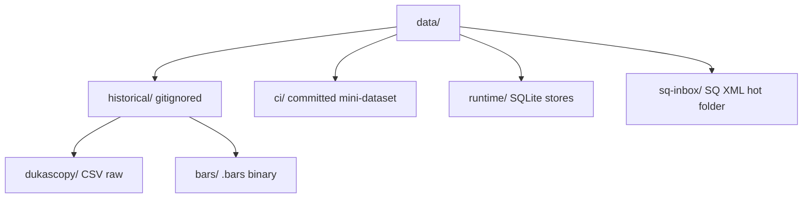

# Historical Market Data

Do **not** commit data files to git. They are too large for the repository.

## Download

```bash
./scripts/download-data.sh --list     # voir l'état
./scripts/download-data.sh --gentle   # 1 paire × 1 an (~5s)
./scripts/download-data.sh --all      # tout downloader (~9 min)
```

## Structure



Les fichiers sont regénérés à la volée. Sur le VPS, l'image Docker
télécharge les données au premier démarrage.

## Source

Dukascopy via `dukascopy-node` (npm). Données gratuites et publiques.
