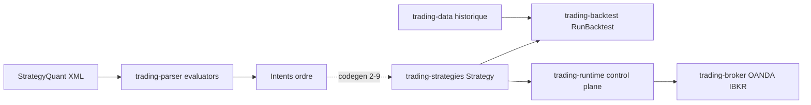
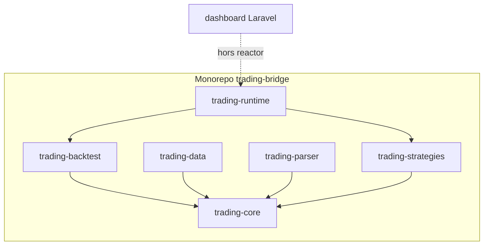

# Trading Bridge

> Pont entre StrategyQuant (JForex) et OANDA / Interactive Brokers
> Projet Bmad — Martin Fournier

## 📋 Vue d'ensemble

Trading Bridge convertit les stratégies de trading générées par **StrategyQuant** (format JForex/XML) en **Java pur**, avec un moteur de **backtesting intégré**, un **control plane** (HTTP/WS, promote gates) et des **connecteurs brokers** pour l'exécution live.

**État (2026-05-31) :** Epics plateforme **12–13** livrés · Parser SQ **2-1 à 2-8** en code (`trading-parser`) · Codegen Java **2-9** à venir.

### Par où commencer


| Lecteur      | Parcours (~15 min)                                                                                                                                                            |
| ------------ | ----------------------------------------------------------------------------------------------------------------------------------------------------------------------------- |
| **Humain**   | Ce fichier (~2 min) → `[contributing.md](contributing.md)` → `[architecture.md](architecture.md)` → `[AGENTS.md](../AGENTS.md)` (section Module layout) → `mvn clean install` |
| **Agent IA** | `AGENTS.md` → `_bmad-output/project-context.md` → `[sq-xml-format.md](sq-xml-format.md)`                                                                                      |


### Index documentation


| Document                                                 | Public            | Contenu                                     |
| -------------------------------------------------------- | ----------------- | ------------------------------------------- |
| [README.md](README.md)                                   | Humain FR         | Vue d’ensemble (ce fichier)                 |
| [contributing.md](contributing.md)                       | Humain FR         | Onboarding contributeur                     |
| [architecture.md](architecture.md)                       | Humain + agent EN | Runtime, flux parser SQ                     |
| [specs.md](specs.md)                                     | Humain FR         | Modèles, API Strategy                       |
| [sq-xml-format.md](sq-xml-format.md)                     | Agent + humain EN | XML StrategyQuant, statut stories           |
| [testing.md](testing.md)                                 | Tous              | Golden backtest, CI, promote gates          |
| [strategy-home.md](strategy-home.md)                     | Dev               | Placement stratégies, file d’ordres         |
| [conversion-guide.md](conversion-guide.md)               | Dev               | JForex → Java                               |
| [sprint-plan.md](sprint-plan.md)                         | PM                | Roadmap                                     |
| [AGENTS.md](../AGENTS.md)                                | Agent EN          | Entrée rapide, **graphe modules canonique** |
| [project-context.md](../_bmad-output/project-context.md) | Agent EN          | Règles d’implémentation                     |





## 🏗️ Architecture

- **Modules, runtime, flux parser :** `[architecture.md](architecture.md)` (anglais)
- **Graphe de dépendances Maven :** `[AGENTS.md](../AGENTS.md)` section « Module layout » (Mermaid canonique)




> Diagrammes du projet : **Mermaid uniquement** (voir [contributing.md](contributing.md) § Maintenance).

## 🧩 Modules


| Module     | Description                                       | Statut                          |
| ---------- | ------------------------------------------------- | ------------------------------- |
| core       | Modèles, Strategy, indicateurs partagés           | ✅                               |
| backtest   | Moteur backtest, RunContext, événements JSONL     | ✅                               |
| data       | Chargement historique unifié, OANDA               | ✅                               |
| strategies | Stratégies prop / SQ / generated                  | ✅                               |
| broker     | OANDA + IBKR (paper/live)                         | ✅                               |
| runtime    | Control plane HTTP/WS, promote gates (port 8080)  | ✅ Epic 13                       |
| tui        | Client terminal JLine3                            | ✅                               |
| examples   | CLI RunBacktest                                   | ✅                               |
| parser     | XML SQ → config, indicateurs, conditions, actions | 🚧 Epic 2 (2-9 codegen restant) |
| genetics   | Recherche génétique offline                       | ✅                               |


## 🎯 Sprints & epics

**Source de vérité implémentation :** `_bmad-output/implementation-artifacts/sprint-status.yaml`  
**Roadmap long terme :** `docs/sprint-plan.md`


| Epic / sprint                      | Statut | Notes                                                   |
| ---------------------------------- | ------ | ------------------------------------------------------- |
| Fondation (Epic 1)                 | ✅      | Core, backtest, exemples                                |
| Plateforme consolidation (Epic 12) | ✅      | Golden CI, RunBacktest unifié, indicateurs partagés     |
| Plateforme runtime (Epic 13)       | ✅      | Control plane, TUI, promote gates                       |
| Parser StrategyQuant (Epic 2)      | 🚧     | 2-1…2-8 en code ; 2-9 codegen ; voir `sq-xml-format.md` |
| Backtest avancé / brokers / prod   | 📋     | Voir `sprint-plan.md`                                   |


Détail parser : `[sq-xml-format.md](sq-xml-format.md)` §6 — ne pas dupliquer ici.

## 🔧 Commandes essentielles

```bash
# Build complet (à la racine du dépôt)
mvn clean install

# Lister les stratégies du catalogue
mvn exec:java -pl trading-examples \
  -Dexec.mainClass=com.martinfou.trading.examples.RunBacktest \
  -Dexec.args="--list"

# Backtest démo
mvn exec:java -pl trading-examples \
  -Dexec.mainClass=com.martinfou.trading.examples.RunBacktest \
  -Dexec.args="--sample"
```

**Toutes les commandes** (backtest historique, paper, control plane port **8080**, TUI, tests parser) : `[contributing.md](contributing.md)`. Référence agents : `[AGENTS.md](../AGENTS.md)`.

## 📝 Format des données

### StrategyQuant CSV

```
Date,Time,Open,High,Low,Close,Volume
2024.01.01,00:00,1.08000,1.08100,1.07950,1.08050,1000
```

### Toute source OHLCV standard

```
DateTime,Open,High,Low,Close,Volume
2024-01-01T00:00:00,1.08000,1.08100,1.07950,1.08050,1000
```

## 📄 Licence

Usage personnel — Martin Fournier — 2026