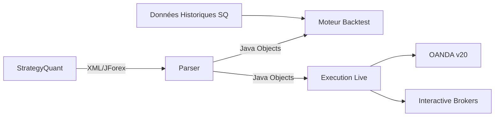

# Trading Bridge

> Pont entre StrategyQuant (JForex) et OANDA / Interactive Brokers
> Projet Bmad — Martin Fournier

## 📋 Vue d'ensemble

Trading Bridge convertit les stratégies de trading générées par **StrategyQuant** (format JForex/XML) en **Java pur**, avec un moteur de **backtesting intégré** et des **connecteurs brokers** pour l'exécution live.



## 🏗️ Architecture

Voir **`docs/architecture.md`** (anglais, référence agents) pour le graphe de modules à jour.

```
trading-bridge/
├── trading-core/           # Domaine, Strategy, Indicators, golden baseline
├── trading-backtest/       # BacktestEngine, RunContext, RunEvent
├── trading-data/           # HistoricalDataLoader, OANDA, calendrier
├── trading-strategies/     # Prop, sqimported, generated + StrategyCatalog
├── trading-broker/         # Connecteurs OANDA / IBKR
├── trading-runtime/        # Control plane HTTP/WS, promote, event store
├── trading-tui/            # Client terminal JLine3
├── trading-examples/       # RunBacktest CLI, tests golden
├── trading-parser/         # XML StrategyQuant → Java (Epic 2)
├── trading-genetics/       # Optimisation génétique (hors catalog runtime)
├── dashboard/              # Laravel control room (hors reactor Maven)
└── data/                   # historical/, ci/, runtime/
```

## 🧩 Modules

| Module | Description | Statut |
|--------|-------------|--------|
| core | Modèles, Strategy, indicateurs partagés | ✅ |
| backtest | Moteur backtest, RunContext, événements JSONL | ✅ |
| data | Chargement historique unifié, OANDA | ✅ |
| strategies | Stratégies prop / SQ / generated | ✅ |
| broker | OANDA + IBKR (paper/live) | ✅ |
| runtime | Control plane, promote gates | ✅ |
| tui | Client terminal | ✅ |
| examples | CLI RunBacktest | ✅ |
| parser | Parseur XML StrategyQuant | 🚧 Epic 2 |
| genetics | Recherche génétique offline | ✅ |

## 🎯 Bmad Sprints

### Sprint 1 — Fondation ✅
- [x] Structure monorepo Maven
- [x] Modèles de données (Bar, Order, Position, Trade)
- [x] Interface Strategy
- [x] BacktestEngine basique (market orders, SMA)
- [x] DataLoader CSV + StrategyQuant

### Sprint 2 — Parser XML
- [ ] Analyser le format XML StrategyQuant
- [ ] Extraire indicateurs (SMA, RSI, Bollinger, etc.)
- [ ] Extraire conditions d'entrée/sortie
- [ ] Générer code Java à partir du XML
- [ ] Valider avec une stratégie réelle

### Sprint 3 — Backtest avancé
- [ ] Support ordres LIMIT/STOP
- [ ] Comission et slippage
- [ ] Multi-timeframe
- [ ] Gestion de risque (taille position, stop loss)
- [ ] Rapport HTML avec graphiques
- [ ] Trades avec sorties (take profit, stop loss)

### Sprint 4 — Brokers
- [ ] Implémenter interface Broker
- [ ] OANDA v20 REST API (compte démo)
- [ ] Interactive Brokers API
- [ ] Market data en temps réel
- [ ] Exécution des ordres

### Sprint 5 — Production
- [ ] Monitoring et alertes
- [ ] Persistance des trades (SQLite)
- [ ] Dashboard web (Spring Boot)
- [ ] Tests unitaires et d'intégration

## 🔧 Configuration

### Build
```bash
mvn clean install
```

### Lister les stratégies disponibles
```bash
mvn exec:java -pl trading-examples \
  -Dexec.mainClass="com.martinfou.trading.examples.RunBacktest" \
  -Dexec.args="--list"
```

### Lancer backtest sample (SmaCrossover)
```bash
mvn exec:java -pl trading-examples \
  -Dexec.mainClass="com.martinfou.trading.examples.RunBacktest" \
  -Dexec.args="--sample"
```

### Lancer backtest avec données historiques
```bash
mvn exec:java -pl trading-examples \
  -Dexec.mainClass="com.martinfou.trading.examples.RunBacktest" \
  -Dexec.args="LondonOpenRangeBreakout EUR_USD 2012"

mvn exec:java -pl trading-examples \
  -Dexec.mainClass="com.martinfou.trading.examples.RunBacktest" \
  -Dexec.args="Strategy_2_14_147_Adapted GBP_JPY 2012"
```

### Lancer backtest avec un fichier
```bash
mvn exec:java -pl trading-examples \
  -Dexec.mainClass="com.martinfou.trading.examples.RunBacktest" \
  -Dexec.args="LondonOpenRangeBreakout data/historical/bars/EUR_USD_H1_2012.bars"
```

> **Alias dépréciés :** `RunPropBacktest` et `RunSqBacktest` délèguent à `RunBacktest`.
> `RunPropBacktest --all` reste disponible pour exécuter toute la suite prop.

### Paper mode (stub)

Rejoue les barres historiques en mode `PAPER` — mêmes fills que le backtest, sans appel broker. Valide le pipeline avant le paper live (Epic 4).

```bash
mvn exec:java -pl trading-examples \
  -Dexec.mainClass="com.martinfou.trading.examples.RunBacktest" \
  -Dexec.args="LondonOpenRangeBreakout EUR_USD 2012 --paper"

# JSONL avec mode PAPER dans les événements
mvn exec:java -pl trading-examples \
  -Dexec.mainClass="com.martinfou.trading.examples.RunBacktest" \
  -Dexec.args="LondonOpenRangeBreakout EUR_USD 2012 --paper --json"
```

### Control plane + TUI

```bash
# Serveur (port 8080 par défaut)
mvn exec:java -pl trading-runtime \
  -Dexec.mainClass="com.martinfou.trading.runtime.ControlPlaneMain"

# Client terminal (control plane doit tourner)
mvn exec:java -pl trading-tui \
  -Dexec.mainClass="com.martinfou.trading.tui.TradingTuiMain"
```

## 📝 Format des données

### StrategyQuant CSV
```
Date,Time,Open,High,Low,Close,Volume
2024.01.01,00:00,1.08000,1.08100,1.07950,1.08050,1000
```

### Toute source OHLCV standard
```
DateTime,Open,High,Low,Close,Volume
2024-01-01T00:00:00,1.08000,1.08100,1.07950,1.08050,1000
```

## 📄 Licence
Usage personnel — Martin Fournier — 2026
