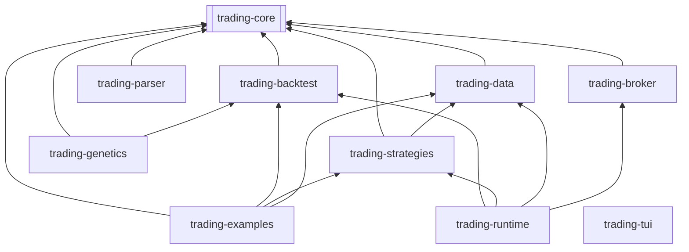

# Architecture - Trading Bridge Java Core

Ce document présente l'architecture technique détaillée de la partie **Trading Bridge Java Core**, qui sert de moteur d'exécution et de simulation de stratégies de trading.

---

## 1. Résumé Exécutif (Executive Summary)

**Trading Bridge Java Core** est une plateforme modulaire écrite en Java 21 permettant de convertir des stratégies StrategyQuant ou JForex en code Java autonome, de réaliser des backtests ultra-rapides et d'exécuter des ordres en direct ou simulés (Paper Trading) via les connecteurs OANDA et Interactive Brokers (IBKR).

La plateforme fournit un plan de contrôle HTTP/WebSocket pour permettre à des interfaces clientes (comme l'application de bureau Electron ou le tableau de bord Laravel) d'interagir avec les processus de trading en cours.

---

## 2. Pile Technologique (Technology Stack)

*   **Runtime** : Java 21 (JDK LTS)
*   **Système de Build** : Maven 4.x (avec script wrapper `./mvnw`)
*   **Framework Web (Plan de Contrôle)** : Javalin 6.6.0
*   **Base de Données** : SQLite JDBC 3.49.1.0
*   **Parser & Serialiseur JSON** : Jackson 2.17.2
*   **Journalisation** : SLF4J 2.0.16
*   **Interface Terminal** : JLine 3.26.3
*   **Framework de Tests** : JUnit 5.11.0
*   **Intégration d'IA** : LangChain4j 0.33.0

---

## 3. Patron d'Architecture (Architecture Pattern)

La solution adopte un patron de **Monolithe Modulaire** orienté services. Le code est découplé en modules Maven spécialisés pour respecter le graphe de dépendance acyclique (DAG) suivant :



---

## 4. Architecture des Données (Data Architecture)

Les données persistantes sont centralisées dans une base de données SQLite locale (`events.db`) régie en mode WAL. Le schéma comporte 4 tables principales :
*   `backtest_runs` : Consigne l'historique des résultats de backtest et les courbes de capital.
*   `deployments` : Suit les stratégies actuellement promues en Live ou en Démo.
*   `events` : Journalise de manière immuable (append-only) tous les événements granulaires (ordres soumis, exécutions, logs, erreurs) pour audit et rejeu WebSocket.
*   `research_inspirations` : Stocke les concepts d'idées de trading et de recherche.

*(Pour les détails du schéma DDL, se référer au document [Modèles de Données - Java](file:///home/martinfou/dev/src/trading-bridge/docs/data-models-trading-bridge-java.md)).*

---

## 5. Design de l'API (API Design)

Le serveur de Plan de Contrôle (`trading-runtime`) expose :
*   Une **API HTTP REST** sur le port `8080` pour la gestion des comptes, le téléchargement des données historiques, le listing et l'arrêt d'urgence des stratégies, ainsi que l'interrogation de l'historique des backtests.
*   Un **flux WebSocket** (`WS /ws/runs/{runId}`) pour diffuser en temps réel les tiques de prix et les exécutions d'ordres vers le client de bureau.

*(Pour les détails des routes, se référer au document [Contrats API - Java](file:///home/martinfou/dev/src/trading-bridge/docs/api-contracts-trading-bridge-java.md)).*

---

## 6. Structure des Fichiers (Source Tree)
*   `trading-core/` : Déclarations de domaine et indicateurs TA partagés.
*   `trading-backtest/` : Moteur de simulation événementiel.
*   `trading-data/` : Extraction de données historiques (OANDA REST client).
*   `trading-broker/` : Connecteurs API de courtage en direct.
*   `trading-strategies/` : Code source des stratégies actives et `StrategyCatalog`.
*   `trading-runtime/` : Orchestrateur du plan de contrôle (point d'entrée principal).
*   `trading-parser/` : Lecteur XML SQ et boîte de réception.

---

## 7. Workflow de Développement (Development Workflow)

1.  **Génération de code** : Conversion de stratégie XML dans `trading-parser`.
2.  **Compilation** : `mvn clean install` depuis la racine.
3.  **Backtest local** : Lancement de simulations en ligne de commande :
    ```bash
    mvn exec:java -pl trading-examples -Dexec.mainClass="com.martinfou.trading.examples.RunBacktest" -Dexec.args="LondonOpenRangeBreakout EUR_USD 2012"
    ```
4.  **Développement Interactif** : Lancement de `ControlPlaneMain` et connexion via le client TUI (`TradingTuiMain`).

---

## 8. Architecture de Déploiement (Deployment Architecture)

*   **Mode Local** : Lancement du serveur via Maven ou encapsulé dans l'application Electron de bureau.
*   **Mode Serveur (VPS)** : Déploiement sous forme de conteneurs Docker (déclarés dans `docker-compose.yml`) avec montage de volumes persistants pour les bases de données SQLite et les fichiers de logs. Les identifiants de production sont chargés de manière sécurisée via des fichiers d'environnement (`.env`) situés en dehors du code source.

---

## 9. Stratégie de Test (Testing Strategy)

*   **Tests Unitaires** : Écrits en JUnit 5 sous chaque sous-module Maven. Exécutés avec `mvn test`.
*   **Golden Backtest** : Un test d'intégration de non-régression à grande échelle (`GoldenBacktestTest`) est utilisé pour comparer les résultats générés par le moteur avec une référence stabilisée locale (Dukascopy/OANDA).
*   **Barrières de promotion (Gate Checks)** : Des critères mathématiques automatiques (facteur de profit minimum, drawdown maximum) sont validés avant d'autoriser la promotion d'une stratégie du mode test au mode réel.
