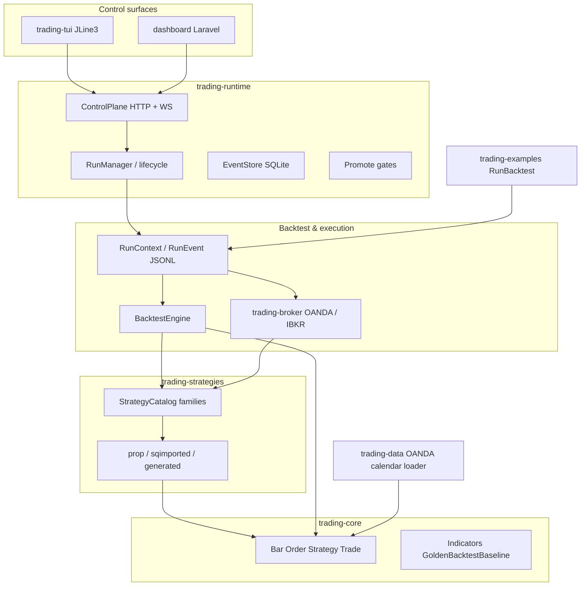
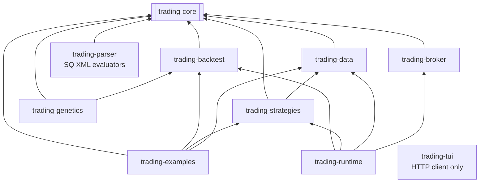
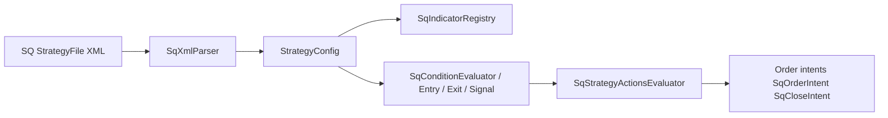

# Architecture (Trading Bridge)

English reference for agents and operators. Human-facing overview: `docs/README.md` (French). Implementation rules: `_bmad-output/project-context.md`, `AGENTS.md`. **Diagrams:** Mermaid only (no ASCII box/tree diagrams). **Module graph:** must match `AGENTS.md` § Module layout.

## System overview




## Maven modules (dependency graph)

Acyclic — `trading-core` has no internal trading dependencies.




| Module               | Role                                                                                               |
| -------------------- | -------------------------------------------------------------------------------------------------- |
| `trading-core`       | Domain models, `Strategy`, `DataLoader`, `TimeConventions`, `Indicators`, `GoldenBacktestBaseline` |
| `trading-backtest`   | `BacktestEngine`, `RunContext`, `RunEvent`, reports, paper stub                                    |
| `trading-data`       | `HistoricalDataLoader`, OANDA client, economic calendar                                            |
| `trading-strategies` | Prop / SQ / generated strategies, `StrategyCatalog`, `LiveStrategyRunner`                          |
| `trading-broker`     | `Broker` implementations (OANDA, IBKR paper/live)                                                  |
| `trading-runtime`    | Control plane, event store, promote gates, run lifecycle                                           |
| `trading-tui`        | Terminal client for control plane                                                                  |
| `trading-examples`   | `RunBacktest` CLI, golden tests                                                                    |
| `trading-parser`     | `SqXmlParser`, `StrategyConfig`, `SqIndicatorRegistry`, condition/action evaluators (Epic 2)       |
| `trading-genetics`   | Genetic strategy search (batch, not runtime catalog)                                               |


**Outside reactor:** `dashboard/` (Laravel control room), `batch-results/` (GA output, not compiled).

## StrategyQuant XML pipeline (Epic 2)



- **Parse & POJO:** `com.martinfou.trading.parser.sq`, `com.martinfou.trading.parser.config`
- **Indicators:** `com.martinfou.trading.parser.indicators` (delegates to `trading-core` `Indicators` where applicable)
- **Conditions:** `com.martinfou.trading.parser.conditions`
- **Actions:** `com.martinfou.trading.parser.actions`
- **Format reference:** `docs/sq-xml-format.md`
- **Not yet:** full Java `Strategy` codegen (story 2-9); gaps listed in sq-xml-format §6

## Runtime data layout


| Path               | Purpose                                              |
| ------------------ | ---------------------------------------------------- |
| `data/historical/` | Full-year CSV / `.bars` (local, not in git)          |
| `data/ci/`         | Committed mini-dataset for golden CI                 |
| `data/runtime/`    | SQLite event store, deployment store, threshold JSON |


## Entry points

```bash
# Backtest CLI (all catalog strategies)
mvn exec:java -pl trading-examples \
  -Dexec.mainClass=com.martinfou.trading.examples.RunBacktest \
  -Dexec.args="--list"

# Control plane (default port 8080)
mvn exec:java -pl trading-runtime \
  -Dexec.mainClass=com.martinfou.trading.runtime.ControlPlaneMain

# TUI client (control plane must be running)
mvn exec:java -pl trading-tui \
  -Dexec.mainClass=com.martinfou.trading.tui.TradingTuiMain
```

## Strategy placement

See `docs/strategy-home.md` — prop/sqimported/generated live in `trading-strategies`; examples in catalog via `trading-examples`.

## Sprint / epic tracking

**Implementation truth:** `_bmad-output/implementation-artifacts/sprint-status.yaml`  
**Vision roadmap:** `docs/sprint-plan.md` (long-term modules; epic numbers may differ from BMAD epics 12/13).

## Related docs


| Doc                        | Content                                |
| -------------------------- | -------------------------------------- |
| `docs/specs.md`            | Strategy API, time (UTC), XML shape    |
| `docs/testing.md`          | Golden backtest, promote gates         |
| `docs/strategy-home.md`    | Module placement, order queue contract |
| `docs/conversion-guide.md` | JForex → Java                          |
| `docs/sq-xml-format.md`    | SQ XML topology, parser story status   |
| `docs/contributing.md`     | Contributor onboarding (French)        |


