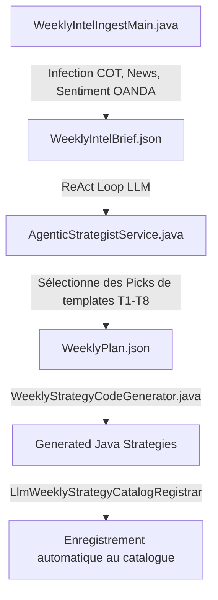

# Guide de Création : Stratégies basées sur le Calendrier Macroéconomique et le Sentiment (Mood)

Ce guide détaille le fonctionnement et la création de stratégies basées sur le **Calendrier Macroéconomique** (`EconomicCalendar`) et le **Sentiment (Mood)** dans **Trading Bridge**. Il couvre à la fois la génération automatisée via le module **`trading-intelligence`** (Agentic Strategy Creation) et la programmation manuelle de stratégies Java personnalisées.

---

## 1. L'Ingénierie Agentique : Génération de Stratégies via `trading-intelligence`

Le projet intègre un module d'intelligence artificielle agentique (`trading-intelligence`) qui analyse le marché, le calendrier macroéconomique, le sentiment utilisateur/retail, et génère dynamiquement du code Java prêt à être compilé et backtesté.



### 1.1 Le Registre des Templates (`template-registry.json`)
Les templates disponibles pour l'Agentic Strategist sont définis dans le fichier [template-registry.json](file:///Volumes/T7/src/trading-bridge/trading-intelligence/src/main/resources/template-registry.json). Les plus importants pour le calendrier et le sentiment sont :

*   **`T1` (HighImpactNewsBreakout)** : Breakout directionnel basé sur des événements macroéconomiques majeurs à fort impact.
*   **`T3` (RetailSentimentFade)** : Stratégie contrarienne se positionnant à l'opposé du sentiment de la majorité des traders particuliers (OANDA position book).
*   **`T6` (CentralBankWeekBias)** : Biais directionnel basé sur les semaines de décision des banques centrales.
*   **`T7` (PreEventRangeBreakout)** : Breakout avant des annonces majeures (CPI, NFP).
*   **`T8` (NoTradeWeek)** : Switch de sécurité désactivant le trading si les signaux ou le sentiment sont contradictoires.

### 1.2 Le Générateur de Code (`WeeklyStrategyCodeGenerator.java`)
Lorsqu'un template de type `THIN_PROP` (comme `T1` ou `T3`) est sélectionné par l'agent, [WeeklyStrategyCodeGenerator.java](file:///Volumes/T7/src/trading-bridge/trading-intelligence/src/main/java/com/martinfou/trading/intelligence/compile/WeeklyStrategyCodeGenerator.java#L143-L200) génère automatiquement une classe Java héritant de `AbstractPropStrategy` (comportant des règles strictes de gestion de risque et des déclencheurs basés sur l'ATR ou le RSI).

---

## 2. Programmation Manuelle : Intégrer le Calendrier et le Sentiment

Si vous développez manuellement vos propres stratégies Java dans `trading-strategies`, voici comment raccorder les déclencheurs.

### 2.1 Accéder au Calendrier Macroéconomique (`EconomicCalendar`)
Toutes les dates et heures d'annonces sont stockées au format **UTC** à l'aide de la classe `Instant` de Java.

```java
import com.martinfou.trading.data.EconomicCalendar;
import java.time.Instant;

public class MyCalendarStrategy {
    private final Instant newsTime;

    public MyCalendarStrategy(String eventSubstring) {
        this.newsTime = EconomicCalendar.THIS_WEEK.stream()
            .filter(e -> e.event().contains(eventSubstring))
            .map(EconomicCalendar.Event::time)
            .findFirst()
            .orElseThrow(() -> new IllegalStateException("Événement macro introuvable : " + eventSubstring));
    }
}
```

### 2.2 Accéder au Biais du Sentiment (Mood)
Le "Mood" ou sentiment du marché est stocké dans le record de données partagé `WeeklyStrategyOutlook` :

*   `bias` (`MarketDirection`) : `BULLISH`, `BEARISH`, ou `NEUTRAL`.
*   `comfortLevel` (`ComfortLevel`) : `HIGH`, `MEDIUM`, `LOW` (définit la taille des positions).
*   `rawSentimentScore` (double) : Score de sentiment brut.
*   `riskFactors().macroEventConflict()` (boolean) : True si l'annonce macroéconomique présente un conflit.

---

### 2.3 Exemple de code Java complet : `CalendarMoodBreakoutStrategy.java`

Voici un exemple de stratégie manuelle utilisant à la fois l'heure de l'annonce et le sentiment du marché :

```java
package com.martinfou.trading.strategies.prop;

import com.martinfou.trading.core.*;
import com.martinfou.trading.core.agent.*;
import com.martinfou.trading.core.indicators.Indicators;
import java.time.Duration;
import java.time.Instant;
import java.util.ArrayList;
import java.util.List;

public class CalendarMoodBreakoutStrategy implements Strategy {

    private final String name;
    private final String symbol;
    private final Instant newsTime;
    private final WeeklyStrategyOutlook outlook;
    private final List<Order> pendingOrders = new ArrayList<>();
    
    private boolean orderPlaced = false;

    public CalendarMoodBreakoutStrategy(String name, String symbol, Instant newsTime, WeeklyStrategyOutlook outlook) {
        this.name = name;
        this.symbol = symbol;
        this.newsTime = newsTime;
        this.outlook = outlook;
    }

    @Override
    public String name() {
        return this.name;
    }

    @Override
    public void onBar(Bar bar) {
        if (orderPlaced || bar.timestamp().isAfter(newsTime)) {
            return;
        }

        // 1. Calcul du temps restant avant l'événement macro
        long minutesToEvent = Duration.between(bar.timestamp(), newsTime).toMinutes();

        // Déclenchement 15 minutes avant l'annonce
        if (minutesToEvent > 0 && minutesToEvent <= 15) {
            
            // 2. Évaluation des facteurs de risque et du "Mood"
            if (outlook.riskFactors().macroEventConflict()) {
                return; // Annulation si conflit majeur identifié
            }

            // Ajustement de la taille selon le Comfort Level
            double lotSize = 0.01;
            if (outlook.comfortLevel() == ComfortLevel.HIGH) {
                lotSize = 0.02;
            } else if (outlook.comfortLevel() == ComfortLevel.LOW) {
                lotSize = 0.005; // Réduction du risque
            }

            // 3. Détermination du sens selon le Biais du Sentiment
            Order.Side side;
            if (outlook.bias() == MarketDirection.BULLISH) {
                side = Order.Side.BUY;
            } else if (outlook.bias() == MarketDirection.BEARISH) {
                side = Order.Side.SELL;
            } else {
                return; // Sentiment neutre -> Aucun trade
            }

            // 4. Calcul dynamique des niveaux SL/TP à l'aide de l'ATR
            double atr = Indicators.atr(List.of(bar), 14);
            double entryPrice = bar.close();
            double stopLoss = (side == Order.Side.BUY) ? entryPrice - (atr * 2) : entryPrice + (atr * 2);
            double takeProfit = (side == Order.Side.BUY) ? entryPrice + (atr * 4) : entryPrice - (atr * 4);

            // 5. Enfilement de l'ordre
            Order order = Order.market(this.symbol, side, lotSize);
            order.setStopLoss(stopLoss);
            order.setTakeProfit(takeProfit);
            
            pendingOrders.add(order);
            orderPlaced = true;
        }
    }

    @Override
    public void onTick(double bid, double ask, long volume) {}

    @Override
    public List<Order> getPendingOrders() {
        // RÈGLE CRITIQUE : Retourner une copie et vider la liste
        List<Order> copy = List.copyOf(pendingOrders);
        pendingOrders.clear();
        return copy;
    }

    @Override
    public void reset() {
        this.pendingOrders.clear();
        this.orderPlaced = false;
    }
}
```

---

## 3. Bonnes Pratiques & Antipatterns

> [!CAUTION]
> **Interdiction d'utiliser `LocalDateTime.now()`**
> Utilisez toujours les objets `Instant` stockés en UTC. L'utilisation de fuseaux locaux naïfs crée des désynchronisations catastrophiques entre le runtime live (GMT), le calendrier macro (GMT) et les backtests historiques.

> [!WARNING]
> ** getPendingOrders() doit vider la file**
> Ne retournez jamais une liste vivante (`return pendingOrders;`). La méthode **doit** renvoyer une copie et vider la liste. Si la liste n'est pas vidée, le moteur continuera de remplir à nouveau le même ordre à chaque nouvelle bougie.
