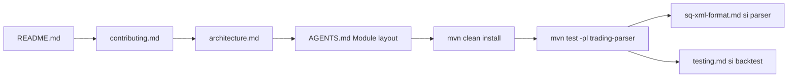
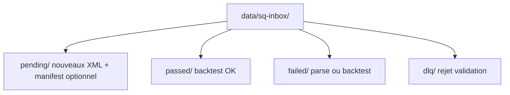

# Contribuer à Trading Bridge

Guide d’onboarding humain (français). Les agents IA utilisent `[AGENTS.md](../AGENTS.md)` et `[project-context.md](../_bmad-output/project-context.md)` (anglais).

**Dernière revue :** 2026-05-31 · Epics 12–13 terminés · Epic 2 parser terminé (2-1…2-10) · Epic 21 SQ inbox en cours.

## Prérequis

- Java **21**, Maven **4.x**
- Clone du dépôt, puis à la racine :

```bash
mvn clean install
```

Si des tests échouent avec `cannot find symbol` après un pull partiel, relancer `**mvn clean install**` avant de déboguer — les classes sous `target/` peuvent être obsolètes.

## Par où commencer (~15 min)




Ordre **canonique** (identique à [README.md](README.md) § Par où commencer) :

1. **[README.md](README.md)** (~2 min) — vue d’ensemble et état du projet
2. **Ce guide** (~8 min) — règles, pièges, commandes ci-dessous
3. **[architecture.md](architecture.md)** — runtime, flux parser SQ (pas le graphe Maven)
4. **[AGENTS.md](../AGENTS.md)** — section « Module layout » uniquement (graphe de dépendances canonique)
5. `**mvn clean install`** à la racine du dépôt
6. `**mvn test -pl trading-parser**` — valider l’environnement
7. **[sq-xml-format.md](sq-xml-format.md)** — si vous touchez au XML StrategyQuant
8. **[testing.md](testing.md)** — si vous lancez des backtests (golden CI vs skip local)

## Où mettre du code


| Type                               | Module               | Ne pas mettre dans |
| ---------------------------------- | -------------------- | ------------------ |
| Modèles domaine, `Strategy`        | `trading-core`       | —                  |
| Parser XML, conditions, actions SQ | `trading-parser`     | `trading-examples` |
| Moteur backtest, `RunContext`      | `trading-backtest`   | —                  |
| Control plane, promote, events     | `trading-runtime`    | `trading-core`     |
| Stratégies prop / SQ / generated   | `trading-strategies` | `trading-parser`   |
| CLI backtest, golden tests         | `trading-examples`   | —                  |
| OANDA / données historiques        | `trading-data`       | `trading-core`     |
| Connecteurs broker                 | `trading-broker`     | `trading-core`     |


Graphe complet : **[AGENTS.md](../AGENTS.md)** (ne pas le recopier ailleurs). File d’ordres : [strategy-home.md](strategy-home.md) (`StrategyOrderQueues.drainPending`).

## Règles qui piègent les nouveaux contributeurs

1. `**getPendingOrders()`** — retourne une copie et **vide** la file ; l’engine ne consomme les ordres qu’une fois par barre.
2. **Ordres MARKET** — remplis au `**open()`** de la barre, pas au close.
3. **Temps** — UTC (`Instant`) en logique trading ; pas `LocalDateTime.now()` pour les décisions.
4. **Golden backtest** — le test année complète **skip** sans `data/historical/` local ; le sous-ensemble CI dans `data/ci/` tourne toujours. Voir [testing.md](testing.md).
5. **Backtest vs control plane** — `RunBacktest` (`trading-examples`) ≠ `ControlPlaneMain` (`trading-runtime`, port **8080**). Le TUI nécessite le control plane démarré.
6. **Secrets** — ne jamais committer `.env`, `**/oanda_creds.json`, ni `target/`.
7. **Pas de Lombok / Spring** sauf décision explicite du projet.

## Commandes utiles

```bash
# Toutes les stratégies du catalogue
mvn exec:java -pl trading-examples \
  -Dexec.mainClass=com.martinfou.trading.examples.RunBacktest \
  -Dexec.args="--list"

# Backtest avec données (exemple)
mvn exec:java -pl trading-examples \
  -Dexec.mainClass=com.martinfou.trading.examples.RunBacktest \
  -Dexec.args="LondonOpenRangeBreakout EUR_USD 2012"

# Paper stub (mêmes fills que backtest)
mvn exec:java -pl trading-examples \
  -Dexec.mainClass=com.martinfou.trading.examples.RunBacktest \
  -Dexec.args="LondonOpenRangeBreakout EUR_USD 2012 --paper"

# Tests parser
mvn test -pl trading-parser

# Golden CI (ne skip pas)
mvn test -pl trading-examples -Dtest=GoldenBacktestTest

# Control plane + TUI (deux terminaux)
mvn exec:java -pl trading-runtime \
  -Dexec.mainClass=com.martinfou.trading.runtime.ControlPlaneMain
mvn exec:java -pl trading-tui \
  -Dexec.mainClass=com.martinfou.trading.tui.TradingTuiMain
```

Alias dépréciés : `RunPropBacktest`, `RunSqBacktest` → utiliser `**RunBacktest**`.

## StrategyQuant — hot folder (Epic 21)

Déposer les exports XML StrategyQuant dans le dossier standard (contenu **gitignored**, structure versionnée) :




**Manifest sidecar** (`StrategyManifest` dans `trading-parser`, package `bridge`) : `id`, `symbol`, `timeframe`, `sqBuild`, `contentSha256`, `exportedAt` (UTC). Si le fichier `*.manifest.json` est absent à côté du XML, il est généré via `SqXmlFormatProbe` :

```java
StrategyManifest manifest = StrategyManifestIO.ensureSidecar(Path.of("data/sq-inbox/pending/my-strategy.xml"));
```

**Traitement automatique** (`SqInboxProcessor`, story 21-2) : parse + backtest interprété (`SqInterpretedStrategy`), puis classement :

```bash
# Depuis la racine du dépôt (détecte data/sq-inbox/)
mvn exec:java -pl trading-parser \
  -Dexec.mainClass=com.martinfou.trading.parser.bridge.SqInboxProcessor \
  -Dexec.args="--bars 500"

# Options : --symbol EUR_USD  --capital 100000  --bars 500  --sq-feedback
# Données historiques : --data-path EUR_USD 2012  ou  --data-path /chemin/fichier.csv
```

Succès → `passed/` + `*-result.json` (métriques incl. Sharpe, profit factor, drawdown, compositeScore). Échec parse/backtest → `failed/`. Hors ligne : pas de control plane.

**Boucle fitness TB→SQ (story 21-8)** — après drain inbox, `--sq-feedback` exporte `data/sq-cli/fitness/tb-fitness.csv` et importe via sqcli (`setup-tb-fitness` + `-extindicators action=import`). Voir `[docs/sq-cli-bridge.md](sq-cli-bridge.md)`.

**Validation et DLQ (story 21-3)** — avant backtest :


| Destination | Cas                                                                                                                              |
| ----------- | -------------------------------------------------------------------------------------------------------------------------------- |
| `dlq/`      | XML trop volumineux, chemin hors `pending/`, blocs **GAP** (`SqImportedBlockInventory`), action d’entrée autre que `EnterAtStop` |
| `failed/`   | XML illisible, exception backtest                                                                                                |
| `passed/`   | Parse + couverture OK + backtest sans exception                                                                                  |


Chaque traitement écrit aussi `*-coverage.json` (blocs supportés, deferred, inline, gap, unknown).

### StrategyQuant X sur Mac

- Variable d’environnement `**SQ_HOME`** : répertoire d’installation de StrategyQuant X (sans espaces dans le chemin si possible).
- Si le chemin d’export contient des espaces, utiliser un **symlink** vers un staging court, par ex. :

```bash
mkdir -p ~/sq-bridge/staging
ln -sf "/Applications/StrategyQuant X" "$HOME/sq-bridge/SQ_HOME"
export SQ_HOME="$HOME/sq-bridge/SQ_HOME"
```

- `sqcli` et les jobs SQ : voir story **21-4** (`SqCliRunner`) et **21-5+** (registry scripts).

**SqCliRunner (story 21-4)** — invoquer `sqcli` depuis Java :

```bash
export SQ_HOME="$HOME/sq-bridge/SQ_HOME"   # ou symlink vers /Applications/StrategyQuant X

# Dry-run (CI / sans SQ installé)
mvn exec:java -pl trading-parser \
  -Dexec.mainClass=com.martinfou.trading.parser.bridge.SqCliRunner \
  -Dexec.args="--dry-run -- -symbol action=list"

# Exécution réelle
mvn exec:java -pl trading-parser \
  -Dexec.mainClass=com.martinfou.trading.parser.bridge.SqCliRunner \
  -Dexec.args="-- -data action=update"
```

Options : `--sq-home PATH`, `--dry-run`, `--timeout-secs N`, puis `--` et les arguments sqcli ([doc SQ CLI](https://strategyquant.com/doc/cli-command-line/introduction-to-cli/)).

Note : la redirection `> fichier` est une syntaxe **sqcli** (pas le shell) — passer les tokens après `--`, ex. `-- -symbol action=list ">" /path/out.log`.

**SqJobRunner (story 21-5)** — jobs nommés + mutex (un seul sqcli à la fois) :

```bash
# Lister les scripts (data/sq-cli/scripts/registry.json)
mvn exec:java -pl trading-parser \
  -Dexec.mainClass=com.martinfou.trading.parser.bridge.SqJobRunner \
  -Dexec.args="--list"

# Exécuter un job enregistré
mvn exec:java -pl trading-parser \
  -Dexec.mainClass=com.martinfou.trading.parser.bridge.SqJobRunner \
  -Dexec.args="--dry-run --run list-symbols"
```

Scripts versionnés : `list-symbols`, `update-data`, `list-databanks`, `setup-tb-fitness`. Verrou : `data/sq-cli/.sq-job.lock`.

**SqNightlyPipeline (story 21-6)** — chaîne nightly sqcli → inbox en une commande :

```bash
# Shell wrapper (cron / launchd) — option Mac pour empêcher la veille
export SQ_HOME="$HOME/sq-bridge/SQ_HOME"
export SQ_EXPORT_DIR="$HOME/sq-exports"   # optionnel : copie *.xml → pending/

./scripts/sq-nightly.sh --caffeinate

# Dry-run offline (sqcli simulé, sans drain inbox)
./scripts/sq-nightly.sh --dry-run --skip-inbox

# Inbox + feedback fitness vers SQ Retester
./scripts/sq-nightly.sh --sq-feedback

# Maven direct
mvn exec:java -pl trading-parser \
  -Dexec.mainClass=com.martinfou.trading.parser.bridge.SqNightlyPipeline \
  -Dexec.args="--skip-jobs --bars 500"
```

Étapes : `update-data` → `list-databanks` (mutex) ; copie optionnelle depuis `SQ_EXPORT_DIR` ; `SqInboxProcessor` sur `pending/`. Résumé stdout : codes exit sqcli, fichiers importés, comptes passed/failed/dlq.

**Checklist manuelle (SQ_HOME requis)** :

1. `export SQ_HOME=…` pointant vers une install SQ valide avec `sqcli`.
2. `./scripts/sq-nightly.sh --dry-run --skip-inbox` — jobs listés, exit 0.
3. Déposer un XML dans `SQ_EXPORT_DIR` ou `data/sq-inbox/pending/`.
4. `./scripts/sq-nightly.sh --skip-jobs` ou pipeline complet — vérifier résumé et dossiers `passed/` / `failed/` / `dlq/`.
5. Cron : `0 8 * * * …/scripts/sq-nightly.sh --caffeinate` (Mac).

**Control plane (story 21-7)** — statut SQ bridge + drain inbox async :

```bash
# Statut (200 même si SQ_HOME absent)
curl -s http://localhost:8080/api/sq-bridge/status | jq

# Déclencher le traitement inbox (202 async, mutex SqJobMutex)
curl -X POST http://localhost:8080/api/sq-bridge/process-inbox

# TUI
#   /sq          pending + dernière exécution
#   /inbox process   POST process-inbox
```

Événements `SQ_EXPORT_RECEIVED` appendés au run `sq-bridge` dans l'event store.

## État du sprint (source de vérité)

- **Stories :** `[sprint-status.yaml](../_bmad-output/implementation-artifacts/sprint-status.yaml)`
- **Vision long terme :** [sprint-plan.md](sprint-plan.md) (numéros d’epic peuvent différer des epics BMAD 12/13)

## Maintenance de la documentation

Après un merge significatif (parser, runtime, backtest, `BacktestEngine`) :

1. Mettre à jour **[project-context.md](../_bmad-output/project-context.md)** si le comportement agent change.
2. Mettre à jour le `**docs/*.md`** concerné pour les humains (FR).
3. Garder **une seule** copie du graphe de modules dans **[AGENTS.md](../AGENTS.md)**.
4. Revoir la date « Dernière revue » en tête de ce fichier et de [README.md](README.md).
5. **Diagrammes** : flux, dépendances et topologies → **Mermaid** (`flowchart`, `sequenceDiagram`, `stateDiagram-v2`) — pas d’ASCII art (boîtes `┌─┐`, arbres `├──`).

## Index des documents


| Document                                                 | Public            | Contenu                             |
| -------------------------------------------------------- | ----------------- | ----------------------------------- |
| [README.md](README.md)                                   | Humain FR         | Vue d’ensemble, état projet         |
| [contributing.md](contributing.md)                       | Humain FR         | Ce guide                            |
| [architecture.md](architecture.md)                       | Humain + agent EN | Runtime, flux parser SQ             |
| [specs.md](specs.md)                                     | Humain FR         | Modèles, API Strategy               |
| [sq-xml-format.md](sq-xml-format.md)                     | Agent + humain EN | XML StrategyQuant, statut stories   |
| [testing.md](testing.md)                                 | Tous              | Golden backtest, CI, promote gates  |
| [strategy-home.md](strategy-home.md)                     | Dev               | Placement stratégies, file d’ordres |
| [conversion-guide.md](conversion-guide.md)               | Dev               | JForex → Java                       |
| [sprint-plan.md](sprint-plan.md)                         | PM                | Roadmap                             |
| [AGENTS.md](../AGENTS.md)                                | Agent EN          | Entrée rapide, graphe modules       |
| [project-context.md](../_bmad-output/project-context.md) | Agent EN          | Règles d’implémentation             |


