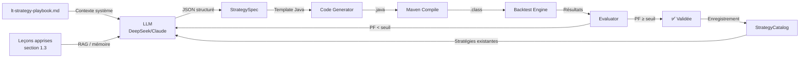
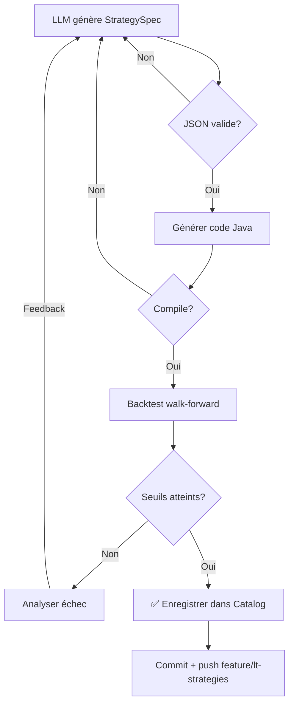

# LT Strategy Playbook — Création d'une Stratégie Long Terme

> **But :** Cadre reproductible pour concevoir, implémenter, valider et documenter
> une stratégie de trading long terme (horizon 15+ ans, H1, 4 paires majeures).
>
> Ce playbook capture les leçons apprises sur 10 stratégies et standardise
> le workflow pour les itérations futures.

---

## 1. 🧠 Conception (Concept)

### 1.1 Source d'inspiration

Choisir une **méthodologie éprouvée** — pas de l'ingénierie inverse hasardeuse :

| Source | Exemple | Pourquoi |
|--------|---------|----------|
| **Recherche académique** | Kaufman Efficiency Ratio, Donchian Channels | Papiers évalués, math solide |
| **Trading classique** | Golden/Death Cross, RSI(2) Connors | Décennies de backtest |
| **Prop firm** | FTMO, Turtle system | Risk management intégré |
| **Quantitatif** | Mean reversion, volatilité adaptative | Réplicable, mesurable |

**Règle :** Pas de stratégie "intuitive" sans source vérifiable. Documenter l'inspiration
dans le Javadoc de la classe (format bloc commentaire, lignes `Inspiration:`).

### 1.2 Critères de sélection

Une idée devient une stratégie si :

- ✅ **Principe clair** — 3 lignes max pour l'expliquer
- ✅ **Signaux reproductibles** — indicateurs mathématiques, pas de pattern visuel
- ✅ **Risk management intégrable** — SL/TP définissables via ATR
- ✅ **H1 compatible** — max 1 trade/jour, pas de scalping
- ✅ **Multi-paire** — fonctionne sur EUR/USD, GBP/USD, USD/JPY, AUD/USD

### 1.3 Leçons apprises (10 stratégies)

| Leçon | Détail |
|-------|--------|
| **Trend following > Mean reversion sur H1** | Les meilleurs PF viennent des stratégies de tendance (CrossMomentum, DoubleMA). La mean reversion souffre sur H1 en marchés trending. |
| **GBP/USD surperforme EUR/USD** | Facteur 1.5-3x sur le PF dans presque toutes les stratégies — volatilité plus élevée = meilleur signal. |
| **RSI(3) > RSI(14) pour le momentum** | RSI(3) donne des signaux plus réactifs sans trop de bruit (RSI3Momentum). RSI(14) réservé à la mean reversion. |
| **Le squeeze + momentum confirme mieux** | Combiner Bollinger squeeze + RSI momentum donne de meilleurs signaux que le squeeze seul (LtSqueezeMomentum vs LtBollingerSqueeze). |
| **Les stops fixes tuent le PF** | Stratégies avec trailing SL adaptatif performent mieux que SL fixes (RangeBreakout). |
| **ATR ratio pour régimes de marché** | VolRegime avait la meilleure idée (switcher selon volatilité) mais le plus faible PF — les transitions de régime ajoutent du bruit. |
| **Pullback entry = concept solide, exécution difficile** | LtPullbackEntry avait un beau concept mais PF < 1.0 en walk-forward. Le timing du pullback est trop incertain sur H1. |
| **Max 3 indicateurs par stratégie** | Au-delà, overfitting. La plupart des meilleures stratégies utilisent 2-3 indicateurs (ex: SMA + ATR). |
| **Toujours valider en walk-forward** | IS/OOS/OOS2 révèle les stratégies qui marchent vraiment. |

---

## 2. 📐 Design Pattern (Implémentation)

### 2.1 Structure de fichier

```java
package com.martinfou.trading.strategies.longterm;

import com.martinfou.trading.core.*;
import com.martinfou.trading.core.indicators.Indicators;
import java.util.*;

/**
 * LtMonConcept — Description courte (1 phrase).
 *
 * Entry:
 *   LONG: condition A ET condition B
 *   SHORT: condition C ET condition D
 *
 * Exit:
 *   Stop loss: ATR x 2
 *   Take profit: ATR x 4
 *   Reverse signal
 *   Max hold: N bars
 *
 * Risk management:
 *   - Max 1 trade par jour calendaire
 *   - closeOnly() sur toutes les sorties
 *   - Position sizing ATR-based (calcRiskPosition)
 *
 * Inspiration:
 *   - Nom du trader/chercheur (concept)
 */
public class LtMonConcept implements Strategy {

    // ── Constantes ──────────────────────────────────────────────
    private static final int INDICATOR_PERIOD = 14;    // période de l'indicateur principal
    private static final int ATR_PERIOD = 14;          // ATR lookback
    private static final double ATR_MULT_SL = 2.0;     // SL = ATR × 2
    private static final double ATR_MULT_TP = 4.0;     // TP = ATR × 4
    private static final double REFERENCE_CAPITAL = 10_000;  // capital de référence
    private static final double RISK_PCT = 0.01;       // 1% risque par trade
    private static final int MAX_HOLD_BARS = 240;      // ~10 jours sur H1
    private static final java.time.ZoneId TZ = java.time.ZoneId.of("America/New_York");

    // ── État ────────────────────────────────────────────────────
    private final String name;
    private final String symbol;
    private final List<Order> pending = new ArrayList<>();
    private final List<Bar> history = new ArrayList<>();

    private boolean inTrade = false;
    private Order.Side direction = Order.Side.BUY;
    private double entryPrice = 0;
    private double entrySl = 0;
    private double entryTp = 0;
    private int lastTradeDay = -1;  // epoch-day pour max 1 trade/jour

    // ── Constructeurs ────────────────────────────────────────────
    public LtMonConcept() { this("LtMonConcept", "EUR_USD"); }
    public LtMonConcept(String name) { this(name, "EUR_USD"); }
    public LtMonConcept(String name, String symbol) {
        this.name = name;
        this.symbol = symbol;
    }

    @Override public String name() { return name; }

    // ── Logique principale ──────────────────────────────────────
    @Override
    public void onBar(Bar bar) {
        history.add(bar);
        int size = history.size();
        if (size < INDICATOR_PERIOD + ATR_PERIOD + 5) return;

        double close = bar.close();
        double atr = Indicators.atr(history, ATR_PERIOD);
        // ... calculer indicateurs ...
        if (Double.isNaN(atr) || atr == 0) return;

        int currentDay = bar.timestamp().atZone(TZ).getDayOfYear();

        if (inTrade) {
            // Vérifier SL / TP / reverse / max hold
            // ...
            return;
        }

        // Max 1 trade/jour
        if (currentDay == lastTradeDay) return;

        // Conditions d'entrée
        if (/* condition LONG */) {
            double sl = close - atr * ATR_MULT_SL;
            double tp = close + atr * ATR_MULT_TP;
            pending.add(new Order(symbol, Order.Side.BUY, Order.Type.MARKET,
                Indicators.calcRiskPosition(REFERENCE_CAPITAL, RISK_PCT, atr, ATR_MULT_SL, symbol), close)
                .withStopLoss(sl).withTakeProfit(tp));
            entryPrice = close; entrySl = sl; entryTp = tp;
            direction = Order.Side.BUY; inTrade = true;
            lastTradeDay = currentDay;
        } else if (/* condition SHORT */) {
            double sl = close + atr * ATR_MULT_SL;
            double tp = close - atr * ATR_MULT_TP;
            pending.add(new Order(symbol, Order.Side.SELL, Order.Type.MARKET,
                Indicators.calcRiskPosition(REFERENCE_CAPITAL, RISK_PCT, atr, ATR_MULT_SL, symbol), close)
                .withStopLoss(sl).withTakeProfit(tp));
            entryPrice = close; entrySl = sl; entryTp = tp;
            direction = Order.Side.SELL; inTrade = true;
            lastTradeDay = currentDay;
        }
    }

    @Override public void onTick(double bid, double ask, long volume) {}

    private void exitTrade(double price) {
        Order.Side exit = direction == Order.Side.BUY ? Order.Side.SELL : Order.Side.BUY;
        pending.add(new Order(symbol, exit, Order.Type.MARKET, 1000, price).closeOnly());
        inTrade = false;
    }

    @Override
    public List<Order> getPendingOrders() {
        List<Order> copy = new ArrayList<>(pending);
        pending.clear();
        return copy;
    }

    @Override
    public void reset() {
        history.clear(); pending.clear();
        inTrade = false; lastTradeDay = -1;
        entryPrice = 0; entrySl = 0; entryTp = 0;
    }
}
```

### 2.2 Règles strictes

| Règle | Raison |
|-------|--------|
| `closeOnly()` sur **toutes les sorties** | Évite le hedging. OANDA supporte REDUCE_ONLY mais pas les hedges longs + shorts. |
| `calcRiskPosition(10_000, 0.01, atr, slMult, symbol)` pour les entrées | Standardise le risque à 1% du capital de référence, adapté à la volatilité. |
| 1000 units pour les sorties (closeOnly) | La quantité n'a pas d'importance avec closeOnly — le framework ferme la position. |
| `atr = 0` check avant d'utiliser calcRiskPosition | Évite division par zéro. |
| Jamais d'instance `Random` | Un backtest déterministe est reproductible. |
| Pas de `System.out` dans onBar() | Ralentit le backtest. Utiliser les logs du framework. |

---

## 3. 🏗️ Enregistrement dans le Catalog

### 3.1 Créer le Runner (optionnel mais utile)

```java
// trading-examples/.../RunLtMonConcept.java
// Copier-coller depuis un runner existant (ex: RunLtEfficiencyRatio)
// Changer le nom de classe + stratégie
```

### 3.2 Mettre à jour LongTermStrategyCatalog.java

```java
// Dans LongTermStrategyCatalog.java, ajouter:
register("LtMonConcept", sym -> new LtMonConcept("LtMonConcept", sym));
```

### 3.3 Ajouter les métadonnées dans StrategyCatalog.java

Dans les 3 fonctions de résolution :

```java
// resolveType:
case "LtMonConcept" -> "Trend Following";

// resolveIndicators:
case "LtMonConcept" -> List.of("EMA", "ATR");

// resolveDescription:
case "LtMonConcept" -> "Description courte et précise.";
```

### 3.4 Ajouter la couleur dans la GUI

```typescript
// desktop/src/components/StrategyCard.vue — déjà fait pour LONG_TERM
```

---

## 4. 🧪 Validation

### 4.1 Workflow TUI

```bash
# Terminal 1 — Control Plane
mvn exec:java -pl trading-runtime \
  -Dexec.mainClass="com.martinfou.trading.runtime.ControlPlaneMain"

# Terminal 2 — TUI
mvn exec:java -pl trading-tui \
  -Dexec.mainClass="com.martinfou.trading.tui.TradingTuiMain"
```

Dans le TUI :
```
/backtest          → assistant interactif
/list              → vérifier que la stratégie apparaît
```

### 4.2 Walk-Forward Validation

Tester sur **4 paires** avec découpage :

| Période | Rôle | Années |
|---------|------|--------|
| FULL | Vision complète | 2010-2025 |
| IS | In-Sample (calibration) | 2010-2018 |
| OOS1 | Out-of-Sample 1 | 2019-2022 |
| OOS2 | Out-of-Sample 2 (récent) | 2023-2025 |

### 4.3 Seuils de passage

| Métrique | Minimum | Bon | Excellent |
|----------|---------|-----|-----------|
| Profit Factor | ≥ 1.05 | ≥ 1.15 | ≥ 1.30 |
| Sharpe Ratio | ≥ 0.3 | ≥ 0.5 | ≥ 0.8 |
| Win Rate | ≥ 35% | ≥ 45% | ≥ 55% |
| Max Drawdown | ≤ 35% | ≤ 25% | ≤ 15% |

**Règle :** Si OOS1 ou OOS2 a PF < 1.0, la stratégie est **invalide** malgré un bon FULL.

### 4.4 Validation de position sizing

```bash
# Vérifier que calcRiskPosition est utilisé (pas de hardcode)
grep -n 'calcRiskPosition' trading-strategies/.../LtMonConcept.java

# Vérifier qu'il n'y a pas de BASE_UNITS / MIN_POSITION résiduel
grep -n 'BASE_UNITS\|MIN_POSITION\|POSITION_SIZE\|MAX_POSITION' trading-strategies/.../LtMonConcept.java
# Doit retourner vide
```

---

## 5. 📝 Rapport & Documentation

### 5.1 Structure du rapport

Chaque stratégie doit avoir un rapport de validation incluant :

```markdown
# Validation — LtMonConcept

## Résultats backtest
| Période | PF | Sharpe | PnL | DD | WR |
|---------|----|--------|-----|----|----|
| FULL    |    |        |     |    |    |
| IS      |    |        |     |    |    |
| OOS1    |    |        |     |    |    |
| OOS2    |    |        |     |    |    |

## Analyse
- Qu'est-ce qui marche ?
- Qu'est-ce qui ne marche pas ?
- Patterns par paire

## Leçons apprises
- À retenir pour la prochaine itération
- Modifications possibles
```

### 5.2 Sauvegarde Joplin

Tout rapport de validation est sauvegardé dans :
```
📂 02 - Projects/Trading robot management system
   📁 02 - Execution
```

### 5.3 Post-mortem pour les échecs

Si PF < 1.0 sur OOS :

```markdown
## Post-mortem — LtMonConcept

### Cause racine
[Pourquoi ça n'a pas marché]

### Ce qu'on apprend
[Leçon pour le futur]

### Alternative envisagée
[Comment on pourrait améliorer ou remplacer]
```

---

## 6. 📂 Branche & Git

Toutes les stratégies long terme vivent sur **une seule branche** :
```
feature/lt-strategies
```

Pas de branche par stratégie. Le workflow :

```bash
git checkout feature/lt-strategies
# Créer/modifier la stratégie
# Compiler
mvn clean install -DskipTests
# Tester avec le TUI
# Commit
git add -A && git commit -m "feat: add LtMonConcept strategy"
git push
```

---

## 7. ⚙️ Position Sizing (standard)

### 7.1 Formule

```
units = calcRiskPosition(10_000, 0.01, atr, 2.0, symbol)
       = floor((10_000 × 0.01) / (atr × 2.0) / pipValue) × roundToLotStep
```

- **Capital de référence :** $10 000
- **Risque par trade :** 1%
- **SL :** ATR × 2.0
- **Minimum :** 1 000 units (0.01 lot)

### 7.2 Pourquoi 2.0× ATR ?

| Multiplicateur | Effet |
|----------------|-------|
| 1.0× ATR | Trop serré — trop de whipsaws |
| 2.0× ATR | Équilibre risque/bruit sur H1 |
| 3.0× ATR | Trop large — DD trop élevé |

Validé empiriquement sur les 10 stratégies.

### 7.3 Notes par paire

| Paire | Pip value | Impact |
|-------|-----------|--------|
| EUR/USD | $0.10 / 0.01 lot | Référence |
| GBP/USD | $0.10 / 0.01 lot | Standard |
| USD/JPY | ~$0.0625 / 0.01 lot (à 160) | Position légèrement plus petite |
| AUD/USD | $0.10 / 0.01 lot | Standard |

---

## 8. ✅ Checklist finale

Avant de déclarer une stratégie "livrée" :

- [ ] **Code compile** : `mvn clean install -DskipTests` ✅
- [ ] **calcRiskPosition** utilisé (pas de position fixe)
- [ ] **closeOnly()** sur toutes les sorties
- [ ] **Enregistré** dans LongTermStrategyCatalog
- [ ] **Métadonnées** (type, indicateurs, description) dans StrategyCatalog
- [ ] **Walk-forward** validé sur 4 paires (FULL, IS, OOS1, OOS2)
- [ ] **Rapport** de validation rédigé
- [ ] **Leçons apprises** documentées
- [ ] **Joplin** — copie sauvegardée dans le carnet trading
- [ ] **Commit + push** sur `feature/lt-strategies`

---

## 10. 🤖 Génération Automatisée via LLM

> **Objectif :** Utiliser un LLM (DeepSeek / Claude) orchestré par **LangChain4j** pour
> générer, compiler, backtester et valider des stratégies long terme en boucle autonome.

### 10.1 Pourquoi LangChain4j

| Critère | LangChain4j | Spring AI | Custom Java | Raison |
|---------|-------------|-----------|-------------|--------|
| **Chaînage (chain)** | ✅ natif | ✅ natif | ❌ à coder | Prompt → LLM → Parse → Code → Compile → Backtest |
| **Structured output** | ✅ JSON Schema | ✅ | ❌ manuel | Sortie LLM parsable en `StrategySpec` |
| **Tool calling** | ✅ natif | ✅ | ❌ | LLM peut appeler `compileAndTest(strategySpec)` |
| **Memory / RAG** | ✅ ContentRetriever | ✅ | ❌ | Injecter les leçons apprises dans le contexte |
| **Déjà compatible** | Java 21+ | Spring | — | Le projet est Maven, pas Spring |
| **Poids** | ~2MB | ~15MB | — | Plus léger, pas de framework Web |

**Verdict :** **LangChain4j** — Java 21 compatible, pas de dépendance Spring, structured output natif,
léger. S'intègre dans le monorepo Maven comme module `trading-intelligence`.

### 10.2 Architecture proposée



### 10.3 Data Model — StrategySpec

Le LLM produit un **JSON structuré** que LangChain4j parse via `JsonSchema` :

```java
public record StrategySpec(
    String name,                    // ex: "LtEfficiencyRatio"
    String inspiration,             // source / papier de recherche
    String description,             // une phrase
    String type,                    // Trend Following, Mean Reversion, Momentum...
    List<String> indicators,        // ["SMA", "ATR", "RSI"]
    // Paramètres
    int fastPeriod,                 // 20
    int slowPeriod,                 // 100
    int rsiPeriod,                  // 14
    int atrPeriod,                  // 14
    double slMultiplier,            // 2.0
    double tpMultiplier,            // 4.0
    double entryThreshold,          // 0.5
    // Logique d'entrée
    EntryCondition longEntry,       // "SMA_FAST > SMA_SLOW"
    EntryCondition shortEntry,      // "SMA_FAST < SMA_SLOW"
    // Logique de sortie
    ExitCondition exitCondition,    // "REVERSE_SIGNAL", "SL_TP", "MAX_HOLD"
    int maxHoldBars                 // 240
) {}

public enum EntryCondition {
    SMA_CROSSOVER, SMA_CROSSUNDER,
    RSI_OVERSOLD, RSI_OVERBOUGHT,
    PRICE_ABOVE_EMA, PRICE_BELOW_EMA,
    BOLLINGER_SQUEEZE,
    DONCHIAN_BREAKOUT
}

public enum ExitCondition {
    REVERSE_SIGNAL, SL_TP, RSI_NEUTRAL, MAX_HOLD
}
```

### 10.4 Implémentation avec LangChain4j

```java
// 1. Dépendance Maven (pom.xml)
<dependency>
    <groupId>dev.langchain4j</groupId>
    <artifactId>langchain4j</artifactId>
    <version>1.0.0-beta2</version>
</dependency>
<dependency>
    <groupId>dev.langchain4j</groupId>
    <artifactId>langchain4j-deepseek</artifactId>
    <version>1.0.0-beta2</version>
</dependency>
```

```java
// 2. Agent de génération de stratégie
public class LtStrategyAgent {

    private final ChatLanguageModel model;
    private final StrategyCodeGenerator codegen;
    private final BacktestRunner backtester;

    public LtStrategyAgent() {
        this.model = DeepSeekChatModel.builder()
            .apiKey(System.getenv("DEEPSEEK_API_KEY"))
            .modelName("deepseek-chat")
            .temperature(0.7)
            .build();

        this.codegen = new StrategyCodeGenerator();
        this.backtester = new BacktestRunner();
    }

    /** Boucle generate → compile → backtest → iterate */
    public StrategySpec generateAndValidate(int maxAttempts) {
        for (int i = 0; i < maxAttempts; i++) {
            // Phase 1: LLM génère un spec
            StrategySpec spec = generateSpec();

            // Phase 2: Code generation
            String javaSource = codegen.generate(spec);

            // Phase 3: Compilation
            boolean compiled = codegen.compile(javaSource);
            if (!compiled) continue;

            // Phase 4: Backtest walk-forward
            BacktestResult result = backtester.runWalkforward(spec);

            // Phase 5: Évaluation
            if (result.profitFactor() >= 1.05
                && result.oos1ProfitFactor() >= 1.0
                && result.oos2ProfitFactor() >= 1.0) {
                return spec;  // ✅ Validée
            }

            // Phase 6: Feedback loop — renvoyer les résultats au LLM
            feedback(spec, result);
        }
        return null; // Échec après maxAttempts
    }

    private StrategySpec generateSpec() {
        String prompt = loadPlaybookContext()  // Sections 1-9 du playbook
            + "\n\nGénère une nouvelle stratégie long terme au format StrategySpec."
            + "\nInspire-toi des leçons apprises (section 1.3) "
            + "et évite les patterns qui ont échoué.";

        return model.generate(prompt, StrategySpec.class);
    }

    private void feedback(StrategySpec spec, BacktestResult result) {
        String message = String.format("""
            Stratégie: %s
            PF FULL: %.4f | PF OOS1: %.4f | PF OOS2: %.4f
            Sharpe: %.4f | DD: %.2f%% | WR: %.1f%%

            %s
            """,
            spec.name(), result.profitFactor(),
            result.oos1ProfitFactor(), result.oos2ProfitFactor(),
            result.sharpeRatio(), result.maxDrawdownPct(),
            result.winningTrades() * 100.0 / Math.max(1, result.totalTrades()),
            analyseEchec(result)
        );

        // Injecter dans le contexte pour la prochaine itération
        model.addContext(message);
    }
}
```

### 10.5 Prompt système (à charger depuis resources)

Le prompt système doit inclure :

```
Tu es un architecte de stratégies de trading long terme pour le Trading Bridge.
Tu travailles dans un monorepo Java avec le framework suivant disponible:
- Indicators: SMA, EMA, RSI, ATR, Bollinger Bands, Donchian Channel, Efficiency Ratio
- Position sizing: calcRiskPosition(capital, riskPct, atr, slMult, symbol)
- REFERENCE_CAPITAL = 10_000, RISK_PCT = 0.01
- Exit: closeOnly() obligatoire
- H1 timeframe, max 1 trade/jour

RÈGLES STRICTES (ne jamais violer):
1. Toujours utiliser calcRiskPosition (pas de position fixe)
2. Toujours closeOnly() sur les sorties
3. Toujours 4 paires majeures: EUR/USD, GBP/USD, USD/JPY, AUD/USD
4. Walk-forward validation: FULL (2010-2025), IS (2010-2018), OOS1 (2019-2022), OOS2 (2023-2025)
5. Max 3 indicateurs par stratégie
6. PF minimum: FULL ≥ 1.05, OOS1 ≥ 1.0, OOS2 ≥ 1.0

LEÇONS APPRISES:
[insérer section 1.3 du playbook]
```

### 10.6 Modules existants à réutiliser

| Module | Classe | Rôle |
|--------|--------|------|
| `trading-intelligence` | `HttpDeepSeekClient` | Client LLM existant (DeepSeek API) |
| `trading-intelligence` | `WeeklyPlanner` | Planner dual-pass (T=0.7 → T=0.2) |
| `trading-intelligence` | `WeeklyStrategyCodeGenerator` | Codegen Java existant (templates T1-T8) |
| `trading-intelligence` | `TemplateRegistry` | Registre de templates de stratégies |
| `trading-intelligence` | `LlmClient` | Interface LLM unifiée |
| `trading-backtest` | `BacktestEngine` | Moteur de backtest |
| `trading-runtime` | `ControlPlaneServer` | API HTTP pour lancer les runs |
| `trading-strategies` | `LongTermStrategyCatalog` | Catalog d'enregistrement |

### 10.7 Pipeline de feedback (itératif)



### 10.8 Critères d'arrêt

Le LLM doit itérer jusqu'à ce que :

| Condition | Action |
|-----------|--------|
| PF FULL ≥ 1.05 **ET** OOS1 ≥ 1.0 **ET** OOS2 ≥ 1.0 | ✅ Accepter |
| 5 itérations sans progression | ❌ Abandonner, documenter l'échec |
| Même stratégie générée 2× de suite | 🔄 Forcer un concept différent |
| PF OOS < 0.9 | ❌ Abandon (overfitting) |

### 10.9 Exemple d'exécution

```
$ mvn exec:java -pl trading-intelligence \
  -Dexec.mainClass="com.martinfou.trading.intelligence.agent.LtStrategyAgent"
  
🤖 Iteration 1 — LtAdaptiveMomentum
   → PF: 1.32 | OOS1: 0.89 | OOS2: 0.91
   → ❌ OOS1 < 1.0 — overfitting détecté
   → Feedback: "Trop de paramètres, réduire à 2 indicateurs"

🤖 Iteration 2 — LtSmaMomentum
   → PF: 1.18 | OOS1: 1.09 | OOS2: 1.12
   → ✅ Validée — enregistrement dans LongTermStrategyCatalog
```

### 10.10 Intégration continue (cron hebdomadaire)

```bash
# Script cron — génère et teste N stratégies chaque semaine
#!/bin/bash
cd ~/projects/trading-bridge
source ~/.bashrc

mvn compile -q -pl trading-intelligence -am -DskipTests
mvn exec:java -pl trading-intelligence \
  -Dexec.mainClass="com.martinfou.trading.intelligence.agent.LtStrategyAgent" \
  -Dexec.args="--count 3 --max-iterations 5"

# Si une stratégie est validée, commit automatique
# (via le cron job Hermes avec script mode)
```

---

## 11. 📚 Références

- `Indicators.calcRiskPosition` — `trading-core/.../indicators/Indicators.java`
- `LongTermStrategyCatalog` — `trading-strategies/.../longterm/`
- `StrategyCatalog` — `trading-strategies/.../strategies/`
- `HttpDeepSeekClient` — `trading-intelligence/.../llm/HttpDeepSeekClient.java`
- `WeeklyStrategyCodeGenerator` — `trading-intelligence/.../compile/WeeklyStrategyCodeGenerator.java`
- `TemplateRegistry` — `trading-intelligence/.../template/TemplateRegistry.java`
- **LangChain4j docs** — https://docs.langchain4j.dev
- Validation reports : sur la branche `feature/lt-strategies`
- TUI commands : `/help`, `/backtest`, `/list`, `/status`
