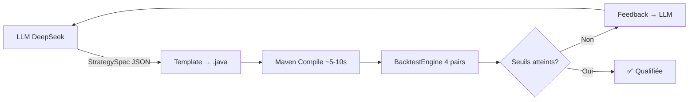

# Pipeline — Unified Strategy Engine

> **Section 10 du LT Strategy Playbook** (version implémentée)
> Voir `_bmad-output/planning-artifacts/architecture-unified-strategy-engine.md` pour l'architecture complète.

## 10.1 Pipeline Overview

Le Unified Strategy Engine automatise la génération, compilation, backtest et validation de stratégies via LLM.



## 10.2 CLI Usage

```bash
# Lancer le pipeline LONG_TERM (profil par défaut)
export JAVA_HOME=/home/martinfou/.local/share/mise/installs/java/26.0.1
export PATH="$JAVA_HOME/bin:/home/martinfou/.local/share/mise/installs/maven/3.9.16/apache-maven-3.9.16/bin:$PATH"
cd ~/projects/trading-bridge
mvn exec:java -pl trading-examples \
  -Dexec.mainClass="com.martinfou.trading.examples.RunStrategyPipeline"

# Profil spécifique + itérations
mvn exec:java -pl trading-examples \
  -Dexec.mainClass="com.martinfou.trading.examples.RunStrategyPipeline" \
  -Dexec.args="--profile PROP_SHOP --iterations 3"

# Lister le catalog
mvn exec:java -pl trading-examples \
  -Dexec.mainClass="com.martinfou.trading.examples.RunStrategyPipeline" \
  -Dexec.args="--list"
```

## 10.3 Profils de Validation

| Profil | Validateur | Paires | Critères |
|--------|-----------|--------|----------|
| LONG_TERM | `LongTermValidator` | EUR/USD, GBP/USD, USD/JPY, AUD/USD | PF≥1.05, DD<20%, trades≥100, ≥2/4 pairs |
| PROP_SHOP | `PropShopValidator` | 9 paires (incl. crosses + XAU) | PF≥1.3, Sharpe≥0.8, DD<15%, WR>40%, trades≥50, ≥2/9 pairs |
| NEWS_WEEKLY | `NewsWeeklyValidator` | EUR/USD | Entry condition + event reference, SL≥2.0x ATR |

## 10.4 Components

| Component | File | Location |
|-----------|------|----------|
| Pipeline orchestrator | `LtPipelineOrchestrator` | `trading-intelligence/pipeline/` |
| Template codegen | `LtTemplateCodeGenerator` | `trading-intelligence/pipeline/` |
| LongTerm validator | `LongTermValidator` | `trading-intelligence/pipeline/` |
| PropShop validator | `PropShopValidator` | `trading-intelligence/pipeline/` |
| NewsWeekly validator | `NewsWeeklyValidator` | `trading-intelligence/pipeline/` |
| Experience Store | `ExperienceStore` | `trading-intelligence/experience/` |
| CLI Runner | `RunStrategyPipeline` | `trading-examples/` |
| Data models | `StrategySpec`, `StrategyMetadata`, `ValidationProfile`, etc. | `trading-core/agent/` |

## 10.5 Data Flow

1. LLM (DeepSeek via LangChain4j) generates a JSON `StrategySpec`
2. `LtTemplateCodeGenerator` produces a compilable `.java` file
3. Maven compiles incrementally (`mvn compile -pl trading-strategies -am -q`)
4. `BacktestEngine` runs walk-forward on required pairs (sample bars for MVP)
5. `ValidationProfile` evaluates results (polymorphic: one impl per profile)
6. If qualified → registered in `StrategyCatalog` + recorded in `ExperienceStore`
7. If rejected → feedback message + lesson recorded → LLM retries (max 5 iterations)

## 10.6 Experience Store (Feedback Loop)

Every pipeline run appends to `data/experience-store/experience.jsonl` (JSONL format).
The last 10 entries are injected into the LLM prompt on subsequent runs.
Rotation at 100 entries → archive to `experience-YYYY-MM-DD.jsonl`.

## 10.7 Compilation

Pas de Docker. Java 26 + Maven 3.9.16 via mise.

```bash
export JAVA_HOME=/home/martinfou/.local/share/mise/installs/java/26.0.1
export PATH="$JAVA_HOME/bin:/home/martinfou/.local/share/mise/installs/maven/3.9.16/apache-maven-3.9.16/bin:$PATH"
mvn compile -pl trading-strategies -am -q   # incrémental, ~5-10s
```
