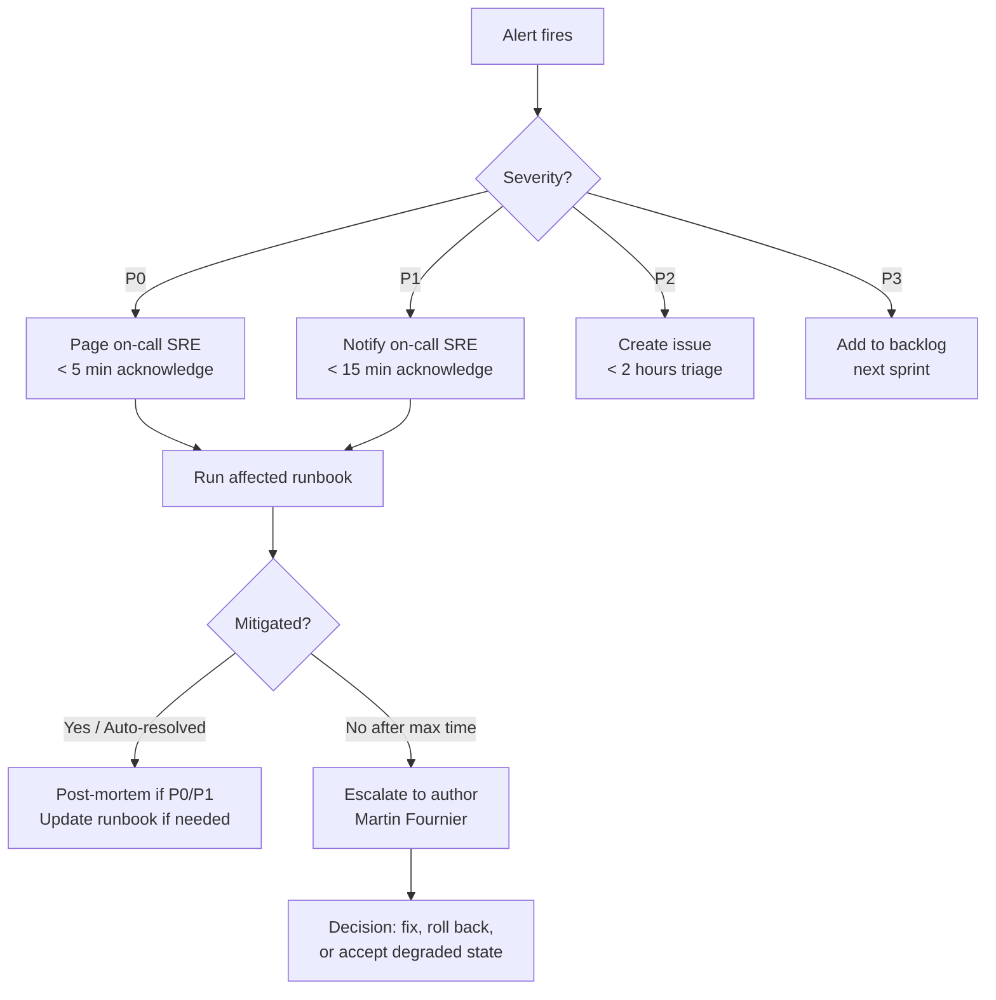

# Reliability Engineering — Trading Bridge

> SRE playbook: SLOs, runbooks, incident response, operational readiness, monitoring, and disaster recovery for the Trading Bridge platform.

**Last updated:** 2026-06-26  
**Owner:** Platform Reliability (Winston Architect)

---

## Table of Contents

1. [Service Level Objectives (SLOs) & Indicators (SLIs)](#1-service-level-objectives-slos--indicators-slis)
2. [Runbooks](#2-runbooks)
   - 2.1 [Broker Disconnected (OANDA)](#21-broker-disconnected-oanda)
   - 2.2 [Broker Disconnected (IBKR)](#22-broker-disconnected-ibkr)
   - 2.3 [Stale Stream / Missing Heartbeat](#23-stale-stream--missing-heartbeat)
   - 2.4 [OANDA Rate Limit Exceeded](#24-oanda-rate-limit-exceeded)
   - 2.5 [SQLite Database Corruption](#25-sqlite-database-corruption)
   - 2.6 [Reconciliation Divergence Alert](#26-reconciliation-divergence-alert)
   - 2.7 [Daily Drawdown Breach](#27-daily-drawdown-breach)
   - 2.8 [Promote Gate Failure](#28-promote-gate-failure)
   - 2.9 [Control Plane Unresponsive](#29-control-plane-unresponsive)
3. [Incident Severity Matrix](#3-incident-severity-matrix)
4. [Operational Readiness Checklist](#4-operational-readiness-checklist)
5. [Monitoring Dashboards](#5-monitoring-dashboards)
6. [Chaos Engineering & Disaster Recovery](#6-chaos-engineering--disaster-recovery)

---

## 1. Service Level Objectives (SLOs) & Indicators (SLIs)

### 1.1 SLI definitions

| SLI | Measurement | Source | Description |
|-----|-------------|--------|-------------|
| **Trade persistence rate** | `events_committed / events_emitted` (rolling 7d) | `SqliteEventStore` | Fraction of trade events (FILL, REJECT, ORDER_SUBMITTED) that commit successfully to SQLite |
| **Broker reconnection time** | P99 time to re-establish broker session after disconnect | `OandaBroker`, `IbkrBroker` connect latency | Wall-clock from disconnect detection to successful re-auth |
| **Run success rate** | `runs_completed / runs_started` (rolling 30d) | `RunManager` lifecycle | Fraction of runs reaching `RUN_ENDED` without crash or unrecoverable error |
| **Reconciliation divergence rate** | `runs_with_divergence / broker_runs_total` (rolling 7d) | `ReconciliationService` | Ratio of broker-backed runs with one or more `RECONCILIATION_ALERT` events |
| **Control plane availability** | `200 / total_health_checks` (1m probes) | `GET /api/health` | Uptime fraction of the Javalin HTTP server |
| **Stale detection latency** | Time from last `HEARTBEAT` to stale flag in `/control/summary` | `StaleThresholds`, `ControlSummaryService` | How quickly a silent broker run is surfaced |
| **Heartbeat delivery rate** | `bars_with_heartbeat / expected_bars` (per run) | `BrokerRunExecutor` | Fraction of bar intervals where a `HEARTBEAT` event was successfully emitted |
| **Promote gate latency** | P95 time for `POST /api/strategies/{id}/promote` to return | `PromoteService` | End-to-end time for promote gate evaluation — all gates run before response |
| **Risk engine rejection rate** | `orders_rejected_risk / orders_total` (rolling 7d) | `RiskEngine` | Fraction of orders blocked by pre-trade or daily drawdown risk checks |

### 1.2 Target SLOs

| SLO | Target | Measurement Window | Severity if breached |
|-----|--------|--------------------|-----------------------|
| Trade persistence | ≥ 99.9% | 7 days rolling | P0 |
| Broker reconnection (P99) | < 30 seconds | Per-event | P1 |
| Run success rate | ≥ 99.5% | 30 days rolling | P1 |
| Reconciliation divergence rate | ≤ 1% | 7 days rolling | P2 |
| Control plane availability | ≥ 99.9% | 30 days rolling | P0 |
| Stale detection latency (P99) | < 65 seconds (threshold + margin) | Per-run | P2 |
| Heartbeat delivery rate | ≥ 99% | 7 days per-run | P2 |
| Promote gate latency (P95) | < 15 seconds | 30 days rolling | P3 |
| Risk engine rejection rate (warning) | > 10% triggers review | 7 days rolling | P2 |

### 1.3 Error budget

Weekly error budget is calculated per SLO. Budget consumption is tracked in `data/runtime/error-budget.json` (auto-generated, not committed).

| SLO | Weekly Budget | Action at 50% consumption | Action at 100% consumption |
|-----|---------------|---------------------------|----------------------------|
| Trade persistence | 10 missed events / 10k | Investigate event store | Freeze LIVE promotes |
| Control plane availability | 10 minutes downtime | Alert on-call | Page all responders |
| Run success rate | 1 failure / 200 runs | Review recent failures | Freeze new deployments |

---

## 2. Runbooks

### 2.1 Broker Disconnected (OANDA)

**Summary:** OANDA REST API is unreachable or returns 5xx for a `LIVE_OANDA` or `PAPER_OANDA` run.

**Signals:**
- `RECONCILIATION_ALERT` with divergence reason `BROKER_UNREACHABLE`
- `HEARTBEAT` events stop for a run
- Run marked `isStale: true` in `/control/summary`
- Broker REST call throws `IOException` or returns HTTP 503

**Severity:** P1 (single strategy) → P0 (all strategies affected)

**Step-by-step:**

```
1. CONFIRM        ┃ curl http://localhost:8080/api/health
                   ┃ curl https://api-fxpractice.oanda.com/v3/accounts/{id}
                   ┃   → if OANDA health endpoint responds, issue may be local

2. ISOLATE        ┃ Check broker-accounts.json config
                   ┃ Check OANDA_API_TOKEN / OANDA_ACCOUNT_ID env vars are set
                   ┃   → export | grep OANDA

3. NETWORK CHECK  ┃ ping api-fxpractice.oanda.com
                   ┃ curl -v https://api-fxpractice.oanda.com/v3/accounts 2>&1 | head -20
                   ┃   → Look for DNS / TLS / timeout errors

4. RESTART RUN    ┃ If network is fine and credentials are valid:
                   ┃ POST /api/strategies/{strategyId}/kill
                   ┃   {"actor":"sre","reason":"broker reconnect - restart run"}
                   ┃ POST /api/strategies/{strategyId}/promote
                   ┃   {"targetMode":"PAPER","executionLabel":"PAPER_OANDA"}
                   ┃   → Or promote to LIVE if already past paper period

5. ESCALATE       ┃ If OANDA API itself is down (check status.oanda.com):
                   ┃ → Switch affected strategies to PAPER_STUB for continuity
                   ┃ → Log incident with OANDA support ticket ID
```

**Expected recovery:** Reconnection within 30 seconds on next bar when API is back. Manual restart if reconnection fails.

---

### 2.2 Broker Disconnected (IBKR)

**Summary:** IBKR Gateway / TWS connection is lost for a `PAPER_IBKR` or `LIVE_IBKR` run.

**Signals:**
- `IbkrBroker` emits `BROKER_DISCONNECT` event
- Gateway TCP socket closes (port 7497 paper / 7496 live)
- Run goes stale with no `HEARTBEAT`

**Severity:** P1–P2 (IBKR is secondary broker per MVP; OANDA is primary)

**Step-by-step:**

```
1. CHECK GATEWAY  ┃ systemctl status ib-gateway   (or docker ps | grep ib-gateway)
                   ┃ netstat -an | grep 7497        (paper)
                   ┃ netstat -an | grep 7496        (live)

2. RESTART GW     ┃ If gateway process is dead:
                   ┃ systemctl restart ib-gateway
                   ┃   → Wait 15 seconds for gateway to fully init

3. VERIFY CONN    ┃ docker logs ib-gateway --tail 20
                   ┃ curl http://localhost:8080/api/broker-accounts
                   ┃   → Check ibkr-paper account shows connected

4. KILL & RESTART ┃ POST /api/strategies/{strategyId}/kill
                   ┃   {"actor":"sre","reason":"ibkr gateway reconnection"}
                   ┃ → Resume via new promote or run start
```

**Root cause candidates:** Gateway nightly restart (IBKR resets), network timeout, client ID conflict (`IBKR_CLIENT_ID` must be unique per gateway session).

---

## 3. Incident Severity Matrix

[incident-severity-matrix.md](incident-severity-matrix.md)

## 4. Pre-Flight Checklist

[pre-flight-checklist.md](pre-flight-checklist.md)

## 5. Review Process

[daily-weekly-review-process.md](daily-weekly-review-process.md)

## 6. Platform Recovery Runbook

[platform-recovery-runbook.md](platform-recovery-runbook.md)

## 7. Run Promotion Playbook

[run-promotion-playbook.md](run-promotion-playbook.md)

## 8. Operator Dashboard Guide

[operator-dashboard-guide.md](operator-dashboard-guide.md)

---

### 2.3 Stale Stream / Missing Heartbeat

**Summary:** A `RUNNING` broker-backed run has not emitted a `HEARTBEAT` event for longer than `runningStaleThresholdSeconds` (default 120s).

**Signals:**
- `/control/summary` shows `runs[].isStale: true` for one or more runs
- `signals.stale[]` populated in control summary
- Dashboard banner: "⚠️ Stale run detected"

**Severity:** P2 (single run) → P1 (all runs stale → control plane issue)

**Step-by-step:**

```
1. IDENTIFY       ┃ curl http://localhost:8080/control/summary | jq '.runs[] | select(.isStale)'
                   ┃   → Note runId, strategyId, executionLabel, secondsSinceLastEvent

2. CHECK BAR      ┃ Verify expected bar interval vs stale threshold:
   INTERVAL       ┃   H1 → threshold 120s is fine
                   ┃   D1 → threshold should be > 86400s (adjust in stale-thresholds.json)
                   ┃   M5 → threshold too high, lower to 300s

3. PROBE BROKER   ┃ If broker-backed (PAPER_OANDA / LIVE_OANDA):
                   ┃   curl -v https://api-fxpractice.oanda.com/v3/accounts/{id}/summary
                   ┃ → If broker responds, issue is in event pipeline
                   ┃ → If broker doesn't respond, follow [§2.1 Broker Disconnected]

4. RESTART RUN    ┃ If run is genuinely stuck and not just slow data:
                   ┃ POST /api/strategies/{strategyId}/kill
                   ┃   {"actor":"sre","reason":"stale run - unresponsive"}
                   ┃ → Review run events first for any ERROR events
```

**Tuning:** Adjust `data/runtime/stale-thresholds.json` per strategy bar interval. Set to 2× the bar interval as a baseline (e.g., H1 → 7200s, D1 → 172800s).

---

### 2.4 OANDA Rate Limit Exceeded

**Summary:** OANDA REST API returns HTTP 429 (Too Many Requests) or `PRICE_NOT_AVAILABLE` with rate-limit semantics.

**Signals:**
- HTTP 429 responses in broker logs
- `ORDER_REJECT` with reason `RATE_LIMITED`
- Successful requests interleaved with failures (bursty pattern)

**Severity:** P2

**Step-by-step:**

```
1. CONFIRM        ┃ grep "429\|RATE_LIMIT" logs/trading-runtime.log
                   ┃   → OANDA docs: 1000 req/min per account (practice)

2. THROTTLE       ┃ Reduce concurrent strategies per account:
                   ┃   If >3 strategies on same OANDA account, split across accounts
                   ┃   (see broker-accounts.json for multi-account config)

3. BACKOFF        ┃ Check if BrokerRunExecutor has exponential backoff:
                   ┃   Current: retries with 1s, 2s, 4s backoff
                   ┃   If not, this is a gap — file a reliability bug

4. MONITOR        ┃ Track rate-limit headroom:
                   ┃   curl -I https://api-fxpractice.oanda.com/v3/accounts/{id}/summary
                   ┃   → Check X-RateLimit-Remaining header (if exposed)
```

**Prevention:** Maximum 3 concurrent broker-backed strategies per OANDA account. Use separate accounts for paper vs live. IBKR does not impose similar REST rate limits but has its own message pacing (implement `IbkrMessagePacer` if not done).

---

### 2.5 SQLite Database Corruption

**Summary:** `SqliteEventStore`, `SqliteBacktestRunStore`, or `SqliteDeploymentStore` throw `SQLException` indicating database corruption.

**Signals:**
- `"database disk image is malformed"` in logs
- `GET /api/runs` returns 500
- Promotes fail with persistence error
- Event queries return empty or truncated results

**Severity:** P0 — data loss risk

**Step-by-step:**

```
1. IMMEDIATE      ┃ STOP ALL BROKER RUNS:
   FREEZE         ┃   for each strategy with RUNNING broker run:
                   ┃     POST /api/strategies/{id}/kill
                   ┃     {"actor":"sre","reason":"db corruption - emergency halt"}
                   ┃ → This prevents new events from being written to corrupt DB

2. BACKUP         ┃ cp data/runtime/events.db data/runtime/events.db.corrupt
   CORRUPT DB     ┃ cp data/runtime/deployments.db data/runtime/deployments.db.corrupt

3. INTEGRITY      ┃ sqlite3 data/runtime/events.db "PRAGMA integrity_check;"
   CHECK          ┃   → Note which errors are reported

4. ATTEMPT        ┃ sqlite3 data/runtime/events.db ".mode insert" > events.sql
   RECOVERY       ┃   → If this succeeds, recreate:
                   ┃   mv data/runtime/events.db data/runtime/events.db.broken
                   ┃   sqlite3 data/runtime/events.db < events.sql

5. RESTORE        ┃ If recovery fails, restore from last known-good backup:
   FROM BACKUP    ┃   cp data/runtime/backups/events-YYYY-MM-DD.db data/runtime/events.db
                   ┃ → Acceptable data loss window = last backup timestamp

6. RESUME         ┃ Restart control plane:
                   ┃   mvn exec:java -pl trading-runtime \
                   ┃     -Dexec.mainClass=com.martinfou.trading.runtime.ControlPlaneMain
                   ┃ → Re-promote strategies from the deployment store (if intact)
                   ┃ → If deployment store also corrupt, manual re-deploy needed
```

**Prevention:**
- Automated daily SQLite `VACUUM` + backup via cron: `0 3 * * * cd /app/data && sqlite3 runtime/events.db ".backup backups/events-$(date +\%Y-\%m-\%d).db"`
- Enable WAL mode: `PRAGMA journal_mode=WAL;` on startup (reduces corruption risk)
- Monitor SQLite error rates via `/control/summary` extension

---

### 2.6 Reconciliation Divergence Alert

**Summary:** `BrokerRunExecutor` detects a mismatch between the broker's reported positions and the journal-derived fill state.

**Signals:**
- `RECONCILIATION_ALERT` event in evidence export
- `/control/summary` shows `runs[].reconciliation.alertCount > 0`
- `reconciliation.clear: false` in promote-readiness response

**Severity:** P1

**Step-by-step:**

```
1. INSPECT        ┃ curl http://localhost:8080/api/runs/{runId}/export | grep RECONCILIATION
                   ┃   → Note divergences[]: symbol, side, brokerQuantity, journalQuantity

2. CLASSIFY       ┃ Small divergence (< 1% of position size)?
    DEVIATION     ┃   → Likely rounding in OANDA fill vs backtest fill calc
                   ┃   → Log as observation, no action needed
                   ┃ Large divergence (> 10%)?
                   ┃   → Possible order duplication or missed fill
                   ┃   → Halt run immediately

3. HALT RUN       ┃ If large divergence:
                   ┃   POST /api/strategies/{strategyId}/kill
                   ┃   {"actor":"sre","reason":"reconciliation divergence - investigation"}

4. INVESTIGATE    ┃ Compare broker position (OANDA web UI / GET /v3/accounts/{id}) 
                   ┃ vs run's fill log (evidence export JSONL).
                   ┃ → Did we miss a broker-side fill/cancel?
                   ┃ → Did we double-submit an order?
```

**Root causes:** OANDA partial fills not modelled in backtest (MVP limitation), asynchronous order state updates, broker-side adjustments/swap fees not journaled.

---

### 2.7 Daily Drawdown Breach

**Summary:** `RiskEngine.checkDailyDrawdown()` flags that a broker-backed run has exceeded `maxDailyDrawdownPct` (default 5%).

**Signals:**
- `OPERATOR_ACTION` with `action: DAILY_DD_BREACH`, `actor: RISK_ENGINE`
- Run transitions to `PAUSED` status
- `/control/summary` shows `dailyDdBreached: true` for the run
- New orders blocked; `ordersDailyDdBlocked` increments

**Severity:** P2 (auto-handled by risk engine, but requires review)

**Step-by-step:**

```
1. REVIEW         ┃ curl http://localhost:8080/control/summary | jq '.runs[] | select(.dailyDdBreached)'
                   ┃   → Check dailyDrawdownPct vs maxDailyDrawdownPct
                   ┃   → Check if this is a one-off spike or trend

2. INVESTIGATE    ┃ Review market conditions for the breached period:
                   ┃   → Major news event? (NFP, FOMC, CPI)
                   ┃   → Strategy-specific issue? (bad entry signal)
                   ┃   → Broker feed issue? (bad price tick)

3. DECIDE         ┃ If strategy flaw:
                   ┃   → Demote to backtest, review parameters
                   ┃ If market outlier (rare):
                   ┃   → Adjust risk limits in risk-limits.json (justify in audit log)
                   ┃ If acceptable:
                   ┃   → Resume run via promote or new run start
```

**Threshold tuning:** `maxDailyDrawdownPct = 5.0` in `data/runtime/risk-limits.json`. Conservative for FX (2× average daily range); adjust per strategy volatility.

---

### 2.8 Promote Gate Failure

**Summary:** `POST /api/strategies/{id}/promote` returns HTTP 422 with one or more failed `GateCheckResult` entries.

**Signals:**
- HTTP 422 response body with `checks[]` array
- Email/Discord notification from CI-style gate monitor
- `ready: false` in promote-readiness endpoint

**Severity:** P3 (blocks workflow, no production impact)

**Step-by-step:**

```
1. READ GATES     ┃ curl http://localhost:8080/api/strategies/{id}/promote-readiness | jq '.gates[] | select(.passed==false)'
                   ┃   → Note which gates failed and their threshold vs actual

2. CLASSIFY       ┃ ┌────────────────────────────┬─────────────────────────────────┐
                   ┃ │ Gate                       │ Common failure reasons          │
                   ┃ ├────────────────────────────┼─────────────────────────────────┤
                   ┃ │ min_trades                 │ Backtest produced 0 trades      │
                   ┃ │ max_drawdown_pct           │ Strategy too risky              │
                   ┃ │ golden_baseline            │ Refactor changed metrics        │
                   ┃ │ paper_duration_days        │ Paper period < 30d              │
                   ┃ │ oos_holdout                │ OOS metrics breach threshold    │
                   ┃ │ execution_stress           │ Slippage×3 hurts performance    │
                   ┃ │ reconciliation             │ Broker feed ≠ journal           │
                   ┃ └────────────────────────────┴─────────────────────────────────┘

3. REMEDIATE      ┃ min_trades:
                   ┃   → Check strategy logic; does it generate signals?
                   ┃ golden_baseline:
                   ┃   → Run `GoldenBaselineCapture` to see live metrics
                   ┃   → If intentional change, update GoldenBacktestBaseline.java
                   ┃ paper_duration_days:
                   ┃   → Wait; no shortcut available
                   ┃ oos_holdout / execution_stress:
                   ┃   → If enabled, review if thresholds are appropriate
                   ┃   → Consider disabling for low-frequency strategies

4. ESCALATE       ┃ If gates keep failing after remediation:
                   ┃   → Review strategy with trading team
                   ┃   → Consider adjusting promote-gates.json thresholds
                   ┃     (document the rationale)
```

---

### 2.9 Control Plane Unresponsive

**Summary:** `GET /api/health` fails or returns non-200, or all HTTP endpoints time out.

**Signals:**
- Dashboard shows "Connection refused"
- TUI shows "Cannot connect to control plane"
- Electron app stuck on splash screen ("Starting server...")
- Port 8080 not listening

**Severity:** P0

**Step-by-step:**

```
1. CHECK PROCESS  ┃ ps aux | grep ControlPlaneMain
                   ┃ netstat -tlnp | grep 8080
                   ┃   → If process not running or port not bound, it's a full outage

2. CHECK LOGS     ┃ tail -100 logs/trading-runtime.log
                   ┃ journalctl --user -u trading-bridge -n 50 --no-pager
                   ┃   → Look for OOM, uncaught exception, port conflict

3. RESTART        ┃ If process crashed:
                   ┃   mvn exec:java -pl trading-runtime \
                   ┃     -Dexec.mainClass=com.martinfou.trading.runtime.ControlPlaneMain &
                   ┃   → Wait for "Control plane started on port 8080"

4. DOCKER DEPLOY  ┃ If running under Docker:
                   ┃   docker compose restart trader
                   ┃   docker compose logs trader --tail 20

5. VERIFY         ┃ curl http://localhost:8080/api/health
                   ┃ curl http://localhost:8080/control/summary
                   ┃   → Both should return 200

6. CHECK STATE    ┃ After restart:
                   ┃   → Verify SQLite DB is intact [§2.5]
                   ┃   → Check run states: were RUNNING runs lost?
                   ┃   → Re-deploy any strategies that were live
```

**Run state recovery after restart:** The control plane does not auto-resume `RUNNING` runs on restart. After a restart, you must re-promote strategies. Broker runs that were in-flight at the time of crash may have orphan orders on the broker side — reconcile manually.

---

## 3. Incident Severity Matrix

### 3.1 Severity levels

| Level | Label | Response time | Mitigation target | Examples |
|-------|-------|---------------|-------------------|----------|
| **P0** | Critical | < 5 min | < 30 min | Control plane down, SQLite corruption, all brokers unreachable, event store data loss |
| **P1** | Major | < 15 min | < 2 hours | Single broker unreachable, large reconciliation divergence, trade persistence < 99%, stale all runs |
| **P2** | Minor | < 2 hours | < 24 hours | Single stale run, OANDA rate limit, risk engine rejections > 10%, single strategy failure |
| **P3** | Trivial | < 24 hours | Next sprint | Promote gate failure (blocked workflow), UI glitch, documentation gap, non-critical gate tune |

### 3.2 Incident response flow



### 3.3 Severity override rules

| Situation | Default severity | Override |
|-----------|-----------------|----------|
| Broker disconnected (single strategy) | P1 | P0 if it causes financial loss (missed SL/TP) |
| Reconciliation divergence (small) | P2 | P1 if divergence > 10% |
| Stale run | P2 | P1 if all runs stale simultaneously |
| Promote gate failure | P3 | P2 if blocking a scheduled deployment |
| Control plane restart during market hours | P1 | P0 if in LIVE trading |

### 3.4 Post-mortem requirements

| Severity | Post-mortem required | Timeline | Minimum content |
|----------|---------------------|----------|-----------------|
| P0 | ✅ Mandatory | 48 hours | Timeline, root cause, action items, runbook update |
| P1 | ✅ Mandatory | 1 week | Timeline, root cause, action items |
| P2 | Optional | — | Summary if pattern emerges |
| P3 | No | — | — |

---

## 4. Operational Readiness Checklist

### 4.1 Strategy lifecycle gate checklist

Before a strategy moves from one stage to the next, the following must be verified.

#### BACKTEST → PAPER (promote to PAPER)

| # | Check | Verification | Gate |
|---|-------|-------------|------|
| 1 | Backtest produces trades | `min_trades >= 1` | ✅ Automated |
| 2 | Max drawdown within bounds | `max_drawdown_pct < 15%` | ✅ Automated |
| 3 | Return above floor | `min_return_pct > -50%` | ✅ Automated |
| 4 | Golden baseline matches (if applicable) | Metrics within ±1% tolerance | ✅ Automated |
| 5 | OOS holdout passes (if enabled) | Out-of-sample metrics in threshold | ✅ Automated |
| 6 | Execution stress passes (if enabled) | Slippage×3, commission×2 within bounds | ✅ Automated |
| 7 | Strategy has been code-reviewed | PR merged with approval | 📋 Manual |
| 8 | Historical data for symbol is available | `data/historical/bars/` for the symbol | 📋 Manual |
| 9 | Paper account has sufficient virtual funds | OANDA practice balance > $10k | 📋 Manual |
| 10 | Risk limits configured | `data/runtime/risk-limits.json` reviewed | 📋 Manual |

#### PAPER → LIVE (promote to LIVE)

| # | Check | Verification | Gate |
|---|-------|-------------|------|
| 1 | Paper period elapsed | ≥ 30 calendar days on PAPER_OANDA | ✅ Automated |
| 2 | Paper execution label valid | Must be PAPER_OANDA (not STUB) | ✅ Automated |
| 3 | Reconciliation clear | No active RECONCILIATION_ALERT | ✅ Automated |
| 4 | No daily drawdown breaches last 30 days | `dailyDdBreached: false` for paper period | 📋 Manual review |
| 5 | Drift signal not PAUSE | `signals.drift[].recommendation != PAUSE` | 📋 Manual review |
| 6 | Kill switch not active | `killSwitchActive: false` | ✅ Automated |
| 7 | Paper performance acceptable | Sharpe, win rate, drawdown reviewed | 📋 Manual review |
| 8 | Market conditions reviewed | NFP, FOMC, holiday calendar checked | 📋 Manual review |
| 9 | LIVE account funded sufficient margin | OANDA live balance > 5× max position risk | 📋 Manual |
| 10 | Alerting configured | Discord/Telegram for stop-loss, drawdown | 📋 Manual |
| 11 | Runbook reviewed | Operator knows kill switch procedure | 📋 Manual |
| 12 | Backup verification | Daily backup confirmed working | 📋 Manual |

#### LIVE operating checklist (ongoing)

| # | Check | Frequency | Responsibility |
|---|-------|-----------|---------------|
| 1 | Review `/control/summary` for stale/gap signals | Daily (09:00 UTC) | Operator |
| 2 | Review daily P&L vs expected | Daily (market close) | Operator |
| 3 | Verify reconciliation state | Daily | Automated + spot check |
| 4 | Check risk-limit utilisation | Daily | Automated alert at 80% |
| 5 | Review drift signals | Weekly | Operator |
| 6 | Validate backtest baseline hasn't drifted | Weekly | Re-run golden test |
| 7 | SQLite VACUUM + backup | Daily (03:00 UTC) | Cron |
| 8 | Error budget review | Weekly | SRE |
| 9 | Log review for unhandled exceptions | Weekly | SRE |
| 10 | OANDA API key rotation check | Monthly | Operator |

---

## 5. Monitoring Dashboards

### 5.1 Control Room (`/control/summary`)

The existing `/control/summary` endpoint should be the **primary monitoring surface**. Below is what must be visible at a glance.

**Suggested layout (view priorities):**

```
┌────────────────────────────────────────────────────────────┐
│  TRADING BRIDGE CONTROL ROOM                     ⏱ 12:34Z │
├───────────────────┬────────────────────────────────────────┤
│  GLOBAL STATUS    │  ALERTS                                │
│  ┌─ live runs: 2 │  ⚠ Stale run: VWPReversion            │
│  │ paper:     1   │  ⚠ Daily DD: 4.2% / 5% limit         │
│  │ backtest:  0   │  ✓ Reconciliation: clear              │
│  │ stale:     1   │  ✓ Risk limits: OK                    │
│  └────────────────┘                                        │
├───────────────────┴────────────────────────────────────────┤
│  RUNS TABLE (sorted: stale/gaps first)                     │
│  ┌──────┬────────┬────────┬──────┬──────┬──────┬────────┐ │
│  │ Run  │ Mode   │ Status │ Bars │ Stale│ DD%  │ Drift  │ │
│  ├──────┼────────┼────────┼──────┼──────┼──────┼────────┤ │
│  │VWPRev│ LIVE   │ RUNNING│ 124  │ ⚠45s │ 4.2 │ HOLD   │ │
│  │CBE   │ LIVE   │ RUNNING│ 124  │ ✓    │ 1.1 │ REVIEW │ │
│  │NFP   │ PAPER  │ PAUSED │ 56   │ ✓    │ 5.1 │ PAUSE  │ │
│  └──────┴────────┴────────┴──────┴──────┴──────┴────────┘ │
├────────────────────────────────────────────────────────────┤
│  SIGNALS PANEL                                             │
│  ┌─────────────────────┬────────────────────┬────────────┐ │
│  │ GAPS                │ DRIFT              │ STALE      │ │
│  │ CBE: 1 gap @ 11:00 │ VWPRev: REVIEW     │ VWPRev:   │ │
│  │                     │  (drawdown 1.8×)   │  45s ago   │ │
│  └─────────────────────┴────────────────────┴────────────┘ │
├────────────────────────────────────────────────────────────┤
│  QUICK ACTIONS                                             │
│  [KILL VWPRev] [KILL CBE] [Promote NFP] [View Events]    │
└────────────────────────────────────────────────────────────┘
```

### 5.2 Dashboard visualisation requirements

For the Electron Desktop (charts) and Laravel Dashboard (web), ensure these views exist:

| View | Data source | Refresh | Components |
|------|-------------|---------|------------|
| **Live Run Monitor** | `GET /control/summary` | Every 5s | Run status table, stale/gap indicators, drift badges |
| **Equity Curves** | `GET /api/runs/{id}/export` (JSONL) | On load / event | Line chart per run (MATERIALIZED from RUN_EVENT equity snapshots) |
| **Risk Gauges** | `GET /control/summary` (daily DD) | Every 5s | Progress bar: current DD vs maxDailyDrawdownPct |
| **Promote Pipeline** | `GET /api/strategies/{id}/promote-readiness` | On page load | Gate checklist (pass/fail), paper countdown timer |
| **Event Stream** | WebSocket `/ws/runs/{runId}` | Real-time | Scrolling log of ORDER, FILL, REJECT, HEARTBEAT events |
| **Reconciliation View** | `GET /api/runs/{id}/export` (filter RECONCILIATION) | On load | Divergence table: symbol, side, broker qty, journal qty |
| **Error Budget Panel** | Computed from SLI logs | Weekly | Budget consumed %, weeks of budget remaining |
| **Broker Status** | `GET /api/broker-accounts` | Every 30s | Connection status per account (green/yellow/red) |

### 5.3 Alerting thresholds

| Alert | Trigger | Channel | Severity |
|-------|---------|---------|----------|
| Control plane down | Health check fails × 3 | Discord + Telegram + Email | P0 |
| Broker run stale | `isStale` for > 300s | Discord | P1 |
| Reconciliation divergence | Any `RECONCILIATION_ALERT` | Discord | P1 |
| Daily drawdown breach | `dailyDdBreached: true` | Discord | P1 |
| Risk limit approaching | `maxPositionSize` or `maxOpenExposure` at 80% | Discord warning | P2 |
| Trade persistence < 99.9% | Count over rolling 7d | Discord | P0 |
| Promote gate failure | HTTP 422 from promote endpoint | Discord | P3 |
| Error budget > 50% consumed | Weekly computation | Discord | P2 |
| SQLite backup failure | Backup cron non-zero exit | Discord | P2 |
| Disk space < 10% | `df` check on `/app/data` | Email | P2 |

---

## 6. Chaos Engineering & Disaster Recovery

### 6.1 Chaos engineering experiments

Prove the system's failure modes are handled correctly under stress.

#### Experiment 1: Broker Disconnect

| Property | Value |
|----------|-------|
| **Scenario** | OANDA REST API becomes unreachable mid-run |
| **Hypothesis** | The run transitions to stale state, no crash, operator can restart |
| **Procedure** | 1. Start a `PAPER_OANDA` run |
| | 2. Block port 443 to api-fxpractice.oanda.com via `iptables -A OUTPUT -p tcp --dport 443 -d api-fxpractice.oanda.com -j DROP` |
| | 3. Wait 120s (stale threshold) |
| | 4. Verify `isStale: true` in `/control/summary` |
| | 5. Unblock: `iptables -D OUTPUT -p tcp --dport 443 -d api-fxpractice.oanda.com -j DROP` |
| | 6. Kill and restart the run |
| | 7. Verify the run resumes successfully |
| **Expected** | Graceful degradation, no crash, operator-driven recovery |
| **Frequency** | Monthly |

#### Experiment 2: SQLite Corruption

| Property | Value |
|----------|-------|
| **Scenario** | Simulate database corruption during a LIVE run |
| **Hypothesis** | Operator can restore from backup, data loss limited to backup interval |
| **Procedure** | 1. Take a manual backup of `events.db` |
| | 2. Start a `PAPER_STUB` run (safe, no real money) |
| | 3. Corrupt the DB: `dd if=/dev/urandom of=data/runtime/events.db bs=1024 count=100 seek=10 conv=notrunc` |
| | 4. Verify control plane returns 500 on event queries |
| | 5. Run [§2.5 SQLite Corruption] runbook |
| | 6. Verify run is restored from backup |
| | 7. Measure data loss = time between last backup and corruption |
| **Expected** | Recovery within 10 minutes. Data loss = backup interval (target < 24h) |
| **Frequency** | Quarterly |

#### Experiment 3: Load Test / Concurrent Strategies

| Property | Value |
|----------|-------|
| **Scenario** | 10 strategies running simultaneously (exceeding typical 3-broker limit) |
| **Hypothesis** | Control plane handles concurrent runs within resource limits |
| **Procedure** | 1. Start 10 `PAPER_STUB` runs concurrently |
| | 2. Measure response times: promote, kill, status |
| | 3. Measure JVM heap usage: `jstat -gc <pid>` |
| | 4. Verify no OOM, no request timeouts |
| | 5. Scale down to normal load |
| **Expected** | P95 promote latency < 15s. Heap < 80% of -Xmx. No OOM. |
| **Frequency** | Quarterly or after major runtime changes |

#### Experiment 4: Kill Switch Under Load

| Property | Value |
|----------|-------|
| **Scenario** | Emergency kill while broker runs are executing orders |
| **Hypothesis** | Kill switch halts all broker activity within 5 seconds |
| **Procedure** | 1. Start 3 `PAPER_OANDA` runs |
| | 2. Submit kill for each: `POST /api/strategies/{id}/kill` |
| | 3. Verify response is HTTP 202 within 5s |
| | 4. Verify runs transition to non-RUNNING state |
| | 5. Verify `killSwitchActive: true` in promote-readiness |
| | 6. Verify no new orders are submitted for killed strategies |
| **Expected** | Kill acknowledged in < 5s. Orphan orders risk minimized. |
| **Frequency** | Monthly |

### 6.2 Disaster recovery procedures

#### DR1: Full platform recovery (bare metal)

**Scenario:** Complete machine failure (VPS crash, disk loss, OS reinstall).

```
1. PROVISION       ┃ New VPS / machine
                   ┃ Install: Java 21, Maven 4.x, Docker

2. RESTORE CODE    ┃ git clone https://github.com/martinfou/trading-bridge.git
                   ┃ git checkout <last-known-good-tag>
                   ┃ mvn clean install -DskipTests

3. RESTORE DATA    ┃ Restore SQLite backups from off-machine storage:
                   ┃   rsync -av backup-server:/backups/trading-bridge/data/ ./data/
                   ┃   → Verify integrity: sqlite3 ... "PRAGMA integrity_check;"

4. RESTORE KEYS    ┃ Recreate .env with OANDA_API_KEY, OANDA_ACCOUNT_ID
                   ┃   (from password manager, never in git)

5. START PLANE     ┃ mvn exec:java -pl trading-runtime \
                   ┃   -Dexec.mainClass=com.martinfou.trading.runtime.ControlPlaneMain

6. VERIFY          ┃ curl http://localhost:8080/api/health
                   ┃ curl http://localhost:8080/control/summary

7. RE-DEPLOY       ┃ For each previously LIVE strategy:
                   ┃   POST /api/strategies/{id}/promote
                   ┃   {"targetMode":"LIVE"}
                   ┃   → Strategy resumes from current broker state
                   ┃   → Note: historical events for runs that were in-flight
                   ┃     at time of crash are lost (SQLite backup window)

**RTO target:** < 1 hour (assuming backup availability)  
**RPO target:** < 24 hours (daily backup interval)
```

#### DR2: OANDA API outage (broker-specific)

**Scenario:** OANDA practice or live API is down for an extended period (> 1 hour).

```
1. DETECT          ┃ Confirmed via status.oanda.com or sustained 5xx responses

2. HALT            ┃ Kill all OANDA broker runs:
                   ┃   for each strategy:
                   ┃     POST /api/strategies/{id}/kill
                   ┃     {"actor":"sre","reason":"oanda api outage"}

3. ASSESS          ┃ If OANDA live is down:
                   ┃   → No trading possible (no alternative broker for FX)
                   ┃   → Monitor status.oanda.com
                   ┃ If only OANDA practice is down:
                   ┃   → PAPER runs stop, no impact on LIVE

4. DOCUMENT        ┃ Log incident with timestamp of kill and expected recovery
                   ┃ Notify Martin via Discord/Telegram

5. RECOVER         ┃ When OANDA status returns to operational:
                   ┃   → Verify broker-accounts.json connectivity
                   ┃   → Re-promote strategies
                   ┃   → Verify positions match broker (reconciliation)
```

#### DR3: IBKR Gateway restart (planned/unplanned)

**Scenario:** IBKR Gateway resets (nightly maintenance or crash).

```
1. SCHEDULED       ┃ IBKR Gateway restarts daily at ~23:45 ET:
   (known)         ┃   → Schedule no broker runs during this window
                   ┃   → Or accept 5-minute gap and auto-reconnect

2. UNSCHEDULED     ┃ Gateway crash:
                   ┃   → Follow [§2.2 Broker Disconnected (IBKR)] runbook
                   ┃   → Gateway auto-recovery typically within 60 seconds
```

#### DR4: Docker host failure

**Scenario:** The Docker host running the trader containers crashes.

```
1. RESTART DOCKER  ┃ systemctl restart docker
                   ┃ docker compose up -d

2. CHECK VOLUMES   ┃ docker volume ls
                   ┃ docker volume inspect data logs
                   ┃   → Verify SQLite db and logs are intact

3. VERIFY PLANE    ┃ docker compose logs trader --tail 20
                   ┃ curl http://localhost:8080/api/health

4. RE-DEPLOY       ┃ Re-promote strategies that were live
```

### 6.3 Backup strategy

| Data | Location | Frequency | Retention | Method |
|------|----------|-----------|-----------|--------|
| SQLite events.db | `data/runtime/backups/` | Daily (03:00 UTC) | 30 days | `sqlite3 .backup` |
| SQLite deployments.db | `data/runtime/backups/` | Daily (03:00 UTC) | 30 days | `sqlite3 .backup` |
| Runtime config JSON | Git-tracked (`data/runtime/*.json`) | On change | Git history | `git commit` |
| OANDA credentials | Password manager (not in repo) | On rotation | Indefinite | — |
| Historical bar data | `data/historical/` | Weekly re-download | Indefinite | Dukascopy / OANDA |

### 6.4 Recovery validation schedule

| Drill | Frequency | Participants | Success criteria |
|-------|-----------|-------------|------------------|
| SQLite restore from backup | Monthly | SRE | Full integrity check passes, all runs recoverable |
| Full platform recovery (DR1) | Quarterly | SRE + Martin | RTO < 1 hour, RPO < 24 hours |
| Broker disconnect experiment | Monthly | SRE | Runbook followed, no manual intervention needed beyond runbook |
| Kill switch test | Monthly | SRE | All broker runs halt within 5 seconds |
| Promote pipeline test (CI gate) | Every deploy | CI/CD | Golden test + all gates pass |

---

## Appendix A: Reliability configuration files reference

| File | Purpose | Override via |
|------|---------|-------------|
| `data/runtime/promote-gates.json` | Strategy promotion thresholds | `TRADING_BRIDGE_PROMOTE_GATES` |
| `data/runtime/risk-limits.json` | Pre-trade and daily drawdown limits | `TRADING_BRIDGE_RISK_LIMITS` |
| `data/runtime/stale-thresholds.json` | Stale run detection timeout | `TRADING_BRIDGE_STALE_THRESHOLDS` |
| `data/runtime/drift-thresholds.json` | Drift signal thresholds | `TRADING_BRIDGE_DRIFT_THRESHOLDS` |
| `data/runtime/broker-accounts.json` | Broker account routing config | — |
| `data/runtime/oos-holdout.json` | Out-of-sample holdout config | `TRADING_BRIDGE_OOS_HOLDOUT` |
| `data/runtime/execution-stress.json` | Execution stress test config | `TRADING_BRIDGE_EXECUTION_STRESS` |
| `data/runtime/error-budget.json` | Auto-generated error budget tracking | — |

## Appendix B: Key endpoints for SRE operations

| Endpoint | Purpose |
|----------|---------|
| `GET /api/health` | Liveness probe |
| `GET /control/summary` | Primary operational status |
| `GET /api/strategies/{id}/promote-readiness` | Pre-promote gate check |
| `POST /api/strategies/{id}/promote` | Promote strategy to next stage |
| `POST /api/strategies/{id}/kill` | Emergency stop |
| `GET /api/runs/{runId}/export` | Full event evidence (for reconciliation) |
| `GET /api/broker-accounts` | Broker connection status |
| `GET /api/strategies` | All strategies with deployment info |
