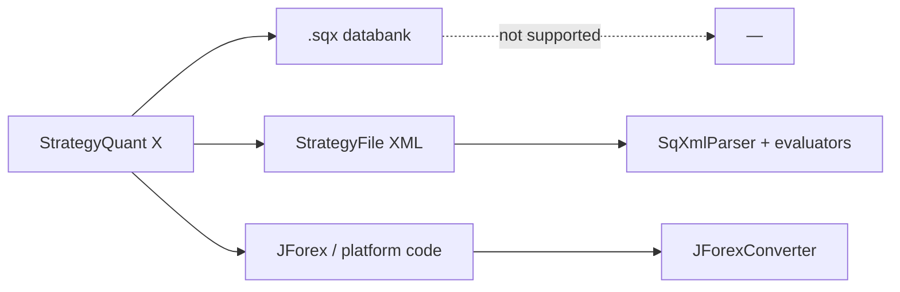
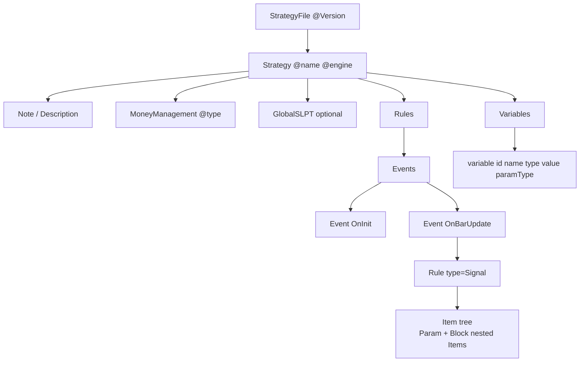

# StrategyQuant X — Strategy XML Format Analysis

> Epic 2 story 2-1 · Ground truth for parser stories 2-2–2-9  
> Agent reference (English). Human sprint overview: `docs/sprint-plan.md`.

## 1. Export paths (three distinct pipelines)



| Path | Format | Openable outside SQ? | Trading Bridge today |
|------|--------|----------------------|----------------------|
| **Databank save** | `.sqx` (proprietary binary/XML bundle) | No — StrategyQuant X only | Not supported |
| **Strategy XML export** | `StrategyFile` XML (custom analysis / API) | Yes — plain XML | **Target for `SqXmlParser` (2-2)** |
| **Platform code export** | JForex / MT4 / MT5 Java/MQL source | Yes — text source | **`JForexConverter`** (regex Java → Bridge) |

The simplified tree in `docs/specs.md` §4.1 (`<StrategyQuant><Strategy>…`) is a **design sketch**, not the on-disk StrategyQuant format. Real strategies use `<StrategyFile Version="…">` with nested building blocks.

References:

- [Databanks and .sqx files](https://strategyquant.com/doc/strategyquant/databanks-and-files/)
- [Reading strategy XML (Variables, Rules, building blocks)](https://strategyquant.com/codebase/reading-strategy-settings-variables-rules-and-building-blocks-in-few-easy-step-using-xml/)
- [Freemarker templates: internal XML → platform code](https://strategyquant.com/wp-content/uploads/2018/12/Extending_SQX.pdf)

## 2. Real XML topology

Root element: **`StrategyFile`** with `Version` attribute (e.g. `3.9.132`).



### 2.1 Variables (parameters)

Standard signal slots (boolean, wired from Rules):

| name | Typical id pattern | role |
|------|-------------------|------|
| `LongEntrySignal` | UUID | Long entry rule output |
| `ShortEntrySignal` | UUID | Short entry rule output |
| `LongExitSignal` | UUID | Long exit rule output |
| `ShortExitSignal` | UUID | Short exit rule output |

Exit / sizing parameters (examples from sample `strategy-1.6.221B.xml`):

| name pattern | type | paramType hint |
|--------------|------|----------------|
| `*StopLoss` | int | `ParamTypeExitUsed` (pips) |
| `*ProfitTarget` | int | exit |
| `*TrailingStop` | int | exit |
| `*ExitAfterBars` | int | `ParamTypeExitUnused` / used |
| `*BarsValid` | int | `ParamTypeEntryLogic` |
| `MagicNumber` | int | platform-specific |

Boolean toggles and session filters live under dotted names (`DontTradeOnWeekends.*`, `LimitTimeRange.*`, …).

### 2.2 Rules / building blocks

Logic is a **tree of `Item` elements**, not flat `<Condition>` tags:

- **Operators:** `AND`, `Not`, `IsFalling`, `IsLowerCount`, … (`categoryType=operators`)
- **Indicators:** `LowestInRange`, `LinearRegression`, `Vortex`, `KeltnerChannel`, `ATR`, … (`categoryType=indicator`)
- **Actions:** `EnterAtStop`, `CloseAllPositions`, … (`returnType=order` or `none`)
- **Controls:** `MarketPositionIsLong`, `BooleanVariable`, …

Each `Item` has `key` (stable identifier for Freemarker templates), `display` (human template with `#Param#` placeholders), and nested `Param` / `Block` children.

**Shift convention:** `#Shift#` params index bars relative to current bar (maps to `getBar(shift)` in converted Java).

**Time-in-range indicators:** `LowestInRange` / `HighestInRange` use `#TimeFrom#` / `#TimeTo#` as integers (e.g. `2100` = 21:00). Session/timezone interpretation is platform-specific — store as documented ints in POJO; convert to UTC/session filters in later stories.

### 2.3 Entry actions (sqimported catalogue)

GBPJPY catalogue strategies (`docs/sqimported/CATALOGUE.md`) are **Long only, BUYSTOP**:

| SQ Item key | Bridge mapping |
|-------------|----------------|
| `EnterAtStop` | `Order.Type.STOP`, side BUY, price from formula |
| SL/PT ints | `withStopLoss` / `withTakeProfit` in pips × pip size |

## 3. sqimported catalogue crosswalk

Families A–L in `CATALOGUE.md` map to SQ `Item key` values. See `SqImportedBlockInventory` for machine-readable mapping.

| Fam | Signal theme | Primary SQ blocks | Bridge status |
|-----|--------------|-------------------|---------------|
| A | ADX + range + BB | ADX, Highest, BBRange | INLINE helpers |
| B | Keltner breakout | KeltnerChannel, ATR | INLINE |
| C | Keltner narrowing | KeltnerChannel, BiggestRange | INLINE; SmallestRange **GAP** |
| D | ADX hump | ADX | INLINE |
| E | Vortex | Vortex | INLINE (`calcVortexPlus/Minus`) |
| F | LinReg trend | LinearRegression, ATR | INLINE |
| G | Ichimoku + ADX | Ichimoku, ADX | **GAP** |
| H | SuperTrend | SuperTrend | **GAP** |
| I | LinReg cross | LinearRegression | INLINE |
| J | Open vs Keltner | KeltnerChannel | INLINE |
| K | Vortex + trailing | Vortex, ATR | INLINE |
| L | Daily high + KC | KeltnerChannel, Highest | INLINE |

Shared core indicators (`Indicators` in `trading-core`): SMA, EMA, RSI, ATR, Bollinger.

## 4. Gap vs `docs/specs.md` §4.1

| specs.md placeholder | Real SQ XML |
|---------------------|-------------|
| Flat `<Indicators><Indicator type="SMA"/>` | Nested `Item key="SMA"` under Rules with Params |
| `<EntryRules><Rule type="CROSSOVER">` | Composed `Item` trees (`AND`, comparisons, indicators) |
| `<ExitRules><Rule type="STOP_LOSS" value="50"/>` | Variables `LongStopLoss` / `ShortStopLoss` + action blocks |
| Single `<StrategyQuant>` root | `<StrategyFile Version="…"><Strategy engine="…">` |

**Implication for 2-3 (`StrategyConfig`):** POJO should mirror `StrategyFile` sections (variables map, rule forest, money management), not the simplified spec tree.

## 5. Test fixtures & probe

| Asset | Location |
|-------|----------|
| Real sample XML | `trading-parser/src/test/resources/sq/strategy-1.6.221B.xml` |
| Structure probe | `com.martinfou.trading.parser.sq.SqXmlFormatProbe` |
| Full parse tree | `com.martinfou.trading.parser.sq.SqXmlParser` → `SqStrategyDocument` |
| Strategy summary | `com.martinfou.trading.parser.config.StrategyConfig` |
| Catalogue crosswalk | `com.martinfou.trading.parser.sq.SqImportedBlockInventory` |

Run analysis in tests:

```bash
mvn test -pl trading-parser -Dtest=SqXmlFormatProbeTest
```

## 6. Recommended parser sequence (stories 2-2+)

1. **2-2** ✅ — `SqXmlParser` → `SqStrategyDocument` (Variables, Rules, Item trees).
2. **2-3** ✅ — `StrategyConfig` POJO + mapper from `SqStrategyDocument`.
3. **2-4** ✅ — `SqIndicatorRegistry` (SMA, EMA, RSI) with shift + applied price.
4. **2-5** ✅ — Extended indicators (MACD, Bollinger, ATR) via `SqIndicatorRegistry`.
5. **2-6** ✅ — Entry conditions: `SqConditionEvaluator`, `SqSignalEvaluator`, `SqEntryEvaluator`.
6. **2-7** ✅ — Exit conditions: `SqExitEvaluator`, position context, `MarketPositionIsLong`/`Short`.
7. **2-8** ✅ — Position sizing + entry/exit actions: `SqActionParser`, `SqOrderIntent`, `SqCloseIntent`, `SqStrategyActionsEvaluator` (`com.martinfou.trading.parser.actions`).
8. **2-9** ✅ — Java codegen: `SqInterpretedStrategy`, `SqStrategyCodeGenerator` (`com.martinfou.trading.parser.codegen`).

Generated wrappers delegate to the interpreter at runtime (classpath XML). For bulk sqimported migration, JForex export + `JForexConverter` remains available when XML uses GAP blocks not yet in the registry.

## 7. Java package map (runtime evaluation)

| Concern | Package | Key types |
|---------|---------|-----------|
| XML DOM | `com.martinfou.trading.parser.sq` | `SqXmlParser`, `SqStrategyDocument`, `SqXmlItem` |
| Strategy POJO | `com.martinfou.trading.parser.config` | `StrategyConfig`, `RuleConfig`, `SignalSlotConfig` |
| Indicators | `com.martinfou.trading.parser.indicators` | `SqIndicatorRegistry`, `SqCoreIndicators`, `SqExtendedIndicators` |
| Conditions | `com.martinfou.trading.parser.conditions` | `SqConditionEvaluator`, `SqEntryEvaluator`, `SqExitEvaluator`, `SqSignalEvaluator`, `SqValueEvaluator` |
| Actions | `com.martinfou.trading.parser.actions` | `SqActionParser`, `SqStrategyActionsEvaluator`, `SqOrderIntent`, `SqCloseIntent` |
| Codegen / runtime Strategy | `com.martinfou.trading.parser.codegen` | `SqInterpretedStrategy`, `SqStrategyCodeGenerator` |
| JForex text import | `com.martinfou.trading.parser` | `JForexConverter` (regex Java → Bridge; not XML tree) |

**Human onboarding:** `docs/contributing.md` · **Agent rules:** `_bmad-output/project-context.md`
