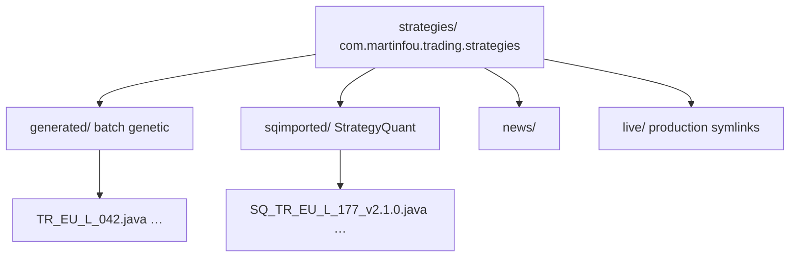
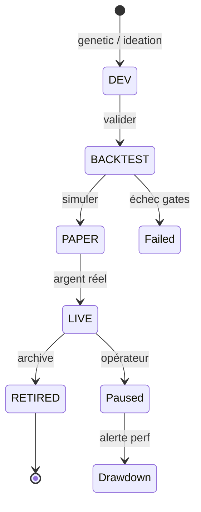

# 🏷️ Stratégie de Nommage & Gestion — Bmad Analysis

## 🔬 First Principles

**Ce qu'on sait :**
1. Une stratégie = [actif + timeframe + signal + direction + risque]
2. Plusieurs stratégies peuvent coexister sur le même actif
3. Il faut pouvoir les distinguer INSTANTANÉMENT dans un dashboard
4. Les performances doivent être traçables dans le temps
5. Les versions évoluent (optimisation, paramètres)
6. On peut avoir >500 stratégies en simultané

## 🔄 Analogical Thinking

| Domaine | Système | Leçon |
|---------|---------|-------|
| 🎵 Spotify | Playlist + artiste + album + piste | Hiérarchie: Collection → Type → Instance |
| 📦 NPM | @scope/package@version | Namespace + nom + version sémantique |
| 🧬 Bio Taxonomie | Règne/Famille/Genre/Espèce | Classification emboîtée |
| 📊 Bloomberg Ticker | AAPL US Equity | Marché + Symbole + Classe d'actif |

## 🧩 Morphological Analysis

### Dimensions de nommage

| Dimension | Options | Exemple |
|-----------|---------|---------|
| **Origine** | SQ (StrategyQuant) / GEN (Genetic) / MAN (Manuelle) | SQ_ |
| **Famille** | Trend / MeanRev / Breakout / Momentum / News / Custom | TR_ |
| **Actif** | EURUSD / GBPUSD / USDCAD / GBPJPY / AUDUSD / USDCHF | EU_ |
| **Direction** | L (Long) / S (Short) / B (Both) | L_ |
| **Timeframe** | M1 / M5 / M15 / H1 / H4 / D1 | H1 |
| **ID** | Numéro unique séquentiel | 042 |
| **Version** | Semantic: 1.0.0 → 1.2.0 | v1.2 |

---

## 🏆 Format Final

```
[SQ|GEN]_[FAM]_[SCOPE]_[ACTIF]_[DIR]_[TF]_[ID]_v[MAJ].[MIN].[PATCH]
```

**Scope:**
- `S` = **Single asset** — stratégie spécifique à un actif (ex: Canada CPI → USDCAD seulement)
- `M` = **Multi asset** — stratégie multi-actifs (ex: RSI MeanRev qui marche sur plusieurs paires)
  - Quand SCOPE=M, ACTIF = `MLT` (Multi)
  - Les actifs réels sont stockés dans les métadonnées (deployedSymbols)

### Exemples

### Exemples

```
SQ_TR_S_EU_L_H1_042_v2.1.0   → Trend **spécifique** EUR/USD Long #42
GEN_MR_M_MLT_B_H1_013_v1.0.0  → MeanRev **multi-actifs** Both #13
↑    ↑  ↑  ↑   ↑  ↑   ↑   ↑
SQ   TR S  EUR  L  H1  042 v2.1.0
```

```
GEN_MR_UC_S_M5_013_v1.0.0  
↑    ↑  ↑  ↑ ↑   ↑   ↑
GEN  MR USDCAD Short M5 #13 Version 1.0.0
```

### Court (pour dashboard)
```
TR-S-EU-L-042     → Trend EURUSD Long #42 (specifique)
MR-M-MLT-B-013    → MeanRev multi-actifs Both #13
BT-S-UC-S-007     → Breakout USDCAD Short #7
MM-M-MLT-L-089    → Momentum multi-actifs Long #89
```

### Couleurs par Famille
```
Trend      → 🔵 Bleu
MeanRev    → 🟢 Vert  
Breakout   → 🟠 Orange
Momentum   → 🔴 Rouge
News       → 🟣 Violet
Custom     → ⚪ Blanc
```

---

## 📁 Structure de dossiers



## 📊 Métadonnées (StrategyRegistry + JSON)

Chaque stratégie a un fichier de métadonnées associé :

```json
{
  "id": "SQ_TR_EU_L_042_v2.1.0",
  "shortName": "TR-EU-L-042",
  "family": "trend",
  "symbol": "EUR/USD",
  "timeframe": "H1",
  "direction": "LONG",
  "params": { "smaPeriod": 14, "emaPeriod": 21, "sl": 150, "tp": 350 },
  "metrics": {
    "sharpe": 1.89,
    "profitFactor": 2.45,
    "winRate": 62.3,
    "maxDrawdown": 12.5,
    "robustness": 78
  },
  "status": "paper",        // dev → backtest → paper → live → retired
  "created": "2026-05-19",
  "lastOptimized": "2026-05-19",
  "source": "strategyquant",
  "tags": ["sma-crossover", "pullback", "momentum"]
}
```

## 🗺️ Strategy Lifecycle



## 👁️ Dashboard — Vue par stratégie

```
🏆 Stratégies Actives (12)

ID              Statut   Sharpe   PF    Win%   DD%    Profit   Depuis
─────────────────────────────────────────────────────────────────────
🔵 TR-EU-L-042  LIVE ✅  1.89    2.45  62.3   12.5   +$4,230  14j
🟢 MR-UC-S-013  LIVE ✅  1.56    2.01  58.1   15.3   +$2,150  10j
🟠 BT-GJ-B-007  PAPER ⏳  1.23    1.78  55.0   18.7   +$890   5j
🔴 MM-AU-L-089  DEV 🏗️  0.89    1.34  48.2   22.4   —       — 
```

## 💻 Implémentation

### StrategyID.java
Génère et parse les IDs, extrait les composants.

### StrategyRegistry.java
Registre central de toutes les stratégies, leurs métadonnées et statuts.

### StrategyLifecycleManager.java
Gère les transitions de statut (DEV → BACKTEST → PAPER → LIVE → RETIRED).

---

*"Une stratégie sans nom, c'est comme un trade sans plan — voué à l'échec."*


## ⏱️ Walk-Forward Calibration

Chaque strategie a une frequence de recalibration WFO (Walk-Forward Optimization).

### Frequences disponibles

| Frequence | Usage | Exemple |
|-----------|-------|---------|
| DAILY | Scalping, strategies tres actives | M1, M5 |
| WEEKLY | Strategies court terme | M15, H1 |
| MONTHLY | Strategies moyen terme (defaut) | H1, H4 |
| QUARTERLY | Strategies long terme | D1 |
| AFTER_20_TRADES | Base sur le nombre de trades | Quel que soit le TF |
| AFTER_100_BARS | Base sur les barres ecoulees | Quel que soit le TF |

### Metadata

```json
{
  "wfFrequency": "MONTHLY",
  "lastWalkForwardDate": "2026-05-19",
  "wfISMonths": 12,
  "wfOOSWeeks": 4,
  "tradesSinceLastWF": 8,
  "barsSinceLastWF": 320,
  "wfDue": false
}
```

### Dashboard — Vue Walk-Forward

```
TR-S-EU-L-042  ✅ LIVE  Sharpe:1.89  WF ok (14d)  🔋
MR-M-MLT-B-013 ✅ LIVE  Sharpe:1.56  🔔 WF due! (45d) 
BT-S-UC-S-007  📊 PAPER Sharpe:1.23  WF ok (3d)   🔋
```

Legende:
- 🔋 WF ok — recalibration a jour
- 🔔 WF due! — recalibration necessaire
- ⚠️ WF overdue — recalibration en retard (>2x la frequence)


## 📊 Multi-Timeframe Strategies

Certaines strategies utilisent plusieurs timeframes, mais une seule est **principale**.

### Regle
Le `TF` dans le nom = le **timeframe principal** (celui de la bougie d'entree/sortie).
Les timeframes secondaires (filtres, confirmation) sont dans les metadonnees.

### Exemple
```
SQ_TR_S_EU_L_H1_042_v2.1.0
               ↑↑
         Main TF = H1 (entree)
         Filter TF = H4 (trend filter, dans metadonnees)
```

### Metadata
```json
{
  "mainTimeframe": "H1",
  "timeframes": ["H1", "H4"],
  "timeframeUsage": {
    "H1": "entry signal (SMA crossover)",
    "H4": "trend filter (200 EMA direction)"
  }
}
```

### Cas d'usage

| Main TF | Filter TF(s) | Usage |
|---------|-------------|-------|
| M5 | M15 | Scalping avec filtre tendance |
| M15 | H1 | Day trading court terme |
| H1 | H4 | Swing trading intraday |
| H1 | D1 | Swing avec tendance daily |
| H4 | D1 | Position trading |
